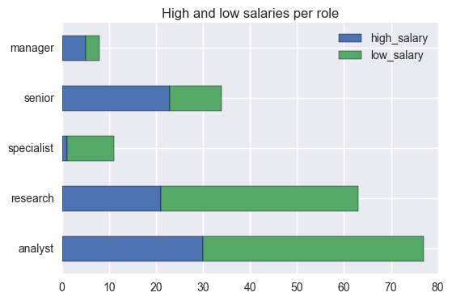

# Web Scraping for Indeed.com & Predicting Salaries

In this project, we will practice two major skills: collecting data by scraping a website and then building a binary predictor with Logistic Regression.

We are going to collect salary information on data science jobs in a variety of markets. Then using the location, title and summary of the job we will attempt to predict the salary of the job. For job posting sites, this would be extraordinarily useful. While most listings DO NOT come with salary information (as you will see in this exercise), being to able extrapolate or predict the expected salaries from other listings can help guide negotiations.

Normally, we could use regression for this task; however, we will convert this problem into classification and use Logistic Regression.

- Question: Why would we want this to be a classification problem?
- Answer: While more precision may be better, there is a fair amount of natural variance in job salaries - predicting a range be may be useful.

Therefore, the first part of the assignment will be focused on scraping Indeed.com. In the second, we'll focus on using listings with salary information to build a model and predict additional salaries.

### Scraping job listings from Indeed.com

We will be scraping job listings from Indeed.com using BeautifulSoup. Luckily, Indeed.com is a simple text page where we can easily find relevant entries.

First, look at the source of an Indeed.com page: (http://www.indeed.com/jobs?q=data+scientist+%2420%2C000&l=New+York&start=10")

Notice, each job listing is underneath a `div` tag with a class name of `result`. We can use BeautifulSoup to extract those. 

#### Setup a request (using `requests`) to the URL below. Use BeautifulSoup to parse the page and extract all results (HINT: Look for div tags with class name result)

The URL here has many query parameters

- `q` for the job search
- This is followed by "+20,000" to return results with salaries (or expected salaries >$20,000)
- `l` for a location 
- `start` for what result number to start on

# Problem statement

Are high salaries for data scientist roles related to the cities where they are available?

Are high salaries for data scientist roles related to some specific words in the job title?

The aim of this project is to answer these questions using data scraped from indeed.com.


```python
# URL to scrape
URL = "http://www.indeed.com/jobs?q=data+scientist+%2420%2C000&l=New+York&start=10"

# URL with some salaries
#URL = "http://www.indeed.com/jobs?q=data+scientist+%2420%2C000&l=New+York&start=270"
```


```python
from __future__ import division, print_function, unicode_literals
import urllib2
import requests
import bs4
from bs4 import BeautifulSoup

import numpy as np
import pandas as pd
import matplotlib.pyplot as plt
%matplotlib inline
import seaborn as sns
```


```python
## Get a soup from the webpage
response = requests.get(URL)
page = response.text
soup = BeautifulSoup(page)
print(soup.prettify())
```

    <!DOCTYPE html>
    <html lang="en">
     <head>
      <meta content="text/html;charset=utf-8" http-equiv="content-type"/>
      <!-- pll -->
      <script src="/s/2c2181b/en_US.js" type="text/javascript">
      </script>
      <link href="/s/1a7c741/jobsearch_all.css" rel="stylesheet" type="text/css"/>
      <link href="http://rss.indeed.com/rss?q=data+scientist+%2420%2C000&amp;l=New+York" rel="alternate" title="Data Scientist $20,000 Jobs, Employment in New York, NY" type="application/rss+xml"/>
      <link href="/m/jobs?q=data+scientist+%2420%2C000&amp;l=New+York" media="handheld" rel="alternate"/>
      <script type="text/javascript">
       window['closureReadyCallbacks'] = [];
    
        function call_when_jsall_loaded(cb) {
            if (window['closureReady']) {
                cb();
            } else {
                window['closureReadyCallbacks'].push(cb);
            }
        }
      </script>
      <script src="/s/3f52f7f/jobsearch-all-compiled.js" type="text/javascript">
      </script>
      <script type="text/javascript">
       var pingUrlsForGA = [];
    
    var searchUID = '1b0q43jdt5mchdc6';
    var tk = '1b0q43jdt5mchdc6';
    
    var loggedIn = false;
    var myindeed = true;
    var userEmail = '';
    var tellFriendEmail = '';
    var globalLoginURL = 'http:\/\/www.indeed.com\/account\/login?dest=%2Fjobs%3Fq%3Ddata%2Bscientist%2B%2420%2C000%26l%3DNew%2BYork%26start%3D10';
    var globalRegisterURL = 'http:\/\/www.indeed.com\/account\/register?dest=%2Fjobs%3Fq%3Ddata%2Bscientist%2B%2420%2C000%26l%3DNew%2BYork%26start%3D10';
    var searchKey = '60e10e972da47133';
    var searchState = 'q=data+scientist+%2420%2C000&amp;l=New+York&amp;start=10';
    var searchQS = 'q=data+scientist+$20,000&l=New+York&start=10';
    var eventType = 'jobsearch';
    var locale = 'en_US';
    function clk(id) { var a = document.getElementById(id); var hr = a.href; var si = a.href.indexOf('&jsa='); if (si > 0) return; var jsh = hr + '&tk=1b0q43jdt5mchdc6&jsa=7565'; a.href = jsh; }
    function sjomd(id) { var a = document.getElementById(id); var hr = a.href; var ocs = hr.indexOf('&oc=1'); if (ocs < 0) return; var oce = ocs + 5; a.href = hr.substring(0, ocs) + hr.substring(oce); }
    function sjoc(id, sal) { var a = document.getElementById(id); a.href = a.href + '&oc=1&sal='+sal; }
    function ptk(st,p) {document.cookie = 'PTK="tk=1b0q43jdt5mchdc6&type=jobsearch&subtype='+st+(p?'&'+p:'')+'"; path=/';}
    function rbptk(st, c, p) { ptk(st, 'cat='+c+(p?'&p='+p:''));}
      </script>
      <script type="text/javascript">
       function loadJSAsync( ) {
    for ( var i = 0; i < arguments.length; i++ ) {
    var url = arguments[i];
    (function() {
    var s = document.createElement("script"), el = document.getElementsByTagName("script")[0];
    s.async = true;
    s.src = url;
    el.parentNode.insertBefore(s, el);
    })();
    }
    }
      </script>
      <meta content="2,296  Data Scientist $20,000 Jobs available in New York, NY on Indeed.com.  one search.  all jobs." name="description"/>
      <meta content="Data Scientist $20,000 Jobs, Employment in New York, NY, New York, NY careers, New York, NY employment, New York, NY job listings, New York, NY job search, New York, NY search engine, work in New York, NY" name="keywords"/>
      <link href="/jobs?q=Data+Scientist+$20,000&amp;l=New+York,+NY&amp;start=10" rel="canonical"/>
      <link href="/jobs?q=data+scientist+%2420%2C000&amp;l=New+York" rel="prev"/>
      <link href="/jobs?q=data+scientist+%2420%2C000&amp;l=New+York&amp;start=20" rel="next"/>
      <style type="text/css">
       #recPromoDisplay { margin-bottom: 3em;margin-left: 0.5em; }
    #recPromoDisplayPageLast { font-size: 16px; margin: 1.5em 0; }
      </style>
      <script type="text/javascript">
       var indeedCsrfToken = 'vkYDe5nsK81f2UOdD5dbQY8PIAw8dK59';
    var hashedCsrfToken = '1594e683c42d206f0ff255e11e7633a6';
      </script>
      <style type="text/css">
       .jasxcustomfonttst-useCustomHostedFontFullPage *{font-family:"Open Sans", sans-serif !important}.jasxcustomfonttst-useLato *{font-family:"Lato", sans-serif !important}.jasxcustomfonttst-useFira *{font-family:"Fira Sans", sans-serif !important}.jasxcustomfonttst-useGibson *{font-family:"Gibson", sans-serif !important}
      </style>
      <style type="text/css">
       #resultsCol { padding-top: 0; }
    .searchCount { margin-top: 6px; }
    .showing { padding-top: 9px; padding-bottom: 9px; }
    
    .brdr { height: 1px; overflow: hidden; background-color: #ccc; }
    
    #bjobalerts { margin-top: 0; }
    
    /* Tall window sizes */
    @media only screen and (min-height:780px){
    .showing { padding-bottom: 0; }
    }
    
    /* Wide window sizes */
    @media only screen and (min-width:1125px){
    .brdr  { margin-left: 12px; margin-right: 12px; }
    }
    
    a,a:link,.link,.btn,.btn:hover{text-decoration:none}a:hover,.link:hover{text-decoration:underline}.dya-container a{text-decoration:underline !important}
      </style>
      <script>
       function onLoadHandler() {
    
    document.js.reset();
    jobSeenInit('1b0q43jdt5mchdc6');
    
    if ( document.radius_update ) { document.radius_update.reset(); }
    
    }
    
    initLogInitialUserInteraction('1b0q43jdt5mchdc6', 'serp');
    
    window.onload = onLoadHandler;
      </script>
      <link href="android-app://com.indeed.android.jobsearch/http/www.indeed.com/m/jobs?q=data+scientist+%2420%2C000&amp;l=New+York&amp;start=10" rel="alternate"/>
      <title>
       Data Scientist $20,000 Jobs, Employment in New York, NY
    |
    Indeed.com
      </title>
      <style>
      </style>
      <style type="text/css">
       .btn,.sg-btn{display:inline-block;padding:9px 15px;border:1px solid #9a99ac;border-bottom-color:#a2a2a2;-webkit-border-radius:6px;-moz-border-radius:6px;-ms-border-radius:6px;-o-border-radius:6px;border-radius:6px;background-color:#D9D9E2;background-image:-moz-linear-gradient(top, #f8f8f9, #D9D9E2);background-image:-webkit-gradient(linear, 0 0, 0 100%, from(#f8f8f9), to(#D9D9E2));background-image:-webkit-linear-gradient(top, #f8f8f9, #D9D9E2);background-image:linear-gradient(to bottom, #f8f8f9, #D9D9E2);background-repeat:repeat-x;-webkit-box-shadow:0 1px 5px rgba(0,0,0,0.2);-moz-box-shadow:0 1px 5px rgba(0,0,0,0.2);-ms-box-shadow:0 1px 5px rgba(0,0,0,0.2);-o-box-shadow:0 1px 5px rgba(0,0,0,0.2);box-shadow:0 1px 5px rgba(0,0,0,0.2);color:#333;vertical-align:middle;text-align:center;text-decoration:none;text-shadow:0 1px #fff;font-weight:700;font-size:16px;font-family:"Helvetica Neue",Helvetica,Arial,"Lucida Grande",sans-serif;line-height:22px;filter:progid:DXImageTransform.Microsoft.gradient(startColorstr='#fff8f8f9', endColorstr='#ffe6e6e6', GradientType=0);cursor:pointer;-webkit-user-select:none;-moz-user-select:none;-ms-user-select:none;-o-user-select:none;user-select:none;-webkit-touch-callout:none;-webkit-highlight:none;-webkit-tap-highlight-color:transparent;text-overflow:ellipsis;white-space:nowrap;overflow:hidden}.btn.active,.btn.sg-active,.btn:active,.btn.disabled,.btn.sg-disabled,.btn[disabled],.sg-btn.active,.sg-btn.sg-active,.sg-btn:active,.sg-btn.disabled,.sg-btn.sg-disabled,.sg-btn[disabled]{outline:none;background-color:#f8f8f9;color:#333}.btn:focus,.sg-btn:focus{outline:0;box-shadow:0 0 1px 0 #1642bb;-webkit-transition:box-shadow 0.2s linear;-moz-transition:box-shadow 0.2s linear;transition:box-shadow 0.2s linear}.btn.active,.btn.sg-active,.btn:active,.sg-btn.active,.sg-btn.sg-active,.sg-btn:active{background-color:#f8f8f9;background-image:none;-webkit-box-shadow:inset 0 2px 4px rgba(0,0,0,0.15),0 1px 2px rgba(0,0,0,0.05);-moz-box-shadow:inset 0 2px 4px rgba(0,0,0,0.15),0 1px 2px rgba(0,0,0,0.05);box-shadow:inset 0 2px 4px rgba(0,0,0,0.15),0 1px 2px rgba(0,0,0,0.05)}.btn.disabled,.btn.sg-disabled,.btn[disabled],.sg-btn.disabled,.sg-btn.sg-disabled,.sg-btn[disabled]{background-color:#f8f8f9;background-image:none;-webkit-box-shadow:none;-moz-box-shadow:none;box-shadow:none;opacity:.65;filter:alpha(opacity=65);cursor:default}.btn-primary,.sg-btn-primary{border-color:#1642bb;background-color:#5585f2;background-image:-moz-linear-gradient(top, #6598ff, #2e5ad7);background-image:-webkit-gradient(linear, 0 0, 0 100%, from(#6598ff), to(#2e5ad7));background-image:-webkit-linear-gradient(top, #6598ff, #2e5ad7);background-image:linear-gradient(to bottom, #6598ff, #2e5ad7);background-repeat:repeat-x;color:#F8F8F9;text-shadow:0 -1px #0f2299;-ms-filter:progid:DXImageTransform.Microsoft.dropshadow(OffX=0, OffY=-1, Color=#e80f2299, Positive=true);filter:progid:DXImageTransform.Microsoft.dropshadow(OffX=0, OffY=-1, Color=#e80f2299, Positive=true);filter:progid:DXImageTransform.Microsoft.gradient(startColorstr='#ff6598fe', endColorstr='#ff3c69e0', GradientType=0);zoom:1}.btn-primary.active,.btn-primary.sg-active,.btn-primary:active,.btn-primary.disabled,.btn-primary.sg-disabled,.btn-primary[disabled],.sg-btn-primary.active,.sg-btn-primary.sg-active,.sg-btn-primary:active,.sg-btn-primary.disabled,.sg-btn-primary.sg-disabled,.sg-btn-primary[disabled]{background-color:#2e5ad7;color:#F8F8F9}.btn-primary:focus,.sg-btn-primary:focus{box-shadow:0 0 1px 0 #000}.btn-special,.sg-btn-special{border-color:#ba3200;background-color:#5585f2;background-image:-moz-linear-gradient(top, #f60, #f14200);background-image:-webkit-gradient(linear, 0 0, 0 100%, from(#f60), to(#f14200));background-image:-webkit-linear-gradient(top, #f60, #f14200);background-image:linear-gradient(to bottom, #f60, #f14200);background-repeat:repeat-x;color:#F8F8F9;text-shadow:0 -1px #000;-ms-filter:progid:DXImageTransform.Microsoft.dropshadow(OffX=0, OffY=-1, Color=#e80f2299, Positive=true);filter:progid:DXImageTransform.Microsoft.dropshadow(OffX=0, OffY=-1, Color=#e80f2299, Positive=true);filter:progid:DXImageTransform.Microsoft.gradient(startColorstr='#ff6598fe', endColorstr='#ff3c69e0', GradientType=0);zoom:1}.btn-special.active,.btn-special.sg-active,.btn-special:active,.btn-special.disabled,.btn-special.sg-disabled,.btn-special[disabled],.sg-btn-special.active,.sg-btn-special.sg-active,.sg-btn-special:active,.sg-btn-special.disabled,.sg-btn-special.sg-disabled,.sg-btn-special[disabled]{background-color:#f14200;color:#F8F8F9}.btn-special:focus,.sg-btn-special:focus{box-shadow:0 0 1px 0 #000}.btn-danger,.sg-btn-danger{border-color:#83121b;background-color:#5585f2;background-image:-moz-linear-gradient(top, #d1787f, #b01825);background-image:-webkit-gradient(linear, 0 0, 0 100%, from(#d1787f), to(#b01825));background-image:-webkit-linear-gradient(top, #d1787f, #b01825);background-image:linear-gradient(to bottom, #d1787f, #b01825);background-repeat:repeat-x;color:#F8F8F9;text-shadow:0 -1px #000;-ms-filter:progid:DXImageTransform.Microsoft.dropshadow(OffX=0, OffY=-1, Color=#e80f2299, Positive=true);filter:progid:DXImageTransform.Microsoft.dropshadow(OffX=0, OffY=-1, Color=#e80f2299, Positive=true);filter:progid:DXImageTransform.Microsoft.gradient(startColorstr='#ff6598fe', endColorstr='#ff3c69e0', GradientType=0);zoom:1}.btn-danger.active,.btn-danger.sg-active,.btn-danger:active,.btn-danger.disabled,.btn-danger.sg-disabled,.btn-danger[disabled],.sg-btn-danger.active,.sg-btn-danger.sg-active,.sg-btn-danger:active,.sg-btn-danger.disabled,.sg-btn-danger.sg-disabled,.sg-btn-danger[disabled]{background-color:#b01825;color:#F8F8F9}.btn-danger:focus,.sg-btn-danger:focus{box-shadow:0 0 1px 0 #000}input.btn,input.sg-btn{-webkit-appearance:none}button.btn::-moz-focus-inner,button.sg-btn::-moz-focus-inner{border:0}.btn-sm,.sg-btn-sm,.btn-xs,.sg-bt-xs{padding:6px 12px}.btn-xs,.sg-btn-xs{padding:3px 6px;line-height:15px}.btn-md,.sg-btn-md{padding:6px 6px}.btn-lg,.sg-btn-lg{padding:9px 18px;border-radius:6px;font-size:18px}.btn-block,.sg-btn-block{display:block;margin:9px auto;-webkit-box-sizing:border-box !important;-moz-box-sizing:border-box !important;box-sizing:border-box !important;max-width:352px}.btn-block-compact,.sg-btn-block-compact{margin:2px auto}input.btn-block,input.sg-btn-block,button.btn-block,button.sg-btn-block{width:100%;max-width:351px}.btn-block+.btn-block,.sg-btn-block+.sg-btn-block{margin-top:5px}#buttonContainer .btn,#buttonContainer .sg-btn{margin:0}.btn-icon .cssImage{margin-bottom:-40px;position:relative;top:-27px}.btn-pair{-webkit-box-sizing:border-box !important;-moz-box-sizing:border-box !important;box-sizing:border-box !important;width:49%}#refineresultscol{width:184px}#refineresults{width:180px}#branding-td{width:186px;text-align:center}.ltr #searchCount{margin-right:4px;margin-left:4px}.ltr #resultsCol .sorting{padding-right:4px}.ltr #resultsCol .showing{padding-left:4px}.ltr #jobsearch{padding-left:4px}.rtl #searchCount{margin-left:4px;margin-right:4px}.rtl #resultsCol .sorting{padding-left:4px}.rtl #resultsCol .showing{padding-right:4px}.rtl #jobsearch{padding-right:4px}.jaui,.hasu .gasc,.row,.message,.oocs{padding-left:4px;padding-right:4px}#resumePromo{padding-left:4px;padding-right:4px}#primePromo{padding-left:4px;padding-right:4px}@media only screen and (min-width: 1125px){.ltr #refineresults{padding-left:15px}.ltr #branding img{margin-left:16px;margin-right:28px}.rtl #refineresults{padding-right:15px}.rtl #branding img{margin-right:16px;margin-left:28px}.ltr #searchCount{margin-right:12px;margin-left:12px}.ltr #resultsCol .sorting{padding-right:12px}.ltr #resultsCol .showing{padding-left:12px}.ltr #jobsearch{padding-left:12px}.rtl #searchCount{margin-left:12px;margin-right:12px}.rtl #resultsCol .sorting{padding-left:12px}.rtl #resultsCol .showing{padding-right:12px}.rtl #jobsearch{padding-right:12px}.jaui,.hasu .gasc,.row,.message,.oocs{padding-left:12px;padding-right:12px}#resumePromo{padding-left:12px;padding-right:12px}#primePromo{padding-left:12px;padding-right:12px}#serpBody{width:1125px}#refineresultscol,#branding-td{width:225px}#refineresults{width:210px}}@media only screen and (min-width: 1250px){#serpBody{width:1250px}#auxCol{width:315px}#refineresultscol,#branding-td{width:275px}#refineresults{width:260px}.ltr #refineresults{padding-left:15px}.ltr #branding img{margin-left:16px;margin-right:28px}.rtl #refineresults{padding-right:15px}.rtl #branding img{margin-right:16px;margin-left:28px}.ltr #searchCount{margin-right:12px;margin-left:12px}.ltr #resultsCol .sorting{padding-right:12px}.ltr #resultsCol .showing{padding-left:12px}.ltr #jobsearch{padding-left:12px}.rtl #searchCount{margin-left:12px;margin-right:12px}.rtl #resultsCol .sorting{padding-left:12px}.rtl #resultsCol .showing{padding-right:12px}.rtl #jobsearch{padding-right:12px}.jaui,.hasu .gasc,.row,.message,.oocs{padding-left:12px;padding-right:12px}#resumePromo{padding-left:12px;padding-right:12px}#primePromo{padding-left:12px;padding-right:12px}}#branding-td{padding:5px 0 5px 0px}
      </style>
     </head>
     <body class="ltr jasxcustomfonttst-inactive" data-tn-application="jasx" data-tn-olth="9d2bcadf63a72746e920e0ea88bc9d14" data-tn-originlogid="1b0q43jdt5mchdc6" data-tn-originlogtype="jobsearch">
      <div id="accessibilityBanner">
       <span id="accessibilityText">
        Skip to
        <!-- This is translated before reaching this state -->
        <a class="accessibilityMenu" href="#jobPostingsAnchor" id="skipToJobs">
         Job Postings
        </a>
        ,
        <!-- This is translated before reaching this state -->
        <a class="accessibilityMenu" href="#what" id="skipToSearch">
         Search
        </a>
       </span>
       <a id="accessibilityClose">
        Close
       </a>
      </div>
      <link href="/s/36397a3/accessibility.css" rel="stylesheet" type="text/css"/>
      <script type="text/javascript">
       createTabBar('1b0q43jdt5mchdc6');
      </script>
      <style type="text/css">
       body { margin-top: 0; margin-left: 0; margin-right: 0; padding-top: 0; padding-right: 0; padding-left: 0; }
    
    #g_nav { border-bottom:1px solid #ccc; margin-bottom: 9px; }
    
    #g_nav a,
    #g_nav a:visited { color: #00c; }
    
    .navBi { display: -moz-inline-box; display: inline-block; padding: 9px 12px; margin: 0; list-style-type: none; }
      </style>
      <div data-tn-section="globalNav" id="g_nav" role="navigation">
       <table cellpadding="0" cellspacing="0" width="100%">
        <tr>
         <td nowrap="">
          <style type="text/css">
           #p_nav a.selected { font-weight: bold; text-decoration:none; color: #000 !important; }
          </style>
          <div id="p_nav">
           <span class="navBi">
            <a class="selected" href="/" id="jobsLink" title="Jobs">
             Find Jobs
            </a>
           </span>
           <span class="navBi">
            <a href="/resumes?isid=find-resumes&amp;ikw=SERPtop&amp;co=US&amp;hl=en" id="rezLink">
             Find Resumes
            </a>
           </span>
           <span class="navBi">
            <a href="/hire?hl=en&amp;cc=US" id="empLink" onclick="if ( this.href.match('&amp;isid=employerlink-US-control&amp;ikw=SERPtop') == null ) { this.href += '&amp;isid=employerlink-US-control&amp;ikw=SERPtop' };">
             Employers / Post Job
            </a>
           </span>
          </div>
         </td>
         <td align="right" nowrap="">
          <style type="text/css">
           #navpromo a,
    #navpromo a:visited {
    color: #f60;
    }
    .resume-promo .ico {
    background: url("data:image/png;base64,iVBORw0KGgoAAAANSUhEUgAAABIAAAAYCAMAAADAi10DAAAAA3NCSVQICAjb4U/gAAAAdVBMVEX////x7/3v7vjl4vXj4PTi3/Lg3fHf2/Dd2u7c2O3a1+vZ1erX0+nW0ufU0ObSz+TRzePPy+LOyuDMyN+uqt+lpeaIiNojI84gIMoeHsccHMQaGsEXF74VFbsTE7gREbQODrEMDK4KCqsICKgFBaQDA6EBAZ54rl54AAAACXBIWXMAAArrAAAK6wGCiw1aAAAAHHRFWHRTb2Z0d2FyZQBBZG9iZSBGaXJld29ya3MgQ1M1cbXjNgAAABV0RVh0Q3JlYXRpb24gVGltZQA5LzEzLzExzT7gEAAAAIJJREFUGNOt0LsOgkAQRuFzkGhP5Ob7PxsmaCy5KDEWC0vEQgv/avPN7M5mzNkm5bqRY0ry2eX/6c5+Q2PO5RAoQdWx0GJUdaahVC2HlfpKVat+oa52Tt1peP4MJ6ABDBMzuAmQwSPQFKowxS4W8u2rX8jdSuGYtkR6tvPFleImfqEXCDYV9f9Fn8cAAAAASUVORK5CYII=");width:18px; height:24px; margin-top: -3px;
    vertical-align: middle;
    display: inline-block;
    }
    
    .resume-promo .new-ico {
    background: url("data:image/png;base64,iVBORw0KGgoAAAANSUhEUgAAABAAAAATCAMAAACuuX39AAAABGdBTUEAALGPC/xhBQAAACBjSFJNAAB6JgAAgIQAAPoAAACA6AAAdTAAAOpgAAA6mAAAF3CculE8AAAArlBMVEUAAAAAAMwAAM0AAM4AAM4AAMwAAM0AAM0AAM0AAM0AAMwAAMwAAM4AAMwAAMwAAM4AAMwAAMwAAM8AAM0AAMwAAMwAAMwAAMwAAM8AAMwAAMwAAM4AAMwAAMwAAM0AAMwAAMwAAMwAAMwAAMwAAMwAAMwAAMwAAM0AAM0AAM0AAM0AAM0AAMwAAMwAAMwAAMwAAMwAAMwAAMwAAMwAAMwAAMwAAMwAAMwAAMz////mwGUNAAAAM3RSTlMAAAAAAAAAAAAADowNhPUOifYPjfcRkPgSlPkYmfxru8G/3BAREAx6cXFzO4WGhUtLS/MxCxrLAAAAAWJLR0Q51wCVQAAAAAd0SU1FB+AFCxIoIcvncLkAAACsSURBVBjTjY7JEoIwEAWHRXZQUJEdVBQUwSUJ8P9fZgLogfJgn9JdU68CwOA0Xdc4+MIbpmWZBv9xYbmyEbJXS2F00VlvEMZos3ZE5outu6NOy87dLgAkzw8GpyXwPQnCKEZkvCAojkJI0mx/aNlGe9hnaQLH/HQuOoIx6YrzKT+yWbnsWehLefqHfBnD5f+gXMfRqzIFtbrVTVPfKhV+cac8ngMP9obXDMAz3umvIW9T/HsIAAAAJXRFWHRkYXRlOmNyZWF0ZQAyMDE2LTA1LTExVDE4OjQwOjMzLTA0OjAwjkX6igAAACV0RVh0ZGF0ZTptb2RpZnkAMjAxNi0wNS0xMVQxODo0MDozMy0wNDowMP8YQjYAAAAASUVORK5CYII=");
    width:16px;
    height:19px;
    margin-top: -3px;
    display: inline-block;
    vertical-align: middle;
    }
    
    
    #u_nav .login_unconfirmed,
    #u_nav .login_unconfirmed a,
    #u_nav .login_unconfirmed a:visited {
    color: #c00
    }
    
    #u_nav .resume_pending,
    #u_nav .resume_pending a,
    #u_nav .resume_pending a:visited {
    color: #c00
    }
    
    #userOptionsLabel {
    position: relative;
    z-index: 5;
    }
    
    #userOptionsLabel b {
    cursor: pointer;
    text-decoration: underline;
    position: relative;
    z-index: 5;
    }
    
    #userOptionsLabel:active {
    outline: none;
    }
    
    #userOptionsLabel.active {
    padding: 9px 11px;
    margin-bottom: -1px;
    _margin-bottom: 0px;
    border: 1px solid #ccc;
    border-top: 0;
    }
    
    #userOptionsLabel.active b {
    color: #666;
    }
    
    #userOptionsLabel.active .arrowStub {
    border-width: 0 3px 3px;
    _border-width: 0px 3px 4px;
    border-color: transparent;
    border-bottom-color: #666;
    top: -2px;
    border-style: dashed dashed solid;
    }
    
    #userOptionsLabel.active .halfPxlFix {
    background: #fff;
    bottom: -3px;
    height: 6px;
    left: 0;
    position: absolute;
    right: 0;
    border: 1px solid #fff;
    }
    
    .arrowStub {
    position: relative;
    border-style: solid dashed dashed;
    border-color: transparent;
    border-top-color: #666;
    display: -moz-inline-box;
    display: inline-block;
    font-size: 0;
    height: 0;
    line-height: 0;
    width: 0;
    left: 4px;
    border-width: 3px 3px 0px;
    padding-top: 1px;
    top: -1px;
    }
    
    #userOptions {
    z-index: 2;
    visibility: hidden;
    position: absolute;
    right: 0;
    x_right: -1px;
    top: 100%;
    padding: 9px 15px;
    border: 1px solid #ccc;
    background: #fff;
    min-width: 150px;
    _width: 150px;
    text-align: left;
    }
    
    #userOptions.open {
    visibility: visible;
    }
    
    .userOptionItem {
    margin: 6px 0;
    }
    
    .userOptionItem a {
    white-space: nowrap;
    }
    
    .userOptionGroup {
    border-top: 1px solid #e8e8e8;
    margin-top: 12px;
    }
    
    .userNameRepeat {
    color: #a8a8a8;
    padding-right: 48px;
    font-weight: bold;
    }
    
    .userOptionGroupHeader {
    font-weight: bold;
    margin: 6px 0;
    }
          </style>
          <div id="u_nav">
           <script type="text/javascript">
            function isUserOptionsOpen() {
    return document.getElementById('userOptions').className === 'open';
    }
    
    function hideUserOptions() {
    destroyKeyboardTrap();
    document.getElementById('userOptions').className = '';
    document.getElementById('userOptionsLabel').className = 'navBi';
    document.getElementById('userOptionsLabel').setAttribute('aria-label', 'open user action drop down menu');
    }
    function toggleUserOptions(e) {
    var options = document.getElementById('userOptions');
    var label = document.getElementById('userOptionsLabel');
    if (isUserOptionsOpen()) {
    hideUserOptions();
    if (!e.keyCode) {
    label.blur();
    }
    } else {
    options.className = 'open';
    label.className = 'navBi active navMenuDropDown';
    label.setAttribute('aria-label', 'close user action drop down menu');
    document.onclick = function() {
    hideUserOptions();
    document.onclick = function() {
    };
    };
    if (e.keyCode && (e.keyCode == 13 || e.keyCode == 32)) {
    var fL = document.getElementById('userOptions').getElementsByTagName('a')[0];
    if (fL) {
    fL.focus();
    }
    }
    else {
    label.blur();
    }
    createKeyboardTrap(document.getElementById('user_actions'), 'navMenuDropDown', hideUserOptions);
    }
    stopPropagation(e);
    
    }
    
    
    function createKeyboardTrap(containingElement, dropdownLinkClass) {
    var dropdownLinks = containingElement.getElementsByClassName(dropdownLinkClass);
    var numLinks = dropdownLinks.length;
    
    document.onkeydown = function(e) {
    if (e.keyCode === 9) {
    if (e.target === dropdownLinks[0] && e.shiftKey) {
    dropdownLinks[numLinks -1].focus();
    e.preventDefault();
    } else if (e.target === dropdownLinks[numLinks -1] && !e.shiftKey) {
    dropdownLinks[0].focus();
    e.preventDefault()
    }
    } else if (e.keyCode === 27) {
    hideUserOptions();
    }
    }
    }
    
    function destroyKeyboardTrap() {
    document.onkeydown = null;
    }
    
    function stopPropagation(e) {
    var e = e || window.event;
    e.stopPropagation ? e.stopPropagation() : e.cancelBubble = true;
    }
           </script>
           <script>
            function regExpEscape(s) {
        return String(s).replace(/([-()\[\]{}+?*.$\^|,:#<!\\])/g, '\\$1').
                replace(/\x08/g, '\\x08');
    }
    
    
    function appendParamsOnce(url, params) {
        var useParams = params.replace(/^(\?|\&)/, '');
        if (url.match(new RegExp('[\\?|\\&]' + regExpEscape(useParams))) == null) {
            return url += (url.indexOf('?') > 0 ? '&' : '?' ) + useParams;
        }
        return url;
    }
           </script>
           <div id="user_actions">
            <span class="navBi">
             <span class="resume-promo" id="navpromo">
              <a href="/promo/resume" onclick="window.location=this.href + '?from=nav&amp;subfrom=rezprmstd&amp;trk.origin=jobsearch&amp;trk.variant=rezprmstd&amp;trk.tk=1b0q43jdt5mchdc6'; return false;">
               Upload your resume
              </a>
             </span>
            </span>
            <span class="navBi">
             <a href="http://www.indeed.com/account/login?dest=%2Fjobs%3Fq%3Ddata%2Bscientist%2B%2420%2C000%26l%3DNew%2BYork%26start%3D10" id="userOptionsLabel" rel="nofollow">
              Sign in
             </a>
            </span>
           </div>
          </div>
         </td>
        </tr>
       </table>
      </div>
      <style type="text/css">
       .indeedLogo {
    background: url(/images/logo.png) no-repeat;
    
    margin: 8px 0 0 9px;
    border: 0;
    width: 166px;
    height: 64px;
    -webkit-background-size: 155px 43px;
    background-size: 155px 43px;
    }
    @media (-webkit-min-device-pixel-ratio: 2),
    (   min--moz-device-pixel-ratio: 2),
    (     -o-min-device-pixel-ratio: 2/1),
    (        min-device-pixel-ratio: 2),
    (                min-resolution: 192dpi),
    (                min-resolution: 2dppx) {
    .indeedLogo {
    background: url(/images/logo.png) no-repeat;
    -webkit-background-size: 155px 43px;
    background-size: 155px 43px;
    }
    }
    #branding img { border: 0; }
    #jobsearch { margin: 0 }
    .inwrap { border-right: 1px solid #e8e8e8;border-bottom: 1px solid #e8e8e8;display:inline-block; }
    .inwrap input { box-sizing: border-box; margin:0; height: 30px; font-family:Arial,sans-serif;border:1px solid #ccc;border-bottom-color:#aaa;border-right-color:#aaa; -webkit-border-radius: 0; -webkit-appearance: none; }
    .inwrap .input_text { font-size:18px;padding:3px 6px;_margin: -1px 0; }
    .inwrap .input_submit {color:#614041;font-size:15px;height:30px;background: #e8e8e8; padding:3px 9px;cursor:pointer;_padding:3px;}
    .inwrap .input_submit:active { background: #ccc; }
    .lnav  {width:100%;line-height:1;;font-size:10pt;}
    .jsf .label {font-size:12px; line-height:1.2;padding-top:0;color:#aaa;font-weight:normal;white-space:nowrap;padding-right:1.5em}
    .jsf .label label {font-weight:normal}
    .jsf .sl { font-size: 11px; color: #77c; white-space: nowrap; }
    .npb { padding-bottom: 0; color: #f60; text-transform: lowercase;font-weight:bold; }
    .npl { padding-left: 0 }
    iframe { display:block; }
    .acd { border: 1px solid #333; background: #fff; position:absolute; width:100%; z-index: 1; }
    .aci { font-size: 18px; padding:1px 6px; cursor:pointer; }
    .acis { background:#36c; color:#fff; }
    
    #tjobalerts .ws_label,
    #bjobalerts .ws_label,
    #tjobalerts .member,
    #bjobalerts .member{ z-index: 1; }
    #acr td { padding-top:0; padding-bottom:0; }
    #acr td .h { display:none; }
    
    #what { width: 280px; }
    #where { width: 260px; }
    .inwrapBorder{border:1px solid #1c4ed9;border-top-color:#2f62f1;border-bottom-color:#133fbb;display:inline-block;width:auto}.inwrapBorderTop{border-top:1px solid #69F;display:inline-block;background-color:#3163f2;filter:progid:DXImageTransform.Microsoft.gradient(startColorstr='#3163F2',endColorstr='#2B57D5');background:-webkit-gradient(linear,left top,left bottom,from(#3163f2),to(#2b57d5));background:-moz-linear-gradient(top,#3163f2,#2b57d5);background:linear-gradient(top,#3163f2,#2b57d5)}.inwrapBorder .input_submit{background:transparent;border:0;color:#fff;font-family:Arial;font-size:15px;margin:0;padding:4px 9px;cursor:pointer;_padding:3px}.inwrapBorder a.input_submit{text-decoration:none;display:block}.inwrapBorder:hover{border-color:#235af6;border-top-color:#4072ff;border-bottom-color:#1e4fd9}.inwrapBorderTop:hover{border-top-color:#7ba7ff;background-color:#4273ff;filter:progid:DXImageTransform.Microsoft.gradient(startColorstr='#4273ff',endColorstr='#3364f1');background:-webkit-gradient(linear,left top,left bottom,from(#4273ff),to(#3364f1));background:-moz-linear-gradient(top,#4273ff,#3364f1);background:linear-gradient(top,#4273ff,#3364f1)}.inwrapBorder:active{border-color:#536db7;border-top-color:#4b69c1;border-bottom-color:#3753a6}.inwrapBorder:active .inwrapBorderTop{border-top-color:#6c82c1;background-color:#4b69c1;filter:progid:DXImageTransform.Microsoft.gradient(startColorstr='#4b69c1',endColorstr='#3753a6');background:-webkit-gradient(linear,left top,left bottom,from(#4b69c1),to(#3753a6));background:-moz-linear-gradient(top,#4b69c1,#3753a6);background:linear-gradient(top,#4b69c1,#3753a6)}.roundedCorner{display:inline-block;zoom:1;*display:inline;vertical-align:baseline;margin:0 2px;outline:0;cursor:pointer;text-align:center;text-decoration:none;font:15px/100% Arial,Helvetica,sans-serif;padding:.5em 2em .55em;text-shadow:0 1px 1px rgba(0,0,0,.3);-webkit-border-radius:.5em;-moz-border-radius:.5em;border-radius:.5em;-webkit-box-shadow:0 1px 2px rgba(0,0,0,.2);-moz-box-shadow:0 1px 2px rgba(0,0,0,.2);box-shadow:0 1px 2px rgba(0,0,0,.2)}.roundedCorner:hover{text-decoration:none}.roundedCorner:active{position:relative;top:1px}.bigrounded{-webkit-border-radius:2em;-moz-border-radius:2em;border-radius:2em}.medium{font-size:12px;padding:.4em 1.5em .42em}.small{font-size:11px;padding:.2em 1em .275em}.indeedblue{color:#d9eef7;border:solid 1px #1c4ed9;background:#3163f2;background:-webkit-gradient(linear,left top,left bottom,from(#2f62f1),to(#133fbb));background:-moz-linear-gradient(top,#2f62f1,#133fbb);filter:progid:DXImageTransform.Microsoft.gradient(startColorstr='#2F62F1',endColorstr='#133FBB')}.indeedblue:hover,.indeedblue:focus{background:#235af6;background:-webkit-gradient(linear,left top,left bottom,from(#4072ff),to(#1e4fd9));background:-moz-linear-gradient(top,#4072ff,#1e4fd9);filter:progid:DXImageTransform.Microsoft.gradient(startColorstr='#4072ff',endColorstr='#1e4fd9')}.indeedblue:active{color:#d9eef7;background:-webkit-gradient(linear,left top,left bottom,from(#4b69c1),to(#3753a6));background:-moz-linear-gradient(top,#4b69c1,#3753a6);filter:progid:DXImageTransform.Microsoft.gradient(startColorstr='#4b69c1',endColorstr='#3753a6')}
      </style>
      <span id="hidden_colon" style="display:none">
       :
      </span>
      <table border="0" cellpadding="0" cellspacing="0" role="banner">
       <tr>
        <td width="1125">
         <table cellpadding="0" cellspacing="0" class="lnav">
          <tr>
           <td id="branding-td" style="vertical-align:top;">
            <a href="/" id="branding" onmousedown="ptk('logo');">
             
            </a>
           </td>
           <td style="padding-top:3px;" valign="top">
            <form action="/jobs" class="jsf" id="jobsearch" method="get" name="js" onsubmit="formptk('topsearch','where_ac','',['where_ac','what_ac'], ptk);formptk('topsearch','what_ac','w',['where_ac','what_ac'], ptk);">
             <table align="left" cellpadding="3" cellspacing="0">
              <tr>
               <td class="npb">
                <label for="what" id="what_label_top">
                 What
                </label>
               </td>
               <td class="npb" colspan="3">
                <label for="where" id="where_label_top">
                 Where
                </label>
               </td>
              </tr>
              <tr role="search">
               <td class="npl epr">
                <span class="inwrap">
                 <input aria-labelledby="what_label_top hidden_colon what_label" class="input_text" id="what" maxlength="512" name="q" size="31" value="data scientist $20,000"/>
                </span>
                <div style="width:250px">
                 <!-- -->
                </div>
               </td>
               <td class="npl epr">
                <span class="inwrap">
                 <input aria-labelledby="where_label_top hidden_colon where_label" class="input_text" id="where" maxlength="45" name="l" size="27" value="New York"/>
                </span>
                <div style="width:200px">
                 <!-- -->
                </div>
               </td>
               <td class="npl" style="width:1px">
                <span class="inwrapBorder" style="width:auto;padding-right:0;">
                 <span class="inwrapBorderTop">
                  <input class="input_submit" id="fj" type="submit" value="Find Jobs"/>
                 </span>
                </span>
               </td>
               <td class="npl advanced-search" style="width:240px;">
                <div style="margin-left:12px; display:flex;">
                 <a class="sl" href="/advanced_search?q=data+scientist+%2420%2C000&amp;l=New+York">
                  Advanced Job Search
                 </a>
                </div>
               </td>
              </tr>
              <tr id="acr">
               <td>
                <span class="h">
                </span>
               </td>
               <td class="npl" colspan="2">
                <div style="position:relative;z-index:2">
                 <div class="acd" id="acdiv" style="display:none;">
                 </div>
                </div>
               </td>
               <td>
                <span class="h">
                </span>
               </td>
              </tr>
              <tr id="acr">
               <td class="npl" colspan="3">
                <div style="position:relative;z-index:2">
                 <div class="acd" id="what_acdiv" style="display:none;">
                 </div>
                </div>
               </td>
               <td>
                <span class="h">
                </span>
               </td>
              </tr>
              <tr valign="baseline">
               <td class="label" id="what_label_cell">
                <label aria-hidden="true" for="what" id="what_label">
                 job title, keywords or company
                </label>
               </td>
               <td class="label" colspan="3" id="where_label_cell">
                <label aria-hidden="true" for="where" id="where_label">
                 city, state, or zip
                </label>
               </td>
              </tr>
             </table>
            </form>
           </td>
          </tr>
         </table>
        </td>
       </tr>
      </table>
      <script type="text/javascript">
       initAutocomplete('where_ac', gbid('where'), gbid('acdiv'), '/rpc/suggest?from=serp&tk=1b0q43jdt5mchdc6', function() { formptk('topsearch','where_ac', '', ['where_ac','what_ac'], ptk); }, gbid('where'));
            
            initAutocomplete('what_ac', gbid('what'), gbid('what_acdiv'), '/rpc/suggest?what=true&tk=1b0q43jdt5mchdc6', function () {formptk('topsearch', 'what_ac', 'w', ['where_ac','what_ac'], ptk);}, gbid('what'));
      </script>
      <script type="text/javascript">
       function rclk(el,jobdata,oc,sal) { var ocstr = oc ? '&onclick=1' : ''; document.cookie='RCLK="jk='+jobdata.jk+'&tk=1b0q43jdt5mchdc6&from=web&rd='+jobdata.rd+'&qd=7tdTJLF8oc4dPpT7T_zGvPNb6L1Ut5KgfhN1tIlu8MGsllFlTeURo2sZc2R1Y4xRV3eCeUmQGU3ztUik3-Gy_V4x-y51VJvTCR9SfSJGNayNgT9zkRzmz4Q4zfuTOuwIFK38yCJw8maS3rT4jGQ8Wg&ts=1478345477565&sal='+sal+ocstr+'"; path=/'; return true;}
    function zrprclk(el,jobdata,oc) { var ocstr = oc ? '&onclick=1' : ''; document.cookie='RCLK="jk='+jobdata.jk+'&tk=1b0q43jdt5mchdc6&from=reconzrp&rd='+jobdata.rd+'&qd=7tdTJLF8oc4dPpT7T_zGvPNb6L1Ut5KgfhN1tIlu8MGsllFlTeURo2sZc2R1Y4xRV3eCeUmQGU3ztUik3-Gy_V4x-y51VJvTCR9SfSJGNayNgT9zkRzmz4Q4zfuTOuwIFK38yCJw8maS3rT4jGQ8Wg&ts=1478345477565'+ocstr+'"; path=/'; return true;}
    function prjbottomclk(el,jobdata,oc) { var ocstr = oc ? '&onclick=1' : ''; document.cookie='RCLK="jk='+jobdata.jk+'&tk=1b0q43jdt5mchdc6&from=reconserp&rd='+jobdata.rd+'&qd=7tdTJLF8oc4dPpT7T_zGvPNb6L1Ut5KgfhN1tIlu8MGsllFlTeURo2sZc2R1Y4xRV3eCeUmQGU3ztUik3-Gy_V4x-y51VJvTCR9SfSJGNayNgT9zkRzmz4Q4zfuTOuwIFK38yCJw8maS3rT4jGQ8Wg&ts=1478345477565'+ocstr+'"; path=/'; return true;}
    
    
    var jobmap = {};
    
    jobmap[0]= {jk:'bc1a6cc667af1be9',efccid: 'c9c008dec2a73be9',srcid:'9c30036b89c8a0b1',cmpid:'0c39fb2c91742dcf',num:'0',srcname:'Morgan Stanley',cmp:'Morgan Stanley',cmpesc:'Morgan Stanley',cmplnk:'/q-Morgan-Stanley-l-New-York-jobs.html',loc:'New York, NY 10032',country:'US',zip:'',city:'New York',title:'Data Scientist \/ Spark ML Developer',locid:'45f6c4ded55c00bf',rd:'1UXSDPaHXaeMa2VQSagDWvmEHlfsw4lIFXF08LVMpBA'};
    
    jobmap[1]= {jk:'82aaaaffcaab4df8',efccid: '9d9146cdd9c8c59a',srcid:'850e257f755e99d8',cmpid:'c36431f1d989663b',num:'1',srcname:'NYC Careers',cmp:'POLICE DEPARTMENT',cmpesc:'POLICE DEPARTMENT',cmplnk:'/q-POLICE-DEPARTMENT-l-New-York-jobs.html',loc:'New York, NY',country:'US',zip:'',city:'New York',title:'Data Analytics Research Scientist',locid:'45f6c4ded55c00bf',rd:'Om2P6qeLzeKYnA6W-As9gArBXv28CVh_VZVF-d1GNk8'};
    
    jobmap[2]= {jk:'9b0e8fe063a266d6',efccid: '7792a4de321a2f28',srcid:'ab4767fb407a3eea',cmpid:'3e901f592b439cea',num:'2',srcname:'Centers for Disease Control and Prevention',cmp:'Centers for Disease Control and Prevention',cmpesc:'Centers for Disease Control and Prevention',cmplnk:'/q-Centers-for-Disease-Control-and-Prevention-l-New-York-jobs.html',loc:'New York, NY',country:'US',zip:'',city:'New York',title:'Health Scientist',locid:'45f6c4ded55c00bf',rd:'lCc23VWYBvtkC_1_E_eZYlPslv137_exsFxvm31g3_0'};
    
    jobmap[3]= {jk:'d076208a906d06f9',efccid: 'caff23281376b83d',srcid:'c6c40f68ed4ae948',cmpid:'db9f9b9d28743c59',num:'3',srcname:'Amazon.com',cmp:'Amazon Corporate LLC',cmpesc:'Amazon Corporate LLC',cmplnk:'/q-Amazon-Corporate-l-New-York-jobs.html',loc:'New York, NY',country:'US',zip:'',city:'New York',title:'Applied Scientist \u2013 Emerging AWS Machine Learning',locid:'45f6c4ded55c00bf',rd:'B54zpp5KFkQmTyWyABx60oScM3sGMUEJFWXRGK1HEr4'};
    
    jobmap[4]= {jk:'cee8a1bcf5661213',efccid: '6a3bbec7a7c106c9',srcid:'20d1c71155085d00',cmpid:'b3c8824c5b196d40',num:'4',srcname:'Natural Resources Defense Council',cmp:'Natural Resources Defense Council',cmpesc:'Natural Resources Defense Council',cmplnk:'/q-Natural-Resources-Defense-Council-l-New-York-jobs.html',loc:'New York, NY 10011',country:'US',zip:'',city:'New York',title:'Clean Energy Grid Integration Science Fellow',locid:'45f6c4ded55c00bf',rd:'SB3wYk63JPkd0olKFt8n4QQZo0T4zKhvoiJ6R8qRUAE'};
    
    jobmap[5]= {jk:'216e7f542bb30ff3',efccid: 'e190ec92313b2a22',srcid:'850e257f755e99d8',cmpid:'2a757335b4200fbc',num:'5',srcname:'NYC Careers',cmp:'DEPT OF HEALTH\/MENTAL HYGIENE',cmpesc:'DEPT OF HEALTH\/MENTAL HYGIENE',cmplnk:'/jobs?q=DEPT+OF+HEALTH%2FMENTAL+HYGIENE&l=New+York',loc:'New York, NY',country:'US',zip:'',city:'New York',title:'Data Analyst, Bureau of Mental Health\/Research and Evaluation',locid:'45f6c4ded55c00bf',rd:'FeujI99XixlPFIQ2ws_jlwrBXv28CVh_VZVF-d1GNk8'};
    
    jobmap[6]= {jk:'4444b060ac85b8f0',efccid: 'c23b508310cc90dd',srcid:'a61416ab935b74e2',cmpid:'f65aedcd2de292bf',num:'6',srcname:'foursquare',cmp:'Foursquare',cmpesc:'Foursquare',cmplnk:'/q-Foursquare-l-New-York-jobs.html',loc:'New York, NY',country:'US',zip:'',city:'New York',title:'Analytics',locid:'45f6c4ded55c00bf',rd:'awxnuKbCNU_OKz-YE9RiGYXjSDRDTP02Nnmu5n_6Gbc'};
    
    jobmap[7]= {jk:'7b1732e37a41f80c',efccid: '033a77cc2481bfa9',srcid:'70b5874aa37fc01f',cmpid:'88a4a46b6b6f6ad3',num:'7',srcname:'Third Bridge',cmp:'Third Bridge',cmpesc:'Third Bridge',cmplnk:'/q-Third-Bridge-l-New-York-jobs.html',loc:'New York, NY',country:'US',zip:'',city:'New York',title:'Research Analyst - All 2017',locid:'45f6c4ded55c00bf',rd:'Vnib52DDg13j502cRjXJr43FQNIt1w_QLUrHJI2HDMo'};
    
    jobmap[8]= {jk:'3e026a178b5caed8',efccid: '7a69e2026bbc9aae',srcid:'ee4979d3b01fa111',cmpid:'4af112e64e0d43e1',num:'8',srcname:'Yahoo! Inc.',cmp:'Yahoo! Inc.',cmpesc:'Yahoo! Inc.',cmplnk:'/q-Yahoo-l-New-York-jobs.html',loc:'New York, NY',country:'US',zip:'',city:'New York',title:'Research Scientist',locid:'45f6c4ded55c00bf',rd:'4Ebq5ZO9Vh15SxvbDdlgCr-dQxKHo8mn02uhNlO5ngI'};
    
    jobmap[9]= {jk:'1573204d537ec470',efccid: 'e85fd81c26836635',srcid:'e8a03471e5809517',cmpid:'5bcd1ef0a7f4fb99',num:'9',srcname:'Citi',cmp:'Citi',cmpesc:'Citi',cmplnk:'/q-Citi-l-New-York-jobs.html',loc:'New York, NY',country:'US',zip:'',city:'New York',title:'ICG Client Analytics, Full Time Associate Statistician (North America)',locid:'45f6c4ded55c00bf',rd:'Rnerd75a9OowM8XapgNKdvmEHlfsw4lIFXF08LVMpBA'};
      </script>
      <style type="text/css">
       .jobtitle {
    font-weight: bold;
    }
    td.snip b, span.company b, #femp_list .jobtitle, #cmpinfo_list .jobtitle, .jobtitle .new {
    font-weight: normal;
    }
      </style>
      <style type="text/css">
       div.row table tr td.snip { line-height: 1.4; }
      </style>
      <table border="0" cellpadding="0" cellspacing="0" id="serpBody" role="main">
       <tr>
        <td>
         <script type="text/javascript">
          window['ree'] = "pdsssps";
    window['jas'] = "JEHK4Y6";
         </script>
         <style type="text/css">
          .basePromo{margin-top:8px;margin-bottom:13px;padding-left:12px;padding-right:12px}.redText{color:red}.bold{font-weight:bold}.basePromo.resume{font-size:14px;margin-top:5px}.basePromo.resume>img{height:20px;margin-right:5px;margin-bottom:3px;width:16px}
         </style>
         <table border="0" cellpadding="0" cellspacing="0" id="pageContent" width="100%">
          <tr valign="top">
           <td data-tn-section="refineBy" id="refineresultscol">
            <div id="refineresults">
             <h1>
              <font size="+1">
               data scientist $20,000 jobs in New York, NY
              </font>
             </h1>
             <div id="recPromoDisplay" style="display:none;">
             </div>
             <script type="text/javascript">
              call_when_jsall_loaded(function() {
                var recJobLink = new RecJobLink("Recommended Jobs", "recPromoDisplay", "1b0q43jab5mchevs", "",
                        "US", "en", "",
                        "", null, true);
                recJobLink.onLoad();
            });
             </script>
             <span aria-level="2" role="heading" style="height: 0; overflow: hidden; position: absolute;">
              Filter results by:
             </span>
             <div style="margin-left: 6px; margin-bottom: 1em;">
              Sort by:
              <nobr>
               <b>
                relevance
               </b>
               -
               <a href="/jobs?q=data+scientist+%2420%2C000&amp;l=New+York&amp;sort=date" rel="nofollow">
                date
               </a>
              </nobr>
             </div>
             <div id="activefilters">
              <span>
               You refined by:
              </span>
              <span class="item">
               <b>
                $20,000+
               </b>
               (
               <a class="undo" href="/q-data-scientist-l-New-York-jobs.html" onmousedown="rbptk('rbundo', 'salest');" rel="nofollow">
                undo
               </a>
               )
               <span class="se_prompt">
                <a class="se_label" href="http://support.indeed.com/hc/en-us/articles/204489020-What-is-a-Salary-Estimate-" onclick="showInPopup( '/jsp/about_salary_estimate.jsp' ); return false;">
                 Salaries estimated if unavailable
                </a>
               </span>
              </span>
             </div>
             <form action="/jobs" id="radius_update" method="get" name="radius_update">
              <input name="q" type="hidden" value="data scientist $20,000"/>
              <input name="l" type="hidden" value="New York"/>
              <label for="distance_selector" onclick="this.form.radius.focus();return false;">
               Distance:
              </label>
              <select id="distance_selector" name="radius" onchange="ptk('radius'); this.form.submit();">
               <option value="0">
                Exact location only
               </option>
               <option value="5">
                within 5 miles
               </option>
               <option value="10">
                within 10 miles
               </option>
               <option value="15">
                within 15 miles
               </option>
               <option selected="" value="25">
                within 25 miles
               </option>
               <option value="50">
                within 50 miles
               </option>
               <option value="100">
                within 100 miles
               </option>
              </select>
              <noscript>
               <input id="r_up" name="r_up" type="submit" value="Go"/>
              </noscript>
             </form>
             <div class="rbSection rbOpen" id="rb_Job Type">
              <div class="rbHeader">
               <span aria-level="3" class="ws_bold" role="heading">
                Job Type
               </span>
              </div>
              <div class="rbsrbo" id="JOB_TYPE_rbo">
               <ul class="rbList">
                <li onmousedown="rbptk('rb', 'jobtype', '1');">
                 <a href="/jobs?q=data+scientist+$20,000&amp;l=New+York&amp;jt=fulltime" rel="nofollow" title="Full-time">
                  Full-time
                 </a>
                </li>
                <li onmousedown="rbptk('rb', 'jobtype', '2');">
                 <a href="/jobs?q=data+scientist+$20,000&amp;l=New+York&amp;jt=contract" rel="nofollow" title="Contract">
                  Contract
                 </a>
                </li>
                <li onmousedown="rbptk('rb', 'jobtype', '3');">
                 <a href="/jobs?q=data+scientist+$20,000&amp;l=New+York&amp;jt=temporary" rel="nofollow" title="Temporary">
                  Temporary
                 </a>
                </li>
                <li onmousedown="rbptk('rb', 'jobtype', '4');">
                 <a href="/jobs?q=data+scientist+$20,000&amp;l=New+York&amp;jt=parttime" rel="nofollow" title="Part-time">
                  Part-time
                 </a>
                </li>
                <li onmousedown="rbptk('rb', 'jobtype', '5');">
                 <a href="/jobs?q=data+scientist+$20,000&amp;l=New+York&amp;jt=internship" rel="nofollow" title="Internship">
                  Internship
                 </a>
                </li>
                <li onmousedown="rbptk('rb', 'jobtype', '6');">
                 <a href="/jobs?q=data+scientist+$20,000&amp;l=New+York&amp;jt=commission" rel="nofollow" title="Commission">
                  Commission
                 </a>
                </li>
               </ul>
              </div>
             </div>
             <div class="rbSection rbOpen" id="rb_Location">
              <div class="rbHeader">
               <span aria-level="3" class="ws_bold" role="heading">
                Location
               </span>
              </div>
              <div class="rbsrbo" id="LOCATION_rbo">
               <ul class="rbList">
                <li onmousedown="rbptk('rb', 'loc', '1');">
                 <a href="/jobs?q=data+scientist+$20,000&amp;l=New+York&amp;rbl=New+York,+NY&amp;jlid=45f6c4ded55c00bf" rel="nofollow" title="New York, NY">
                  New York, NY
                 </a>
                </li>
                <li onmousedown="rbptk('rb', 'loc', '2');">
                 <a href="/jobs?q=data+scientist+$20,000&amp;l=New+York&amp;rbl=Summit,+NJ&amp;jlid=f3c783c0c5425d6a" rel="nofollow" title="Summit, NJ">
                  Summit, NJ
                 </a>
                </li>
                <li onmousedown="rbptk('rb', 'loc', '3');">
                 <a href="/jobs?q=data+scientist+$20,000&amp;l=New+York&amp;rbl=Manhattan,+NY&amp;jlid=ea5405905f293f14" rel="nofollow" title="Manhattan, NY">
                  Manhattan, NY
                 </a>
                </li>
                <li onmousedown="rbptk('rb', 'loc', '4');">
                 <a href="/jobs?q=data+scientist+$20,000&amp;l=New+York&amp;rbl=Jersey+City,+NJ&amp;jlid=a8725547cbf3b706" rel="nofollow" title="Jersey City, NJ">
                  Jersey City, NJ
                 </a>
                </li>
                <li onmousedown="rbptk('rb', 'loc', '5');">
                 <a href="/jobs?q=data+scientist+$20,000&amp;l=New+York&amp;rbl=Roseland,+NJ&amp;jlid=218092364ca6bfe9" rel="nofollow" title="Roseland, NJ">
                  Roseland, NJ
                 </a>
                </li>
                <li class="moreLi" onmousedown="rbptk('rb', 'loc', '6');">
                 <a href="/jobs?q=data+scientist+$20,000&amp;l=New+York&amp;rbl=Bronx,+NY&amp;jlid=609f72bcaf2fb185" rel="nofollow" title="Bronx, NY">
                  Bronx, NY
                 </a>
                </li>
                <li class="moreLi" onmousedown="rbptk('rb', 'loc', '7');">
                 <a href="/jobs?q=data+scientist+$20,000&amp;l=New+York&amp;rbl=Parsippany,+NJ&amp;jlid=61d39317b53e0380" rel="nofollow" title="Parsippany, NJ">
                  Parsippany, NJ
                 </a>
                </li>
                <li class="moreLi" onmousedown="rbptk('rb', 'loc', '8');">
                 <a href="/jobs?q=data+scientist+$20,000&amp;l=New+York&amp;rbl=Newark,+NJ&amp;jlid=fc0723f9333e9830" rel="nofollow" title="Newark, NJ">
                  Newark, NJ
                 </a>
                </li>
                <li class="moreLi" onmousedown="rbptk('rb', 'loc', '9');">
                 <a href="/jobs?q=data+scientist+$20,000&amp;l=New+York&amp;rbl=Kenilworth,+NJ&amp;jlid=d4ba7419e50dc16c" rel="nofollow" title="Kenilworth, NJ">
                  Kenilworth, NJ
                 </a>
                </li>
                <li class="moreLi" onmousedown="rbptk('rb', 'loc', '10');">
                 <a href="/jobs?q=data+scientist+$20,000&amp;l=New+York&amp;rbl=Rahway,+NJ&amp;jlid=4ee8dde7f79849a9" rel="nofollow" title="Rahway, NJ">
                  Rahway, NJ
                 </a>
                </li>
                <li class="moreLi" onmousedown="rbptk('rb', 'loc', '11');">
                 <a href="/jobs?q=data+scientist+$20,000&amp;l=New+York&amp;rbl=Berkeley+Heights,+NJ&amp;jlid=53861cbd532c8f01" rel="nofollow" title="Berkeley Heights, NJ">
                  Berkeley Heights, NJ
                 </a>
                </li>
                <li class="moreLi" onmousedown="rbptk('rb', 'loc', '12');">
                 <a href="/jobs?q=data+scientist+$20,000&amp;l=New+York&amp;rbl=Woodcliff+Lake,+NJ&amp;jlid=28b1ba47ab37f16b" rel="nofollow" title="Woodcliff Lake, NJ">
                  Woodcliff Lake, NJ
                 </a>
                </li>
                <li class="moreLi" onmousedown="rbptk('rb', 'loc', '13');">
                 <a href="/jobs?q=data+scientist+$20,000&amp;l=New+York&amp;rbl=East+Hanover,+NJ&amp;jlid=0133c97d9389fa29" rel="nofollow" title="East Hanover, NJ">
                  East Hanover, NJ
                 </a>
                </li>
                <li class="moreLi" onmousedown="rbptk('rb', 'loc', '14');">
                 <a href="/jobs?q=data+scientist+$20,000&amp;l=New+York&amp;rbl=Clark,+NJ&amp;jlid=27829490440682b8" rel="nofollow" title="Clark, NJ">
                  Clark, NJ
                 </a>
                </li>
                <li class="moreLi" onmousedown="rbptk('rb', 'loc', '15');">
                 <a href="/jobs?q=data+scientist+$20,000&amp;l=New+York&amp;rbl=Florham+Park,+NJ&amp;jlid=b5a6da3a8969d064" rel="nofollow" title="Florham Park, NJ">
                  Florham Park, NJ
                 </a>
                </li>
                <li class="moreLi" onmousedown="rbptk('rb', 'loc', '16');">
                 <a href="/q-Data-Scientist-$20,000-jobs.html">
                  Data Scientist $20,000 jobs
                 </a>
                 nationwide
                </li>
               </ul>
               <div class="more_link">
                <span onclick="showAllRefinements('rb_Location'); return false;" onkeyup="if (event.keyCode == 13) showAllRefinements('rb_Location'); return false;" tabindex="0">
                 more »
                </span>
               </div>
              </div>
             </div>
             <div class="rbSection rbOpen" id="rb_Company">
              <div class="rbHeader">
               <span aria-level="3" class="ws_bold" role="heading">
                Company
               </span>
              </div>
              <div class="rbsrbo" id="COMPANY_rbo">
               <ul class="rbList">
                <li onmousedown="rbptk('rb', 'cmp', '1');">
                 <a href="/jobs?q=data+scientist+$20,000&amp;l=New+York&amp;rbc=NYU+Langone+Medical+Center&amp;jcid=a259fc86b1470609" rel="nofollow" title="NYU Langone Medical Center">
                  NYU Langone Medical Center
                 </a>
                </li>
                <li onmousedown="rbptk('rb', 'cmp', '2');">
                 <a href="/jobs?q=data+scientist+$20,000&amp;l=New+York&amp;rbc=Selby+Jennings&amp;jcid=e46dcf251ad893cd" rel="nofollow" title="Selby Jennings">
                  Selby Jennings
                 </a>
                </li>
                <li onmousedown="rbptk('rb', 'cmp', '3');">
                 <a href="/jobs?q=data+scientist+$20,000&amp;l=New+York&amp;rbc=Mount+Sinai+Health+System&amp;jcid=c007936ceb766fe5" rel="nofollow" title="Mount Sinai Health System">
                  Mount Sinai Health System
                 </a>
                </li>
                <li onmousedown="rbptk('rb', 'cmp', '4');">
                 <a href="/jobs?q=data+scientist+$20,000&amp;l=New+York&amp;rbc=Weill+Cornell+Medical+College&amp;jcid=eab46b3ba6851e42" rel="nofollow" title="Weill Cornell Medical College">
                  Weill Cornell Medical College
                 </a>
                </li>
                <li onmousedown="rbptk('rb', 'cmp', '5');">
                 <a href="/jobs?q=data+scientist+$20,000&amp;l=New+York&amp;rbc=ADP&amp;jcid=e996c2d6855fe778" rel="nofollow" title="ADP">
                  ADP
                 </a>
                </li>
                <li class="moreLi" onmousedown="rbptk('rb', 'cmp', '6');">
                 <a href="/jobs?q=data+scientist+$20,000&amp;l=New+York&amp;rbc=Columbia+University&amp;jcid=bd976cc171c690e0" rel="nofollow" title="Columbia University">
                  Columbia University
                 </a>
                </li>
                <li class="moreLi" onmousedown="rbptk('rb', 'cmp', '7');">
                 <a href="/jobs?q=data+scientist+$20,000&amp;l=New+York&amp;rbc=Celgene+Corporation&amp;jcid=b7b2b0ecc148eab5" rel="nofollow" title="Celgene Corporation">
                  Celgene Corporation
                 </a>
                </li>
                <li class="moreLi" onmousedown="rbptk('rb', 'cmp', '8');">
                 <a href="/jobs?q=data+scientist+$20,000&amp;l=New+York&amp;rbc=Merck&amp;jcid=c38b7d5e0419a6a7" rel="nofollow" title="Merck">
                  Merck
                 </a>
                </li>
                <li class="moreLi" onmousedown="rbptk('rb', 'cmp', '9');">
                 <a href="/jobs?q=data+scientist+$20,000&amp;l=New+York&amp;rbc=Albert+Einstein+College+of+Medicine&amp;jcid=65ce85f45facac9b" rel="nofollow" title="Albert Einstein College of Medicine">
                  Albert Einstein College of Medicine
                 </a>
                </li>
                <li class="moreLi" onmousedown="rbptk('rb', 'cmp', '10');">
                 <a href="/jobs?q=data+scientist+$20,000&amp;l=New+York&amp;rbc=DEPT+OF+HEALTH%2FMENTAL+HYGIENE&amp;jcid=2a757335b4200fbc" rel="nofollow" title="DEPT OF HEALTH/MENTAL HYGIENE">
                  DEPT OF HEALTH/MENTAL HYGIENE
                 </a>
                </li>
                <li class="moreLi" onmousedown="rbptk('rb', 'cmp', '11');">
                 <a href="/jobs?q=data+scientist+$20,000&amp;l=New+York&amp;rbc=Averity&amp;jcid=26ad2002ff6ebf9c" rel="nofollow" title="Averity">
                  Averity
                 </a>
                </li>
                <li class="moreLi" onmousedown="rbptk('rb', 'cmp', '12');">
                 <a href="/jobs?q=data+scientist+$20,000&amp;l=New+York&amp;rbc=Morgan+Stanley&amp;jcid=0c39fb2c91742dcf" rel="nofollow" title="Morgan Stanley">
                  Morgan Stanley
                 </a>
                </li>
                <li class="moreLi" onmousedown="rbptk('rb', 'cmp', '13');">
                 <a href="/jobs?q=data+scientist+$20,000&amp;l=New+York&amp;rbc=Celgene&amp;jcid=5d4039033d28e663" rel="nofollow" title="Celgene">
                  Celgene
                 </a>
                </li>
                <li class="moreLi" onmousedown="rbptk('rb', 'cmp', '14');">
                 <a href="/jobs?q=data+scientist+$20,000&amp;l=New+York&amp;rbc=JPMorgan+Chase&amp;jcid=c46d0116f6e69eae" rel="nofollow" title="JPMorgan Chase">
                  JPMorgan Chase
                 </a>
                </li>
                <li class="moreLi" onmousedown="rbptk('rb', 'cmp', '15');">
                 <a href="/jobs?q=data+scientist+$20,000&amp;l=New+York&amp;rbc=Amazon+Corporate+LLC&amp;jcid=db9f9b9d28743c59" rel="nofollow" title="Amazon Corporate LLC">
                  Amazon Corporate LLC
                 </a>
                </li>
               </ul>
               <div class="more_link">
                <span onclick="showAllRefinements('rb_Company'); return false;" onkeyup="if (event.keyCode == 13) showAllRefinements('rb_Company'); return false;" tabindex="0">
                 more »
                </span>
               </div>
              </div>
             </div>
             <div class="rbSection rbOpen" id="rb_Experience Level">
              <div class="rbHeader">
               <span aria-level="3" class="ws_bold" role="heading">
                Experience Level
               </span>
              </div>
              <div class="rbsrbo" id="EXP_LVL_rbo">
               <ul class="rbList">
                <li onmousedown="rbptk('rb', 'explvl', '1');">
                 <a href="/jobs?q=data+scientist+$20,000&amp;l=New+York&amp;explvl=mid_level" rel="nofollow" title="Mid Level">
                  Mid Level
                 </a>
                </li>
                <li onmousedown="rbptk('rb', 'explvl', '2');">
                 <a href="/jobs?q=data+scientist+$20,000&amp;l=New+York&amp;explvl=entry_level" rel="nofollow" title="Entry Level">
                  Entry Level
                 </a>
                </li>
                <li onmousedown="rbptk('rb', 'explvl', '3');">
                 <a href="/jobs?q=data+scientist+$20,000&amp;l=New+York&amp;explvl=senior_level" rel="nofollow" title="Senior Level">
                  Senior Level
                 </a>
                </li>
               </ul>
              </div>
             </div>
            </div>
           </td>
           <td id="resultsCol">
            <div class="messageContainer">
             <script type="text/javascript">
              function setJaPromoCookie() {
    var expires = new Date();
    expires.setTime(expires.getTime() + (5 * 365 * 24 * 60 * 60 * 1000));
    setCookie("showJaPromo", "1", expires);
    }
    function setRefineByCookie(refineByTypes) {
    var expires = new Date();
    expires.setTime(expires.getTime() + (10 * 1000));
    refineByTypes.forEach(function(type) {
    setCookie(type, "1", expires);
    });
    }
             </script>
            </div>
            <style type="text/css">
             #increased_radius_result {
    font-size: 16px;
    font-style: italic;
    }
    #original_radius_result{
    font-size: 13px;
    font-style: italic;
    color: #666666;
    }
            </style>
            <div style="padding-top:9px;">
             <div id="searchCount">
              Jobs 11 to 20 of 2,296
             </div>
             <div data-tn-section="resumePromo" id="resumePromo">
              <a aria-hidden="true" href="/promo/resume" onclick="this.href = appendParamsOnce( this.href, '?from=serptop3&amp;subfrom=resprmrtop&amp;trk.origin=jobsearch&amp;trk.variant=resprmrtop&amp;trk.tk=1b0q43jdt5mchdc6')" tabindex="-1">
               <span aria-label="post resume icon" class="new-ico" role="img">
               </span>
              </a>
              <a href="/promo/resume" onclick="this.href = appendParamsOnce( this.href, '?from=serptop3&amp;subfrom=resprmrtop&amp;trk.origin=jobsearch&amp;trk.variant=resprmrtop&amp;trk.tk=1b0q43jdt5mchdc6')">
               <b>
                Upload your resume
               </b>
              </a>
              - Let employers find you
             </div>
            </div>
            <a id="jobPostingsAnchor" tabindex="-1">
            </a>
            <div class=" row result" data-jk="bc1a6cc667af1be9" data-tn-component="organicJob" id="p_bc1a6cc667af1be9" itemscope="" itemtype="http://schema.org/JobPosting">
             <h2 class="jobtitle" id="jl_bc1a6cc667af1be9">
              <a class="turnstileLink" data-tn-element="jobTitle" href="/rc/clk?jk=bc1a6cc667af1be9&amp;fccid=0c39fb2c91742dcf" itemprop="title" onclick="setRefineByCookie(['salest']); return rclk(this,jobmap[0],true,0);" onmousedown="return rclk(this,jobmap[0],0);" rel="nofollow" target="_blank" title="Data Scientist / Spark ML Developer">
               <b>
                Data
               </b>
               <b>
                Scientist
               </b>
               / Spark ML Developer
              </a>
             </h2>
             <span class="company" itemprop="hiringOrganization" itemtype="http://schema.org/Organization">
              <span itemprop="name">
               <a href="/cmp/Morgan-Stanley" onmousedown="this.href = appendParamsOnce(this.href, 'from=SERP&amp;campaignid=serp-linkcompanyname&amp;fromjk=bc1a6cc667af1be9&amp;jcid=0c39fb2c91742dcf')" target="_blank">
                Morgan Stanley
               </a>
              </span>
             </span>
             -
             <a class="turnstileLink slNoUnderline " data-tn-element="reviewStars" data-tn-variant="cmplinktst2" href="/cmp/Morgan-Stanley/reviews" onmousedown="this.href = appendParamsOnce(this.href, '?campaignid=cmplinktst2&amp;from=SERP&amp;jt=Data+Scientist+%5C%2F+Spark+ML+Developer&amp;fromjk=bc1a6cc667af1be9&amp;jcid=0c39fb2c91742dcf');" target="_blank" title="Morgan Stanley reviews">
              <span class="ratings" style="height: 11px; line-height: 11px; background-image: url(/images/cmp/star_2_sm@2x.png); background-size: 12px 22px;width: 60px;">
               <span class="rating" style="height: 11px; line-height: 11px; background-image: url(/images/cmp/star_2_sm@2x.png); background-size: 12px 22px;background-position: 0 11px; width: 44.4px;">
                <!-- -->
               </span>
              </span>
              <span class="slNoUnderline">
               1,535 reviews
              </span>
             </a>
             -
             <span itemprop="jobLocation" itemscope="" itemtype="http://schema.org/Place">
              <span class="location" itemprop="address" itemscope="" itemtype="http://schema.org/Postaladdress">
               <span itemprop="addressLocality">
                New York, NY 10032
                <span style="font-size: smaller">
                 (Washington Heights area)
                </span>
               </span>
              </span>
             </span>
             <table border="0" cellpadding="0" cellspacing="0">
              <tr>
               <td class="snip">
                <div>
                 <span class="summary" itemprop="description">
                  Spark ML, Big
                  <b>
                   Data
                  </b>
                  technologies, Kafka, Python/R, Java/Scala, Relational database. TIR's mandate is to enable the Firm to manage its technology and
                  <b>
                   data
                  </b>
                  related...
                 </span>
                </div>
                <div class="result-link-bar-container">
                 <div class="result-link-bar">
                  <span class="date">
                   2 days ago
                  </span>
                  <span class="tt_set" id="tt_set_0">
                   -
                   <span class="savelink2" id="savelink2_bc1a6cc667af1be9">
                    <a class="sl resultLink save-job-link" href="#" id="sj_bc1a6cc667af1be9" onclick="changeJobState('bc1a6cc667af1be9', 'save', 'linkbar', false);return false;" title="Save this job to my.indeed">
                     save job
                    </a>
                   </span>
                   -
                   <a class="sl resultLink more-link " href="#" id="tog_0" onclick="toggleMoreLinks('bc1a6cc667af1be9'); return false;">
                    more...
                   </a>
                  </span>
                  <div class="edit_note_content" id="editsaved2_bc1a6cc667af1be9" style="display:none;">
                  </div>
                  <script>
                   window['result_bc1a6cc667af1be9'] = {"showSource": false, "source": "Morgan Stanley", "loggedIn": false, "showMyJobsLinks": true,"undoAction": "unsave","relativeJobAge": "2 days ago","jobKey": "bc1a6cc667af1be9", "myIndeedAvailable": true, "tellAFriendEnabled": false, "showMoreActionsLink": true, "resultNumber": 0, "jobStateChangedToSaved": false, "searchState": "q=data scientist $20,000&amp;l=New+York&amp;start=10", "basicPermaLink": "http://www.indeed.com", "saveJobFailed": false, "removeJobFailed": false, "requestPending": false, "notesEnabled": true, "currentPage" : "serp", "sponsored" : false,"reportJobButtonEnabled": false, "showMyJobsHired": false};
                  </script>
                 </div>
                </div>
                <div class="tab-container">
                 <div class="more-links-container result-tab" id="tt_display_0" style="display:none;">
                  <a class="close-link closeLink" href="#" onclick="toggleMoreLinks('bc1a6cc667af1be9'); return false;" title="Close">
                  </a>
                  <div class="more_actions" id="more_0">
                   <ul>
                    <li>
                     <span class="mat">
                      View all
                      <a href="/q-Morgan-Stanley-l-New-York,-NY-jobs.html" rel="nofollow">
                       Morgan Stanley jobs in New York, NY
                      </a>
                      -
                      <a href="/l-New-York,-NY-jobs.html">
                       New York jobs
                      </a>
                     </span>
                    </li>
                    <li>
                     <span class="mat">
                      Salary Search:
                      <a href="/salary?q1=Data+Scientist&amp;l1=New+York%2C+NY" onmousedown="this.href = appendParamsOnce(this.href, '');">
                       Data Scientist salaries in New York, NY
                      </a>
                     </span>
                    </li>
                    <li>
                     <span class="mat">
                      Learn more about working at
                      <a href="/cmp/Morgan-Stanley" onmousedown="this.href = appendParamsOnce(this.href, '?fromjk=bc1a6cc667af1be9&amp;from=serp-more&amp;campaignid=serp-more&amp;jcid=0c39fb2c91742dcf');">
                       Morgan Stanley
                      </a>
                     </span>
                    </li>
                    <li>
                     <span class="mat">
                      Related forums:
                      <a href="/forum/loc/New-York-New-York.html">
                       New York, New York
                      </a>
                      -
                      <a href="/forum/cmp/Morgan-Stanley.html">
                       Morgan Stanley
                      </a>
                     </span>
                    </li>
                   </ul>
                  </div>
                 </div>
                 <div class="dya-container result-tab">
                 </div>
                 <div class="tellafriend-container result-tab email_job_content">
                 </div>
                 <div class="sign-in-container result-tab">
                 </div>
                 <div class="notes-container result-tab">
                 </div>
                </div>
               </td>
              </tr>
             </table>
            </div>
            <div class=" row result" data-jk="82aaaaffcaab4df8" data-tn-component="organicJob" id="p_82aaaaffcaab4df8" itemscope="" itemtype="http://schema.org/JobPosting">
             <h2 class="jobtitle" id="jl_82aaaaffcaab4df8">
              <a class="turnstileLink" data-tn-element="jobTitle" href="/rc/clk?jk=82aaaaffcaab4df8&amp;fccid=c36431f1d989663b" itemprop="title" onclick="setRefineByCookie(['salest']); return rclk(this,jobmap[1],true,1);" onmousedown="return rclk(this,jobmap[1],1);" rel="nofollow" target="_blank" title="Data Analytics Research Scientist">
               <b>
                Data
               </b>
               Analytics Research
               <b>
                Scientist
               </b>
              </a>
             </h2>
             <span class="company" itemprop="hiringOrganization" itemtype="http://schema.org/Organization">
              <span itemprop="name">
               <a href="/cmp/Police-Department" onmousedown="this.href = appendParamsOnce(this.href, 'from=SERP&amp;campaignid=serp-linkcompanyname&amp;fromjk=82aaaaffcaab4df8&amp;jcid=c36431f1d989663b')" target="_blank">
                POLICE DEPARTMENT
               </a>
              </span>
             </span>
             -
             <a class="turnstileLink slNoUnderline " data-tn-element="reviewStars" data-tn-variant="cmplinktst2" href="/cmp/Police-Department/reviews" onmousedown="this.href = appendParamsOnce(this.href, '?campaignid=cmplinktst2&amp;from=SERP&amp;jt=Data+Analytics+Research+Scientist&amp;fromjk=82aaaaffcaab4df8&amp;jcid=c36431f1d989663b');" target="_blank" title="Police Department reviews">
              <span class="ratings" style="height: 11px; line-height: 11px; background-image: url(/images/cmp/star_2_sm@2x.png); background-size: 12px 22px;width: 60px;">
               <span class="rating" style="height: 11px; line-height: 11px; background-image: url(/images/cmp/star_2_sm@2x.png); background-size: 12px 22px;background-position: 0 11px; width: 51.0px;">
                <!-- -->
               </span>
              </span>
              <span class="slNoUnderline">
               33 reviews
              </span>
             </a>
             -
             <span itemprop="jobLocation" itemscope="" itemtype="http://schema.org/Place">
              <span class="location" itemprop="address" itemscope="" itemtype="http://schema.org/Postaladdress">
               <span itemprop="addressLocality">
                New York, NY
               </span>
              </span>
             </span>
             <table border="0" cellpadding="0" cellspacing="0">
              <tr>
               <td class="snip">
                <nobr>
                 $70,286 - $88,213 a year
                </nobr>
                <div>
                 <span class="summary" itemprop="description">
                  Extensive knowledge of applied statistics, analytics, machine learning,
                  <b>
                   data
                  </b>
                  science or big
                  <b>
                   data
                  </b>
                  tools.....
                 </span>
                </div>
                <div class="result-link-bar-container">
                 <div class="result-link-bar">
                  <span class="result-link-source">
                   NYC Careers
                  </span>
                  -
                  <span class="date">
                   2 days ago
                  </span>
                  <span class="tt_set" id="tt_set_1">
                   -
                   <span class="savelink2" id="savelink2_82aaaaffcaab4df8">
                    <a class="sl resultLink save-job-link" href="#" id="sj_82aaaaffcaab4df8" onclick="changeJobState('82aaaaffcaab4df8', 'save', 'linkbar', false);return false;" title="Save this job to my.indeed">
                     save job
                    </a>
                   </span>
                   -
                   <a class="sl resultLink more-link " href="#" id="tog_1" onclick="toggleMoreLinks('82aaaaffcaab4df8'); return false;">
                    more...
                   </a>
                  </span>
                  <div class="edit_note_content" id="editsaved2_82aaaaffcaab4df8" style="display:none;">
                  </div>
                  <script>
                   window['result_82aaaaffcaab4df8'] = {"showSource": true, "source": "NYC Careers", "loggedIn": false, "showMyJobsLinks": true,"undoAction": "unsave","relativeJobAge": "2 days ago","jobKey": "82aaaaffcaab4df8", "myIndeedAvailable": true, "tellAFriendEnabled": false, "showMoreActionsLink": true, "resultNumber": 1, "jobStateChangedToSaved": false, "searchState": "q=data scientist $20,000&amp;l=New+York&amp;start=10", "basicPermaLink": "http://www.indeed.com", "saveJobFailed": false, "removeJobFailed": false, "requestPending": false, "notesEnabled": true, "currentPage" : "serp", "sponsored" : false,"reportJobButtonEnabled": false, "showMyJobsHired": false};
                  </script>
                 </div>
                </div>
                <div class="tab-container">
                 <div class="more-links-container result-tab" id="tt_display_1" style="display:none;">
                  <a class="close-link closeLink" href="#" onclick="toggleMoreLinks('82aaaaffcaab4df8'); return false;" title="Close">
                  </a>
                  <div class="more_actions" id="more_1">
                   <ul>
                    <li>
                     <span class="mat">
                      View all
                      <a href="/q-Police-Department-l-New-York,-NY-jobs.html" rel="nofollow">
                       POLICE DEPARTMENT jobs in New York, NY
                      </a>
                      -
                      <a href="/l-New-York,-NY-jobs.html">
                       New York jobs
                      </a>
                     </span>
                    </li>
                    <li>
                     <span class="mat">
                      Salary Search:
                      <a href="/salary?q1=Data+Analytic+Research+Scientist&amp;l1=New+York%2C+NY" onmousedown="this.href = appendParamsOnce(this.href, '');">
                       Data Analytic Research Scientist salaries in New York, NY
                      </a>
                     </span>
                    </li>
                    <li>
                     <span class="mat">
                      Learn more about working at
                      <a href="/cmp/Police-Department" onmousedown="this.href = appendParamsOnce(this.href, '?fromjk=82aaaaffcaab4df8&amp;from=serp-more&amp;campaignid=serp-more&amp;jcid=c36431f1d989663b');">
                       Police Department
                      </a>
                     </span>
                    </li>
                    <li>
                     <span class="mat">
                      Related forums:
                      <a href="/forum/loc/New-York-New-York.html">
                       New York, New York
                      </a>
                      -
                      <a href="/forum/cmp/Police-Department.html">
                       Police Department
                      </a>
                     </span>
                    </li>
                   </ul>
                  </div>
                 </div>
                 <div class="dya-container result-tab">
                 </div>
                 <div class="tellafriend-container result-tab email_job_content">
                 </div>
                 <div class="sign-in-container result-tab">
                 </div>
                 <div class="notes-container result-tab">
                 </div>
                </div>
               </td>
              </tr>
             </table>
            </div>
            <div class=" row result" data-jk="9b0e8fe063a266d6" data-tn-component="organicJob" id="p_9b0e8fe063a266d6" itemscope="" itemtype="http://schema.org/JobPosting">
             <h2 class="jobtitle" id="jl_9b0e8fe063a266d6">
              <a class="turnstileLink" data-tn-element="jobTitle" href="/rc/clk?jk=9b0e8fe063a266d6&amp;fccid=3e901f592b439cea" itemprop="title" onclick="setRefineByCookie(['salest']); return rclk(this,jobmap[2],true,1);" onmousedown="return rclk(this,jobmap[2],1);" rel="nofollow" target="_blank" title="Health Scientist">
               Health
               <b>
                Scientist
               </b>
              </a>
             </h2>
             <span class="company" itemprop="hiringOrganization" itemtype="http://schema.org/Organization">
              <span itemprop="name">
               <a href="/cmp/Centers-For-Disease-Control-and-Prevention" onmousedown="this.href = appendParamsOnce(this.href, 'from=SERP&amp;campaignid=serp-linkcompanyname&amp;fromjk=9b0e8fe063a266d6&amp;jcid=3e901f592b439cea')" target="_blank">
                Centers for Disease Control and Prevention
               </a>
              </span>
             </span>
             -
             <a class="turnstileLink slNoUnderline " data-tn-element="reviewStars" data-tn-variant="cmplinktst2" href="/cmp/Centers-For-Disease-Control-and-Prevention/reviews" onmousedown="this.href = appendParamsOnce(this.href, '?campaignid=cmplinktst2&amp;from=SERP&amp;jt=Health+Scientist&amp;fromjk=9b0e8fe063a266d6&amp;jcid=3e901f592b439cea');" target="_blank">
              <span class="ratings" style="height: 11px; line-height: 11px; background-image: url(/images/cmp/star_2_sm@2x.png); background-size: 12px 22px;width: 60px;">
               <span class="rating" style="height: 11px; line-height: 11px; background-image: url(/images/cmp/star_2_sm@2x.png); background-size: 12px 22px;background-position: 0 11px; width: 53.4px;">
                <!-- -->
               </span>
              </span>
              <span class="slNoUnderline">
               65 reviews
              </span>
             </a>
             -
             <span itemprop="jobLocation" itemscope="" itemtype="http://schema.org/Place">
              <span class="location" itemprop="address" itemscope="" itemtype="http://schema.org/Postaladdress">
               <span itemprop="addressLocality">
                New York, NY
               </span>
              </span>
             </span>
             <table border="0" cellpadding="0" cellspacing="0">
              <tr>
               <td class="snip">
                <nobr>
                 $88,305 - $146,570 a year
                </nobr>
                <div>
                 <span class="summary" itemprop="description">
                  Analyze scientific investigation
                  <b>
                   data
                  </b>
                  . The Centers for Disease Control and Prevention (CDC) is the agency Americans trust with their lives....
                 </span>
                </div>
                <div class="result-link-bar-container">
                 <div class="result-link-bar">
                  <span class="date">
                   1 day ago
                  </span>
                  <span class="tt_set" id="tt_set_2">
                   -
                   <span class="savelink2" id="savelink2_9b0e8fe063a266d6">
                    <a class="sl resultLink save-job-link" href="#" id="sj_9b0e8fe063a266d6" onclick="changeJobState('9b0e8fe063a266d6', 'save', 'linkbar', false);return false;" title="Save this job to my.indeed">
                     save job
                    </a>
                   </span>
                   -
                   <a class="sl resultLink more-link " href="#" id="tog_2" onclick="toggleMoreLinks('9b0e8fe063a266d6'); return false;">
                    more...
                   </a>
                  </span>
                  <div class="edit_note_content" id="editsaved2_9b0e8fe063a266d6" style="display:none;">
                  </div>
                  <script>
                   window['result_9b0e8fe063a266d6'] = {"showSource": false, "source": "Centers for Disease Control and Prevention", "loggedIn": false, "showMyJobsLinks": true,"undoAction": "unsave","relativeJobAge": "1 day ago","jobKey": "9b0e8fe063a266d6", "myIndeedAvailable": true, "tellAFriendEnabled": false, "showMoreActionsLink": true, "resultNumber": 2, "jobStateChangedToSaved": false, "searchState": "q=data scientist $20,000&amp;l=New+York&amp;start=10", "basicPermaLink": "http://www.indeed.com", "saveJobFailed": false, "removeJobFailed": false, "requestPending": false, "notesEnabled": true, "currentPage" : "serp", "sponsored" : false,"reportJobButtonEnabled": false, "showMyJobsHired": false};
                  </script>
                 </div>
                </div>
                <div class="tab-container">
                 <div class="more-links-container result-tab" id="tt_display_2" style="display:none;">
                  <a class="close-link closeLink" href="#" onclick="toggleMoreLinks('9b0e8fe063a266d6'); return false;" title="Close">
                  </a>
                  <div class="more_actions" id="more_2">
                   <ul>
                    <li>
                     <span class="mat">
                      View all
                      <a href="/q-Centers-For-Disease-Control-Prevention-l-New-York,-NY-jobs.html" rel="nofollow">
                       Centers for Disease Control and Prevention jobs in New York, NY
                      </a>
                      -
                      <a href="/l-New-York,-NY-jobs.html">
                       New York jobs
                      </a>
                     </span>
                    </li>
                    <li>
                     <span class="mat">
                      Salary Search:
                      <a href="/salary?q1=Health+Scientist&amp;l1=New+York%2C+NY" onmousedown="this.href = appendParamsOnce(this.href, '');">
                       Health Scientist salaries in New York, NY
                      </a>
                     </span>
                    </li>
                    <li>
                     <span class="mat">
                      Learn more about working at
                      <a href="/cmp/Centers-For-Disease-Control-and-Prevention" onmousedown="this.href = appendParamsOnce(this.href, '?fromjk=9b0e8fe063a266d6&amp;from=serp-more&amp;campaignid=serp-more&amp;jcid=3e901f592b439cea');">
                       Centers For Disease Control and Prevention
                      </a>
                     </span>
                    </li>
                    <li>
                     <span class="mat">
                      Related forums:
                      <a href="/forum/loc/New-York-New-York.html">
                       New York, New York
                      </a>
                      -
                      <a href="/forum/cmp/Centers-For-Disease-Control-and-Prevention.html">
                       Centers for Disease Control and Prevention
                      </a>
                     </span>
                    </li>
                   </ul>
                  </div>
                 </div>
                 <div class="dya-container result-tab">
                 </div>
                 <div class="tellafriend-container result-tab email_job_content">
                 </div>
                 <div class="sign-in-container result-tab">
                 </div>
                 <div class="notes-container result-tab">
                 </div>
                </div>
               </td>
              </tr>
             </table>
            </div>
            <div class=" row result" data-jk="d076208a906d06f9" data-tn-component="organicJob" id="p_d076208a906d06f9" itemscope="" itemtype="http://schema.org/JobPosting">
             <h2 class="jobtitle" id="jl_d076208a906d06f9">
              <a class="turnstileLink" data-tn-element="jobTitle" href="/rc/clk?jk=d076208a906d06f9&amp;fccid=fe2d21eef233e94a" itemprop="title" onclick="setRefineByCookie(['salest']); return rclk(this,jobmap[3],true,0);" onmousedown="return rclk(this,jobmap[3],0);" rel="nofollow" target="_blank" title="Applied Scientist – Emerging AWS Machine Learning">
               Applied
               <b>
                Scientist
               </b>
               – Emerging AWS Machine Learning
              </a>
             </h2>
             <span class="company" itemprop="hiringOrganization" itemtype="http://schema.org/Organization">
              <span itemprop="name">
               <a href="/cmp/Amazon.com" onmousedown="this.href = appendParamsOnce(this.href, 'from=SERP&amp;campaignid=serp-linkcompanyname&amp;fromjk=d076208a906d06f9&amp;jcid=db9f9b9d28743c59')" target="_blank">
                Amazon Corporate LLC
               </a>
              </span>
             </span>
             -
             <a class="turnstileLink slNoUnderline " data-tn-element="reviewStars" data-tn-variant="cmplinktst2" href="/cmp/Amazon.com/reviews" onmousedown="this.href = appendParamsOnce(this.href, '?campaignid=cmplinktst2&amp;from=SERP&amp;jt=Applied+Scientist+%5Cu2013+Emerging+AWS+Machine+Learning&amp;fromjk=d076208a906d06f9&amp;jcid=db9f9b9d28743c59');" target="_blank" title="Amazon Corporate reviews">
              <span class="ratings" style="height: 11px; line-height: 11px; background-image: url(/images/cmp/star_2_sm@2x.png); background-size: 12px 22px;width: 60px;">
               <span class="rating" style="height: 11px; line-height: 11px; background-image: url(/images/cmp/star_2_sm@2x.png); background-size: 12px 22px;background-position: 0 11px; width: 43.2px;">
                <!-- -->
               </span>
              </span>
              <span class="slNoUnderline">
               9,814 reviews
              </span>
             </a>
             -
             <span itemprop="jobLocation" itemscope="" itemtype="http://schema.org/Place">
              <span class="location" itemprop="address" itemscope="" itemtype="http://schema.org/Postaladdress">
               <span itemprop="addressLocality">
                New York, NY
               </span>
              </span>
             </span>
             <table border="0" cellpadding="0" cellspacing="0">
              <tr>
               <td class="snip">
                <div>
                 <span class="summary" itemprop="description">
                  Computer Science fundamentals in object-oriented design,
                  <b>
                   data
                  </b>
                  structures, high-performance computing and GPGPU programming....
                 </span>
                </div>
                <div class="result-link-bar-container">
                 <div class="result-link-bar">
                  <span class="result-link-source">
                   Amazon.com
                  </span>
                  -
                  <span class="date">
                   15 hours ago
                  </span>
                  <span class="tt_set" id="tt_set_3">
                   -
                   <span class="savelink2" id="savelink2_d076208a906d06f9">
                    <a class="sl resultLink save-job-link" href="#" id="sj_d076208a906d06f9" onclick="changeJobState('d076208a906d06f9', 'save', 'linkbar', false);return false;" title="Save this job to my.indeed">
                     save job
                    </a>
                   </span>
                   -
                   <a class="sl resultLink more-link " href="#" id="tog_3" onclick="toggleMoreLinks('d076208a906d06f9'); return false;">
                    more...
                   </a>
                  </span>
                  <div class="edit_note_content" id="editsaved2_d076208a906d06f9" style="display:none;">
                  </div>
                  <script>
                   window['result_d076208a906d06f9'] = {"showSource": true, "source": "Amazon.com", "loggedIn": false, "showMyJobsLinks": true,"undoAction": "unsave","relativeJobAge": "15 hours ago","jobKey": "d076208a906d06f9", "myIndeedAvailable": true, "tellAFriendEnabled": false, "showMoreActionsLink": true, "resultNumber": 3, "jobStateChangedToSaved": false, "searchState": "q=data scientist $20,000&amp;l=New+York&amp;start=10", "basicPermaLink": "http://www.indeed.com", "saveJobFailed": false, "removeJobFailed": false, "requestPending": false, "notesEnabled": true, "currentPage" : "serp", "sponsored" : false,"reportJobButtonEnabled": false, "showMyJobsHired": false};
                  </script>
                 </div>
                </div>
                <div class="tab-container">
                 <div class="more-links-container result-tab" id="tt_display_3" style="display:none;">
                  <a class="close-link closeLink" href="#" onclick="toggleMoreLinks('d076208a906d06f9'); return false;" title="Close">
                  </a>
                  <div class="more_actions" id="more_3">
                   <ul>
                    <li>
                     <span class="mat">
                      View all
                      <a href="/jobs?q=Amazon+Corporate+LLC&amp;l=New+York,+NY&amp;nc=jasx" rel="nofollow">
                       Amazon Corporate LLC jobs in New York, NY
                      </a>
                      -
                      <a href="/l-New-York,-NY-jobs.html">
                       New York jobs
                      </a>
                     </span>
                    </li>
                    <li>
                     <span class="mat">
                      Salary Search:
                      <a href="/salary?q1=Applied+Scientist+Emerging+Aws+Machine+Learning&amp;l1=New+York%2C+NY" onmousedown="this.href = appendParamsOnce(this.href, '');">
                       Applied Scientist Emerging Aws Machine Learning salaries in New York, NY
                      </a>
                     </span>
                    </li>
                    <li>
                     <span class="mat">
                      Learn more about working at
                      <a href="/cmp/Amazon.com" onmousedown="this.href = appendParamsOnce(this.href, '?fromjk=d076208a906d06f9&amp;from=serp-more&amp;campaignid=serp-more&amp;jcid=db9f9b9d28743c59');">
                       Amazon Corporate LLC
                      </a>
                     </span>
                    </li>
                    <li>
                     <span class="mat">
                      Related forums:
                      <a href="/forum/loc/New-York-New-York.html">
                       New York, New York
                      </a>
                     </span>
                    </li>
                   </ul>
                  </div>
                 </div>
                 <div class="dya-container result-tab">
                 </div>
                 <div class="tellafriend-container result-tab email_job_content">
                 </div>
                 <div class="sign-in-container result-tab">
                 </div>
                 <div class="notes-container result-tab">
                 </div>
                </div>
               </td>
              </tr>
             </table>
            </div>
            <div class=" row result" data-jk="cee8a1bcf5661213" data-tn-component="organicJob" id="p_cee8a1bcf5661213" itemscope="" itemtype="http://schema.org/JobPosting">
             <h2 class="jobtitle" id="jl_cee8a1bcf5661213">
              <a class="turnstileLink" data-tn-element="jobTitle" href="/rc/clk?jk=cee8a1bcf5661213&amp;fccid=b3c8824c5b196d40" itemprop="title" onclick="setRefineByCookie(['salest']); return rclk(this,jobmap[4],true,0);" onmousedown="return rclk(this,jobmap[4],0);" rel="nofollow" target="_blank" title="Clean Energy Grid Integration Science Fellow">
               Clean Energy Grid Integration Science Fellow
              </a>
             </h2>
             <span class="company" itemprop="hiringOrganization" itemtype="http://schema.org/Organization">
              <span itemprop="name">
               <a href="/cmp/Natural-Resources-Defense-Council" onmousedown="this.href = appendParamsOnce(this.href, 'from=SERP&amp;campaignid=serp-linkcompanyname&amp;fromjk=cee8a1bcf5661213&amp;jcid=b3c8824c5b196d40')" target="_blank">
                Natural Resources Defense Council
               </a>
              </span>
             </span>
             -
             <a class="turnstileLink slNoUnderline " data-tn-element="reviewStars" data-tn-variant="cmplinktst2" href="/cmp/Natural-Resources-Defense-Council/reviews" onmousedown="this.href = appendParamsOnce(this.href, '?campaignid=cmplinktst2&amp;from=SERP&amp;jt=Clean+Energy+Grid+Integration+Science+Fellow&amp;fromjk=cee8a1bcf5661213&amp;jcid=b3c8824c5b196d40');" target="_blank" title="Natural Resources Defense Council reviews">
              <span class="ratings" style="height: 11px; line-height: 11px; background-image: url(/images/cmp/star_2_sm@2x.png); background-size: 12px 22px;width: 60px;">
               <span class="rating" style="height: 11px; line-height: 11px; background-image: url(/images/cmp/star_2_sm@2x.png); background-size: 12px 22px;background-position: 0 11px; width: 52.800003px;">
                <!-- -->
               </span>
              </span>
              <span class="slNoUnderline">
               8 reviews
              </span>
             </a>
             -
             <span itemprop="jobLocation" itemscope="" itemtype="http://schema.org/Place">
              <span class="location" itemprop="address" itemscope="" itemtype="http://schema.org/Postaladdress">
               <span itemprop="addressLocality">
                New York, NY 10011
                <span style="font-size: smaller">
                 (Chelsea area)
                </span>
               </span>
              </span>
             </span>
             <table border="0" cellpadding="0" cellspacing="0">
              <tr>
               <td class="snip">
                <div>
                 <span class="summary" itemprop="description">
                  Modeling skills and comfort working with large amounts of
                  <b>
                   data
                  </b>
                  . Identify available and useful
                  <b>
                   data
                  </b>
                  sources and assist with securing them for use in analyses....
                 </span>
                </div>
                <div class="result-link-bar-container">
                 <div class="result-link-bar">
                  <span class="date">
                   10 days ago
                  </span>
                  <span class="tt_set" id="tt_set_4">
                   -
                   <span class="savelink2" id="savelink2_cee8a1bcf5661213">
                    <a class="sl resultLink save-job-link" href="#" id="sj_cee8a1bcf5661213" onclick="changeJobState('cee8a1bcf5661213', 'save', 'linkbar', false);return false;" title="Save this job to my.indeed">
                     save job
                    </a>
                   </span>
                   -
                   <a class="sl resultLink more-link " href="#" id="tog_4" onclick="toggleMoreLinks('cee8a1bcf5661213'); return false;">
                    more...
                   </a>
                  </span>
                  <div class="edit_note_content" id="editsaved2_cee8a1bcf5661213" style="display:none;">
                  </div>
                  <script>
                   window['result_cee8a1bcf5661213'] = {"showSource": false, "source": "Natural Resources Defense Council", "loggedIn": false, "showMyJobsLinks": true,"undoAction": "unsave","relativeJobAge": "10 days ago","jobKey": "cee8a1bcf5661213", "myIndeedAvailable": true, "tellAFriendEnabled": false, "showMoreActionsLink": true, "resultNumber": 4, "jobStateChangedToSaved": false, "searchState": "q=data scientist $20,000&amp;l=New+York&amp;start=10", "basicPermaLink": "http://www.indeed.com", "saveJobFailed": false, "removeJobFailed": false, "requestPending": false, "notesEnabled": true, "currentPage" : "serp", "sponsored" : false,"reportJobButtonEnabled": false, "showMyJobsHired": false};
                  </script>
                 </div>
                </div>
                <div class="tab-container">
                 <div class="more-links-container result-tab" id="tt_display_4" style="display:none;">
                  <a class="close-link closeLink" href="#" onclick="toggleMoreLinks('cee8a1bcf5661213'); return false;" title="Close">
                  </a>
                  <div class="more_actions" id="more_4">
                   <ul>
                    <li>
                     <span class="mat">
                      View all
                      <a href="/q-Natural-Resources-Defense-Council-l-New-York,-NY-jobs.html" rel="nofollow">
                       Natural Resources Defense Council jobs in New York, NY
                      </a>
                      -
                      <a href="/l-New-York,-NY-jobs.html">
                       New York jobs
                      </a>
                     </span>
                    </li>
                    <li>
                     <span class="mat">
                      Salary Search:
                      <a href="/salary?q1=Clean+Energy+Grid+Integration+Science+Fellow&amp;l1=New+York%2C+NY" onmousedown="this.href = appendParamsOnce(this.href, '');">
                       Clean Energy Grid Integration Science Fellow salaries in New York, NY
                      </a>
                     </span>
                    </li>
                    <li>
                     <span class="mat">
                      Learn more about working at
                      <a href="/cmp/Natural-Resources-Defense-Council" onmousedown="this.href = appendParamsOnce(this.href, '?fromjk=cee8a1bcf5661213&amp;from=serp-more&amp;campaignid=serp-more&amp;jcid=b3c8824c5b196d40');">
                       Natural Resources Defense Council
                      </a>
                     </span>
                    </li>
                    <li>
                     <span class="mat">
                      Related forums:
                      <a href="/forum/loc/New-York-New-York.html">
                       New York, New York
                      </a>
                      -
                      <a href="/forum/cmp/Natural-Resources-Defense-Council.html">
                       Natural Resources Defense Council
                      </a>
                     </span>
                    </li>
                   </ul>
                  </div>
                 </div>
                 <div class="dya-container result-tab">
                 </div>
                 <div class="tellafriend-container result-tab email_job_content">
                 </div>
                 <div class="sign-in-container result-tab">
                 </div>
                 <div class="notes-container result-tab">
                 </div>
                </div>
               </td>
              </tr>
             </table>
            </div>
            <div class=" row result" data-jk="216e7f542bb30ff3" data-tn-component="organicJob" id="p_216e7f542bb30ff3" itemscope="" itemtype="http://schema.org/JobPosting">
             <h2 class="jobtitle" id="jl_216e7f542bb30ff3">
              <a class="turnstileLink" data-tn-element="jobTitle" href="/rc/clk?jk=216e7f542bb30ff3&amp;fccid=dc0fdb58dd346fd6" itemprop="title" onclick="setRefineByCookie(['salest']); return rclk(this,jobmap[5],true,1);" onmousedown="return rclk(this,jobmap[5],1);" rel="nofollow" target="_blank" title="Data Analyst, Bureau of Mental Health/Research and Evaluation">
               <b>
                Data
               </b>
               Analyst, Bureau of Mental Health/Research and Evaluatio...
              </a>
             </h2>
             <span class="company" itemprop="hiringOrganization" itemtype="http://schema.org/Organization">
              <span itemprop="name">
               <a href="/cmp/Department-of-Mental-Health-and-Hygiene" onmousedown="this.href = appendParamsOnce(this.href, 'from=SERP&amp;campaignid=serp-linkcompanyname&amp;fromjk=216e7f542bb30ff3&amp;jcid=2a757335b4200fbc')" target="_blank">
                DEPT OF HEALTH/MENTAL HYGIENE
               </a>
              </span>
             </span>
             -
             <a class="turnstileLink slNoUnderline " data-tn-element="reviewStars" data-tn-variant="cmplinktst2" href="/cmp/Department-of-Mental-Health-and-Hygiene/reviews" onmousedown="this.href = appendParamsOnce(this.href, '?campaignid=cmplinktst2&amp;from=SERP&amp;jt=Data+Analyst%2C+Bureau+of+Mental+Health%5C%2FResearch+and+Evaluation&amp;fromjk=216e7f542bb30ff3&amp;jcid=2a757335b4200fbc');" target="_blank" title="Dept of Health/mental Hygiene reviews">
              <span class="ratings" style="height: 11px; line-height: 11px; background-image: url(/images/cmp/star_2_sm@2x.png); background-size: 12px 22px;width: 60px;">
               <span class="rating" style="height: 11px; line-height: 11px; background-image: url(/images/cmp/star_2_sm@2x.png); background-size: 12px 22px;background-position: 0 11px; width: 51.0px;">
                <!-- -->
               </span>
              </span>
              <span class="slNoUnderline">
               5 reviews
              </span>
             </a>
             -
             <span itemprop="jobLocation" itemscope="" itemtype="http://schema.org/Place">
              <span class="location" itemprop="address" itemscope="" itemtype="http://schema.org/Postaladdress">
               <span itemprop="addressLocality">
                New York, NY
               </span>
              </span>
             </span>
             <table border="0" cellpadding="0" cellspacing="0">
              <tr>
               <td class="snip">
                <nobr>
                 $70,286 - $88,213 a year
                </nobr>
                <div>
                 <span class="summary" itemprop="description">
                  Monitor, maintain, troubleshoot, and improve
                  <b>
                   data
                  </b>
                  collection systems to ensure
                  <b>
                   data
                  </b>
                  quality and reliability....
                 </span>
                </div>
                <div class="result-link-bar-container">
                 <div class="result-link-bar">
                  <span class="result-link-source">
                   NYC Careers
                  </span>
                  -
                  <span class="date">
                   2 days ago
                  </span>
                  <span class="tt_set" id="tt_set_5">
                   -
                   <span class="savelink2" id="savelink2_216e7f542bb30ff3">
                    <a class="sl resultLink save-job-link" href="#" id="sj_216e7f542bb30ff3" onclick="changeJobState('216e7f542bb30ff3', 'save', 'linkbar', false);return false;" title="Save this job to my.indeed">
                     save job
                    </a>
                   </span>
                   -
                   <a class="sl resultLink more-link " href="#" id="tog_5" onclick="toggleMoreLinks('216e7f542bb30ff3'); return false;">
                    more...
                   </a>
                  </span>
                  <div class="edit_note_content" id="editsaved2_216e7f542bb30ff3" style="display:none;">
                  </div>
                  <script>
                   window['result_216e7f542bb30ff3'] = {"showSource": true, "source": "NYC Careers", "loggedIn": false, "showMyJobsLinks": true,"undoAction": "unsave","relativeJobAge": "2 days ago","jobKey": "216e7f542bb30ff3", "myIndeedAvailable": true, "tellAFriendEnabled": false, "showMoreActionsLink": true, "resultNumber": 5, "jobStateChangedToSaved": false, "searchState": "q=data scientist $20,000&amp;l=New+York&amp;start=10", "basicPermaLink": "http://www.indeed.com", "saveJobFailed": false, "removeJobFailed": false, "requestPending": false, "notesEnabled": true, "currentPage" : "serp", "sponsored" : false,"reportJobButtonEnabled": false, "showMyJobsHired": false};
                  </script>
                 </div>
                </div>
                <div class="tab-container">
                 <div class="more-links-container result-tab" id="tt_display_5" style="display:none;">
                  <a class="close-link closeLink" href="#" onclick="toggleMoreLinks('216e7f542bb30ff3'); return false;" title="Close">
                  </a>
                  <div class="more_actions" id="more_5">
                   <ul>
                    <li>
                     <span class="mat">
                      View all
                      <a href="/q-Dept-of-Health-Mental-Hygiene-l-New-York,-NY-jobs.html" rel="nofollow">
                       DEPT OF HEALTH/MENTAL HYGIENE jobs in New York, NY
                      </a>
                      -
                      <a href="/l-New-York,-NY-jobs.html">
                       New York jobs
                      </a>
                     </span>
                    </li>
                    <li>
                     <span class="mat">
                      Salary Search:
                      <a href="/salary?q1=Data+Analyst&amp;l1=New+York%2C+NY" onmousedown="this.href = appendParamsOnce(this.href, '');">
                       Data Analyst salaries in New York, NY
                      </a>
                     </span>
                    </li>
                    <li>
                     <span class="mat">
                      Learn more about working at
                      <a href="/cmp/Department-of-Mental-Health-and-Hygiene" onmousedown="this.href = appendParamsOnce(this.href, '?fromjk=216e7f542bb30ff3&amp;from=serp-more&amp;campaignid=serp-more&amp;jcid=2a757335b4200fbc');">
                       Dept of Health/mental Hygiene
                      </a>
                     </span>
                    </li>
                    <li>
                     <span class="mat">
                      Related forums:
                      <a href="/forum/loc/New-York-New-York.html">
                       New York, New York
                      </a>
                      -
                      <a href="/forum/cmp/Department-of-Mental-Health-and-Hygiene.html">
                       Department of Mental Health and Hygiene
                      </a>
                     </span>
                    </li>
                   </ul>
                  </div>
                 </div>
                 <div class="dya-container result-tab">
                 </div>
                 <div class="tellafriend-container result-tab email_job_content">
                 </div>
                 <div class="sign-in-container result-tab">
                 </div>
                 <div class="notes-container result-tab">
                 </div>
                </div>
               </td>
              </tr>
             </table>
            </div>
            <div class=" row result" data-jk="4444b060ac85b8f0" data-tn-component="organicJob" id="p_4444b060ac85b8f0" itemscope="" itemtype="http://schema.org/JobPosting">
             <h2 class="jobtitle" id="jl_4444b060ac85b8f0">
              <a class="turnstileLink" data-tn-element="jobTitle" href="/rc/clk?jk=4444b060ac85b8f0&amp;fccid=f65aedcd2de292bf" itemprop="title" onclick="setRefineByCookie(['salest']); return rclk(this,jobmap[6],true,0);" onmousedown="return rclk(this,jobmap[6],0);" rel="nofollow" target="_blank" title="Analytics">
               Analytics
              </a>
             </h2>
             <span class="company" itemprop="hiringOrganization" itemtype="http://schema.org/Organization">
              <span itemprop="name">
               <a href="/cmp/Foursquare" onmousedown="this.href = appendParamsOnce(this.href, 'from=SERP&amp;campaignid=serp-linkcompanyname&amp;fromjk=4444b060ac85b8f0&amp;jcid=f65aedcd2de292bf')" target="_blank">
                Foursquare
               </a>
              </span>
             </span>
             -
             <a class="turnstileLink slNoUnderline " data-tn-element="reviewStars" data-tn-variant="cmplinktst2" href="/cmp/Foursquare/reviews" onmousedown="this.href = appendParamsOnce(this.href, '?campaignid=cmplinktst2&amp;from=SERP&amp;jt=Analytics&amp;fromjk=4444b060ac85b8f0&amp;jcid=f65aedcd2de292bf');" target="_blank" title="Foursquare reviews">
              <span class="ratings" style="height: 11px; line-height: 11px; background-image: url(/images/cmp/star_2_sm@2x.png); background-size: 12px 22px;width: 60px;">
               <span class="rating" style="height: 11px; line-height: 11px; background-image: url(/images/cmp/star_2_sm@2x.png); background-size: 12px 22px;background-position: 0 11px; width: 55.199997px;">
                <!-- -->
               </span>
              </span>
              <span class="slNoUnderline">
               3 reviews
              </span>
             </a>
             -
             <span itemprop="jobLocation" itemscope="" itemtype="http://schema.org/Place">
              <span class="location" itemprop="address" itemscope="" itemtype="http://schema.org/Postaladdress">
               <span itemprop="addressLocality">
                New York, NY
               </span>
              </span>
             </span>
             <table border="0" cellpadding="0" cellspacing="0">
              <tr>
               <td class="snip">
                <div>
                 <span class="summary" itemprop="description">
                  2+ years work experience as a
                  <b>
                   data
                  </b>
                  <b>
                   scientist
                  </b>
                  or in analytics, working with big datasets. Knowledge of Foursquare or location
                  <b>
                   data
                  </b>
                  and an ability to clearly...
                 </span>
                </div>
                <div class="result-link-bar-container">
                 <div class="result-link-bar">
                  <span class="date">
                   18 days ago
                  </span>
                  <span class="tt_set" id="tt_set_6">
                   -
                   <span class="savelink2" id="savelink2_4444b060ac85b8f0">
                    <a class="sl resultLink save-job-link" href="#" id="sj_4444b060ac85b8f0" onclick="changeJobState('4444b060ac85b8f0', 'save', 'linkbar', false);return false;" title="Save this job to my.indeed">
                     save job
                    </a>
                   </span>
                   -
                   <a class="sl resultLink more-link " href="#" id="tog_6" onclick="toggleMoreLinks('4444b060ac85b8f0'); return false;">
                    more...
                   </a>
                  </span>
                  <div class="edit_note_content" id="editsaved2_4444b060ac85b8f0" style="display:none;">
                  </div>
                  <script>
                   window['result_4444b060ac85b8f0'] = {"showSource": false, "source": "foursquare", "loggedIn": false, "showMyJobsLinks": true,"undoAction": "unsave","relativeJobAge": "18 days ago","jobKey": "4444b060ac85b8f0", "myIndeedAvailable": true, "tellAFriendEnabled": false, "showMoreActionsLink": true, "resultNumber": 6, "jobStateChangedToSaved": false, "searchState": "q=data scientist $20,000&amp;l=New+York&amp;start=10", "basicPermaLink": "http://www.indeed.com", "saveJobFailed": false, "removeJobFailed": false, "requestPending": false, "notesEnabled": true, "currentPage" : "serp", "sponsored" : false,"reportJobButtonEnabled": false, "showMyJobsHired": false};
                  </script>
                 </div>
                </div>
                <div class="tab-container">
                 <div class="more-links-container result-tab" id="tt_display_6" style="display:none;">
                  <a class="close-link closeLink" href="#" onclick="toggleMoreLinks('4444b060ac85b8f0'); return false;" title="Close">
                  </a>
                  <div class="more_actions" id="more_6">
                   <ul>
                    <li>
                     <span class="mat">
                      View all
                      <a href="/q-Foursquare-l-New-York,-NY-jobs.html" rel="nofollow">
                       Foursquare jobs in New York, NY
                      </a>
                      -
                      <a href="/l-New-York,-NY-jobs.html">
                       New York jobs
                      </a>
                     </span>
                    </li>
                    <li>
                     <span class="mat">
                      Salary Search:
                      <a href="/salary?q1=Analytic&amp;l1=New+York%2C+NY" onmousedown="this.href = appendParamsOnce(this.href, '');">
                       Analytic salaries in New York, NY
                      </a>
                     </span>
                    </li>
                    <li>
                     <span class="mat">
                      Learn more about working at
                      <a href="/cmp/Foursquare" onmousedown="this.href = appendParamsOnce(this.href, '?fromjk=4444b060ac85b8f0&amp;from=serp-more&amp;campaignid=serp-more&amp;jcid=f65aedcd2de292bf');">
                       Foursquare
                      </a>
                     </span>
                    </li>
                    <li>
                     <span class="mat">
                      Related forums:
                      <a href="/forum/loc/New-York-New-York.html">
                       New York, New York
                      </a>
                      -
                      <a href="/forum/cmp/Foursquare.html">
                       foursquare
                      </a>
                     </span>
                    </li>
                   </ul>
                  </div>
                 </div>
                 <div class="dya-container result-tab">
                 </div>
                 <div class="tellafriend-container result-tab email_job_content">
                 </div>
                 <div class="sign-in-container result-tab">
                 </div>
                 <div class="notes-container result-tab">
                 </div>
                </div>
               </td>
              </tr>
             </table>
            </div>
            <div class=" row result" data-jk="7b1732e37a41f80c" data-tn-component="organicJob" id="p_7b1732e37a41f80c" itemscope="" itemtype="http://schema.org/JobPosting">
             <h2 class="jobtitle" id="jl_7b1732e37a41f80c">
              <a class="turnstileLink" data-tn-element="jobTitle" href="/rc/clk?jk=7b1732e37a41f80c&amp;fccid=b6bce26653fc9dd9" itemprop="title" onclick="setRefineByCookie(['salest']); return rclk(this,jobmap[7],true,0);" onmousedown="return rclk(this,jobmap[7],0);" rel="nofollow" target="_blank" title="Research Analyst - All 2017">
               Research Analyst - All 2017
              </a>
             </h2>
             <span class="company" itemprop="hiringOrganization" itemtype="http://schema.org/Organization">
              <span itemprop="name">
               <a href="/cmp/Third-Bridge" onmousedown="this.href = appendParamsOnce(this.href, 'from=SERP&amp;campaignid=serp-linkcompanyname&amp;fromjk=7b1732e37a41f80c&amp;jcid=88a4a46b6b6f6ad3')" target="_blank">
                Third Bridge
               </a>
              </span>
             </span>
             -
             <a class="turnstileLink slNoUnderline " data-tn-element="reviewStars" data-tn-variant="cmplinktst2" href="/cmp/Third-Bridge/reviews" onmousedown="this.href = appendParamsOnce(this.href, '?campaignid=cmplinktst2&amp;from=SERP&amp;jt=Research+Analyst+-+All+2017&amp;fromjk=7b1732e37a41f80c&amp;jcid=88a4a46b6b6f6ad3');" target="_blank" title="Third Bridge reviews">
              <span class="ratings" style="height: 11px; line-height: 11px; background-image: url(/images/cmp/star_2_sm@2x.png); background-size: 12px 22px;width: 60px;">
               <span class="rating" style="height: 11px; line-height: 11px; background-image: url(/images/cmp/star_2_sm@2x.png); background-size: 12px 22px;background-position: 0 11px; width: 42.0px;">
                <!-- -->
               </span>
              </span>
              <span class="slNoUnderline">
               2 reviews
              </span>
             </a>
             -
             <span itemprop="jobLocation" itemscope="" itemtype="http://schema.org/Place">
              <span class="location" itemprop="address" itemscope="" itemtype="http://schema.org/Postaladdress">
               <span itemprop="addressLocality">
                New York, NY
               </span>
              </span>
             </span>
             <table border="0" cellpadding="0" cellspacing="0">
              <tr>
               <td class="snip">
                <div>
                 <span class="summary" itemprop="description">
                  First job out of college not what you thought it would be? Boring? No real responsibility? Just a cog in a wheel? If you are ready to leave dull and join
                 </span>
                </div>
                <div class="result-link-bar-container">
                 <div class="result-link-bar">
                  <span class="date">
                   44 minutes ago
                  </span>
                  <span class="tt_set" id="tt_set_7">
                   -
                   <span class="savelink2" id="savelink2_7b1732e37a41f80c">
                    <a class="sl resultLink save-job-link" href="#" id="sj_7b1732e37a41f80c" onclick="changeJobState('7b1732e37a41f80c', 'save', 'linkbar', false);return false;" title="Save this job to my.indeed">
                     save job
                    </a>
                   </span>
                   -
                   <a class="sl resultLink more-link " href="#" id="tog_7" onclick="toggleMoreLinks('7b1732e37a41f80c'); return false;">
                    more...
                   </a>
                  </span>
                  <div class="edit_note_content" id="editsaved2_7b1732e37a41f80c" style="display:none;">
                  </div>
                  <script>
                   window['result_7b1732e37a41f80c'] = {"showSource": false, "source": "Third Bridge", "loggedIn": false, "showMyJobsLinks": true,"undoAction": "unsave","relativeJobAge": "44 minutes ago","jobKey": "7b1732e37a41f80c", "myIndeedAvailable": true, "tellAFriendEnabled": false, "showMoreActionsLink": true, "resultNumber": 7, "jobStateChangedToSaved": false, "searchState": "q=data scientist $20,000&amp;l=New+York&amp;start=10", "basicPermaLink": "http://www.indeed.com", "saveJobFailed": false, "removeJobFailed": false, "requestPending": false, "notesEnabled": true, "currentPage" : "serp", "sponsored" : false,"reportJobButtonEnabled": false, "showMyJobsHired": false};
                  </script>
                 </div>
                </div>
                <div class="tab-container">
                 <div class="more-links-container result-tab" id="tt_display_7" style="display:none;">
                  <a class="close-link closeLink" href="#" onclick="toggleMoreLinks('7b1732e37a41f80c'); return false;" title="Close">
                  </a>
                  <div class="more_actions" id="more_7">
                   <ul>
                    <li>
                     <span class="mat">
                      View all
                      <a href="/q-Third-Bridge-l-New-York,-NY-jobs.html" rel="nofollow">
                       Third Bridge jobs in New York, NY
                      </a>
                      -
                      <a href="/l-New-York,-NY-jobs.html">
                       New York jobs
                      </a>
                     </span>
                    </li>
                    <li>
                     <span class="mat">
                      Salary Search:
                      <a href="/salary?q1=Research+Analyst&amp;l1=New+York%2C+NY" onmousedown="this.href = appendParamsOnce(this.href, '');">
                       Research Analyst salaries in New York, NY
                      </a>
                     </span>
                    </li>
                    <li>
                     <span class="mat">
                      Learn more about working at
                      <a href="/cmp/Third-Bridge" onmousedown="this.href = appendParamsOnce(this.href, '?fromjk=7b1732e37a41f80c&amp;from=serp-more&amp;campaignid=serp-more&amp;jcid=88a4a46b6b6f6ad3');">
                       Third Bridge
                      </a>
                     </span>
                    </li>
                    <li>
                     <span class="mat">
                      Related forums:
                      <a href="/forum/loc/New-York-New-York.html">
                       New York, New York
                      </a>
                      -
                      <a href="/forum/cmp/Third-Bridge.html">
                       Third Bridge
                      </a>
                      -
                      <a href="/forum/job/Research-Analyst.html">
                       Research Analyst
                      </a>
                     </span>
                    </li>
                   </ul>
                  </div>
                 </div>
                 <div class="dya-container result-tab">
                 </div>
                 <div class="tellafriend-container result-tab email_job_content">
                 </div>
                 <div class="sign-in-container result-tab">
                 </div>
                 <div class="notes-container result-tab">
                 </div>
                </div>
               </td>
              </tr>
             </table>
            </div>
            <div class=" row result" data-jk="3e026a178b5caed8" data-tn-component="organicJob" id="p_3e026a178b5caed8" itemscope="" itemtype="http://schema.org/JobPosting">
             <h2 class="jobtitle" id="jl_3e026a178b5caed8">
              <a class="turnstileLink" data-tn-element="jobTitle" href="/rc/clk?jk=3e026a178b5caed8&amp;fccid=4af112e64e0d43e1" itemprop="title" onclick="setRefineByCookie(['salest']); return rclk(this,jobmap[8],true,0);" onmousedown="return rclk(this,jobmap[8],0);" rel="nofollow" target="_blank" title="Research Scientist">
               Research
               <b>
                Scientist
               </b>
              </a>
             </h2>
             <span class="company" itemprop="hiringOrganization" itemtype="http://schema.org/Organization">
              <span itemprop="name">
               <a href="/cmp/Yahoo!-Inc." onmousedown="this.href = appendParamsOnce(this.href, 'from=SERP&amp;campaignid=serp-linkcompanyname&amp;fromjk=3e026a178b5caed8&amp;jcid=4af112e64e0d43e1')" target="_blank">
                Yahoo! Inc.
               </a>
              </span>
             </span>
             -
             <a class="turnstileLink slNoUnderline " data-tn-element="reviewStars" data-tn-variant="cmplinktst2" href="/cmp/Yahoo!-Inc./reviews" onmousedown="this.href = appendParamsOnce(this.href, '?campaignid=cmplinktst2&amp;from=SERP&amp;jt=Research+Scientist&amp;fromjk=3e026a178b5caed8&amp;jcid=4af112e64e0d43e1');" target="_blank" title="Yahoo! reviews">
              <span class="ratings" style="height: 11px; line-height: 11px; background-image: url(/images/cmp/star_2_sm@2x.png); background-size: 12px 22px;width: 60px;">
               <span class="rating" style="height: 11px; line-height: 11px; background-image: url(/images/cmp/star_2_sm@2x.png); background-size: 12px 22px;background-position: 0 11px; width: 51.6px;">
                <!-- -->
               </span>
              </span>
              <span class="slNoUnderline">
               323 reviews
              </span>
             </a>
             -
             <span itemprop="jobLocation" itemscope="" itemtype="http://schema.org/Place">
              <span class="location" itemprop="address" itemscope="" itemtype="http://schema.org/Postaladdress">
               <span itemprop="addressLocality">
                New York, NY
               </span>
              </span>
             </span>
             <table border="0" cellpadding="0" cellspacing="0">
              <tr>
               <td class="snip">
                <div>
                 <span class="summary" itemprop="description">
                  Our
                  <b>
                   scientists
                  </b>
                  specialize in designing and building scalable and reliable distributed and parallel systems that serve all the aspects of big
                  <b>
                   data
                  </b>
                  like
                  <b>
                   data
                  </b>
                  ...
                 </span>
                </div>
                <div class="result-link-bar-container">
                 <div class="result-link-bar">
                  <span class="date">
                   8 days ago
                  </span>
                  <span class="tt_set" id="tt_set_8">
                   -
                   <span class="savelink2" id="savelink2_3e026a178b5caed8">
                    <a class="sl resultLink save-job-link" href="#" id="sj_3e026a178b5caed8" onclick="changeJobState('3e026a178b5caed8', 'save', 'linkbar', false);return false;" title="Save this job to my.indeed">
                     save job
                    </a>
                   </span>
                   -
                   <a class="sl resultLink more-link " href="#" id="tog_8" onclick="toggleMoreLinks('3e026a178b5caed8'); return false;">
                    more...
                   </a>
                  </span>
                  <div class="edit_note_content" id="editsaved2_3e026a178b5caed8" style="display:none;">
                  </div>
                  <script>
                   window['result_3e026a178b5caed8'] = {"showSource": false, "source": "Yahoo! Inc.", "loggedIn": false, "showMyJobsLinks": true,"undoAction": "unsave","relativeJobAge": "8 days ago","jobKey": "3e026a178b5caed8", "myIndeedAvailable": true, "tellAFriendEnabled": false, "showMoreActionsLink": true, "resultNumber": 8, "jobStateChangedToSaved": false, "searchState": "q=data scientist $20,000&amp;l=New+York&amp;start=10", "basicPermaLink": "http://www.indeed.com", "saveJobFailed": false, "removeJobFailed": false, "requestPending": false, "notesEnabled": true, "currentPage" : "serp", "sponsored" : false,"reportJobButtonEnabled": false, "showMyJobsHired": false};
                  </script>
                 </div>
                </div>
                <div class="tab-container">
                 <div class="more-links-container result-tab" id="tt_display_8" style="display:none;">
                  <a class="close-link closeLink" href="#" onclick="toggleMoreLinks('3e026a178b5caed8'); return false;" title="Close">
                  </a>
                  <div class="more_actions" id="more_8">
                   <ul>
                    <li>
                     <span class="mat">
                      View all
                      <a href="/jobs?q=Yahoo+Inc&amp;l=New+York,+NY&amp;nc=jasx" rel="nofollow">
                       Yahoo! Inc. jobs in New York, NY
                      </a>
                      -
                      <a href="/l-New-York,-NY-jobs.html">
                       New York jobs
                      </a>
                     </span>
                    </li>
                    <li>
                     <span class="mat">
                      Salary Search:
                      <a href="/salary?q1=Research+Scientist&amp;l1=New+York%2C+NY" onmousedown="this.href = appendParamsOnce(this.href, '');">
                       Research Scientist salaries in New York, NY
                      </a>
                     </span>
                    </li>
                    <li>
                     <span class="mat">
                      Learn more about working at
                      <a href="/cmp/Yahoo!-Inc." onmousedown="this.href = appendParamsOnce(this.href, '?fromjk=3e026a178b5caed8&amp;from=serp-more&amp;campaignid=serp-more&amp;jcid=4af112e64e0d43e1');">
                       Yahoo! Inc.
                      </a>
                     </span>
                    </li>
                    <li>
                     <span class="mat">
                      Related forums:
                      <a href="/forum/loc/New-York-New-York.html">
                       New York, New York
                      </a>
                      -
                      <a href="/forum/job/Research-Scientist.html">
                       Research Scientist
                      </a>
                     </span>
                    </li>
                   </ul>
                  </div>
                 </div>
                 <div class="dya-container result-tab">
                 </div>
                 <div class="tellafriend-container result-tab email_job_content">
                 </div>
                 <div class="sign-in-container result-tab">
                 </div>
                 <div class="notes-container result-tab">
                 </div>
                </div>
               </td>
              </tr>
             </table>
            </div>
            <div class="lastRow row result" data-jk="1573204d537ec470" data-tn-component="organicJob" id="p_1573204d537ec470" itemscope="" itemtype="http://schema.org/JobPosting">
             <h2 class="jobtitle" id="jl_1573204d537ec470">
              <a class="turnstileLink" data-tn-element="jobTitle" href="/rc/clk?jk=1573204d537ec470&amp;fccid=5bcd1ef0a7f4fb99" itemprop="title" onclick="setRefineByCookie(['salest']); return rclk(this,jobmap[9],true,0);" onmousedown="return rclk(this,jobmap[9],0);" rel="nofollow" target="_blank" title="ICG Client Analytics, Full Time Associate Statistician (North America)">
               ICG Client Analytics, Full Time Associate Statistician (Nort...
              </a>
             </h2>
             <span class="company" itemprop="hiringOrganization" itemtype="http://schema.org/Organization">
              <span itemprop="name">
               <a href="/cmp/Citi" onmousedown="this.href = appendParamsOnce(this.href, 'from=SERP&amp;campaignid=serp-linkcompanyname&amp;fromjk=1573204d537ec470&amp;jcid=5bcd1ef0a7f4fb99')" target="_blank">
                Citi
               </a>
              </span>
             </span>
             -
             <a class="turnstileLink slNoUnderline " data-tn-element="reviewStars" data-tn-variant="cmplinktst2" href="/cmp/Citi/reviews" onmousedown="this.href = appendParamsOnce(this.href, '?campaignid=cmplinktst2&amp;from=SERP&amp;jt=ICG+Client+Analytics%2C+Full+Time+Associate+Statistician+%28North+America%29&amp;fromjk=1573204d537ec470&amp;jcid=5bcd1ef0a7f4fb99');" target="_blank" title="Citi reviews">
              <span class="ratings" style="height: 11px; line-height: 11px; background-image: url(/images/cmp/star_2_sm@2x.png); background-size: 12px 22px;width: 60px;">
               <span class="rating" style="height: 11px; line-height: 11px; background-image: url(/images/cmp/star_2_sm@2x.png); background-size: 12px 22px;background-position: 0 11px; width: 44.4px;">
                <!-- -->
               </span>
              </span>
              <span class="slNoUnderline">
               8,045 reviews
              </span>
             </a>
             -
             <span itemprop="jobLocation" itemscope="" itemtype="http://schema.org/Place">
              <span class="location" itemprop="address" itemscope="" itemtype="http://schema.org/Postaladdress">
               <span itemprop="addressLocality">
                New York, NY
               </span>
              </span>
             </span>
             <table border="0" cellpadding="0" cellspacing="0">
              <tr>
               <td class="snip">
                <div>
                 <span class="summary" itemprop="description">
                  The team has developed an analytical platform to aggregate multiple internal and external
                  <b>
                   data
                  </b>
                  sources and integrate the
                  <b>
                   data
                  </b>
                  by client on multiple dimensions...
                 </span>
                </div>
                <div class="result-link-bar-container">
                 <div class="result-link-bar">
                  <span class="date">
                   9 days ago
                  </span>
                  <span class="tt_set" id="tt_set_9">
                   -
                   <span class="savelink2" id="savelink2_1573204d537ec470">
                    <a class="sl resultLink save-job-link" href="#" id="sj_1573204d537ec470" onclick="changeJobState('1573204d537ec470', 'save', 'linkbar', false);return false;" title="Save this job to my.indeed">
                     save job
                    </a>
                   </span>
                   -
                   <a class="sl resultLink more-link " href="#" id="tog_9" onclick="toggleMoreLinks('1573204d537ec470'); return false;">
                    more...
                   </a>
                  </span>
                  <div class="edit_note_content" id="editsaved2_1573204d537ec470" style="display:none;">
                  </div>
                  <script>
                   window['result_1573204d537ec470'] = {"showSource": false, "source": "Citi", "loggedIn": false, "showMyJobsLinks": true,"undoAction": "unsave","relativeJobAge": "9 days ago","jobKey": "1573204d537ec470", "myIndeedAvailable": true, "tellAFriendEnabled": false, "showMoreActionsLink": true, "resultNumber": 9, "jobStateChangedToSaved": false, "searchState": "q=data scientist $20,000&amp;l=New+York&amp;start=10", "basicPermaLink": "http://www.indeed.com", "saveJobFailed": false, "removeJobFailed": false, "requestPending": false, "notesEnabled": true, "currentPage" : "serp", "sponsored" : false,"reportJobButtonEnabled": false, "showMyJobsHired": false};
                  </script>
                 </div>
                </div>
                <div class="tab-container">
                 <div class="more-links-container result-tab" id="tt_display_9" style="display:none;">
                  <a class="close-link closeLink" href="#" onclick="toggleMoreLinks('1573204d537ec470'); return false;" title="Close">
                  </a>
                  <div class="more_actions" id="more_9">
                   <ul>
                    <li>
                     <span class="mat">
                      View all
                      <a href="/q-Citi-l-New-York,-NY-jobs.html" rel="nofollow">
                       Citi jobs in New York, NY
                      </a>
                      -
                      <a href="/l-New-York,-NY-jobs.html">
                       New York jobs
                      </a>
                     </span>
                    </li>
                    <li>
                     <span class="mat">
                      Salary Search:
                      <a href="/salary?q1=Icg+Client+Analytic&amp;l1=New+York%2C+NY" onmousedown="this.href = appendParamsOnce(this.href, '');">
                       Icg Client Analytic salaries in New York, NY
                      </a>
                     </span>
                    </li>
                    <li>
                     <span class="mat">
                      Learn more about working at
                      <a href="/cmp/Citi" onmousedown="this.href = appendParamsOnce(this.href, '?fromjk=1573204d537ec470&amp;from=serp-more&amp;campaignid=serp-more&amp;jcid=5bcd1ef0a7f4fb99');">
                       Citi
                      </a>
                     </span>
                    </li>
                    <li>
                     <span class="mat">
                      Related forums:
                      <a href="/forum/cmp/Citi.html">
                       Citi
                      </a>
                      -
                      <a href="/forum/loc/New-York-New-York.html">
                       New York, New York
                      </a>
                     </span>
                    </li>
                   </ul>
                  </div>
                 </div>
                 <div class="dya-container result-tab">
                 </div>
                 <div class="tellafriend-container result-tab email_job_content">
                 </div>
                 <div class="sign-in-container result-tab">
                 </div>
                 <div class="notes-container result-tab">
                 </div>
                </div>
               </td>
              </tr>
             </table>
            </div>
            <style>
             .fixed_ja_link_x { color:#00C; float: right; font-size: 22px; margin-top: -8px; font-weight: bold;}
    .fixed_ja_link_x:hover { cursor:pointer;}
    .fixed_ja_link { color:#00C; cursor: pointer;}
    .fixed_ja_link:hover { text-decoration: underline;}
    .fixed_ja_background { background-color: #ebebeb;}
            </style>
            <div id="bjobalertswrapper">
             <div class="open jaui JEHK4Y6" id="bjobalerts">
              <div class="jobalertlabel">
               <span class="jobalerts_title" id="bjobalertlabel">
                <span aria-label="alert icon" class="ico" role="img">
                </span>
                Get email updates for the latest
                <b>
                 data scientist $20,000 jobs in New York
                </b>
               </span>
              </div>
              <div class="jaform" id="bjobalertform">
               <span id="bjobalerttext">
               </span>
               <span id="bjobalertsending">
               </span>
               <div id="bjobalertmessage">
                <form action="/alert" method="POST" onsubmit="return addalertdelegate('data+scientist+%2420%2C000','New+York','b','',this.email.value,'1b0q43jdt5mchdc6', this.verified.value, false, '', true, '661982', 'US', '1594e683c42d206f0ff255e11e7633a6', this.recjobalert.checked, false);">
                 <input name="a" type="hidden" value="add"/>
                 <input name="q" type="hidden" value="data scientist $20,000"/>
                 <input name="l" type="hidden" value="New York"/>
                 <input name="radius" type="hidden" value="25"/>
                 <input name="noscript" type="hidden" value="1"/>
                 <input name="fr" type="hidden" value="b"/>
                 <input name="tk" type="hidden" value="1b0q43jdt5mchdc6"/>
                 <input id="balertverified" name="verified" type="hidden" value="0"/>
                 <input name="alertparams" type="hidden" value=""/>
                 <label for="balertemail">
                  My email:
                 </label>
                 <input id="balertemail" maxlength="100" name="email" size="25" type="text" value=""/>
                 <span class="indeed-apply-button">
                  <span class="indeed-apply-button-inner">
                   <input class="indeed-apply-button-label" id="balertsubmit" type="submit" value="Activate"/>
                  </span>
                 </span>
                 <style type="text/css">
                  .indeed-apply-button { cursor : pointer !important; display : inline-block !important; padding : 1px !important; height : 31px !important; -moz-border-radius : 7px !important; border-radius : 7px !important; position : relative !important; text-decoration : none !important;background-color:#79788B; filter:progid:DXImageTransform.Microsoft.gradient(startColorstr='#BCBBCD', endColorstr='#79788B', GradientType=0);background-image: -webkit-gradient(linear, center top, center bottom, from(#BCBBCD), to(#79788B)) !important;background-image: -webkit-linear-gradient(top, #BCBBCD, #79788B) !important;background-image: -moz-linear-gradient(top, #BCBBCD, #79788B) !important;background-image: -o-linear-gradient(top, #BCBBCD, #79788B) !important;background-image: -ms-linear-gradient(top, #BCBBCD, #79788B) !important;background-image: linear-gradient(top, #BCBBCD, #79788B) !important;-webkit-box-shadow: 0 1px 2px rgba(0,0,0,0.2) !important;-moz-box-shadow: 0 1px 2px rgba(0,0,0,0.2) !important;box-shadow: 0 1px 2px rgba(0,0,0,0.2) !important; } #indeed-ia-1329175190441-0:link, #indeed-ia-1329175190441-0:visited, #indeed-ia-1329175190441-0:hover, #indeed-ia-1329175190441-0:active { border : 0 !important; text-decoration : none !important; }
    
        .indeed-apply-button:hover { filter:progid:DXImageTransform.Microsoft.gradient(startColorstr='#6D99F6', endColorstr='#1B45A3', GradientType=0);background-image: -webkit-gradient(linear, center top, center bottom, from(#6D99F6), to(#1B45A3)) !important;background-image: -webkit-linear-gradient(top, #6D99F6, #1B45A3) !important;background-image: -moz-linear-gradient(top, #6D99F6, #1B45A3) !important;background-image: -o-linear-gradient(top, #6D99F6, #1B45A3) !important;background-image: -ms-linear-gradient(top, #6D99F6, #1B45A3) !important;background-image: linear-gradient(top, #6D99F6, #1B45A3) !important; }
    
        .indeed-apply-state-clicked .indeed-apply-button,
        .indeed-apply-button:active { filter:progid:DXImageTransform.Microsoft.gradient(startColorstr='#B3BACA', endColorstr='#7C8493', GradientType=0);background-image: -webkit-gradient(linear, center top, center bottom, from(#B3BACA), to(#7C8493)) !important;background-image: -webkit-linear-gradient(top, #B3BACA, #7C8493) !important;background-image: -moz-linear-gradient(top, #B3BACA, #7C8493) !important;background-image: -o-linear-gradient(top, #B3BACA, #7C8493) !important;background-image: -ms-linear-gradient(top, #B3BACA, #7C8493) !important;background-image: linear-gradient(top, #B3BACA, #7C8493) !important;-webkit-box-shadow: none !important;-moz-box-shadow: none !important;box-shadow: none !important; }
    
        .indeed-apply-button-inner { display : inline-block !important; height : 31px !important; -moz-border-radius : 6px !important; border-radius : 6px !important; font : 18px 'Helvetica Neue','Helvetica',Arial !important; font-weight : 200 !important; text-decoration : none !important; text-shadow : 0px 1px #F1F1F4 !important;background-color:#D9D9E2;  color: #FF6703;filter:progid:DXImageTransform.Microsoft.gradient(startColorstr='#FAFAFB', endColorstr='#D9D9E2', GradientType=0);background-image: -webkit-gradient(linear, center top, center bottom, from(#FAFAFB), to(#D9D9E2)) !important;background-image: -webkit-linear-gradient(top, #FAFAFB, #D9D9E2) !important;background-image: -moz-linear-gradient(top, #FAFAFB, #D9D9E2) !important;background-image: -o-linear-gradient(top, #FAFAFB, #D9D9E2) !important;background-image: -ms-linear-gradient(top, #FAFAFB, #D9D9E2) !important;background-image: linear-gradient(top, #FAFAFB, #D9D9E2) !important; }
    
        .indeed-apply-button:active .indeed-apply-button-inner { filter:progid:DXImageTransform.Microsoft.gradient(startColorstr='#E8E8E9', endColorstr='#CBCBD3', GradientType=0);background-image: -webkit-gradient(linear, center top, center bottom, from(#E8E8E9), to(#CBCBD3)) !important;background-image: -webkit-linear-gradient(top, #E8E8E9, #CBCBD3) !important;background-image: -moz-linear-gradient(top, #E8E8E9, #CBCBD3) !important;background-image: -o-linear-gradient(top, #E8E8E9, #CBCBD3) !important;background-image: -ms-linear-gradient(top, #E8E8E9, #CBCBD3) !important;background-image: linear-gradient(top, #E8E8E9, #CBCBD3) !important; }
    
        .indeed-apply-button-label {cursor: pointer; text-align : center !important; border:0; background: transparent;font-size: 12px; font-family: Arial, sans-serif; padding:3px 14px 2px 12px; margin:0; line-height: 26px; }
    
        .indeed-apply-button:active .indeed-apply-button-label,
        .indeed-apply-state-clicked .indeed-apply-button-label { -ms-filter: "progid:DXImageTransform.Microsoft.Alpha(Opacity=0.75)" !important;filter: alpha(opacity=75) !important;-moz-opacity: 0.75 !important;-khtml-opacity: 0.75 !important;opacity: 0.75 !important; }
    
        #talertemail, #balertemail {  height: 27px; line-height: 24px; padding-left: 6px; padding-right: 6px; font-size: 14px; font-family: Arial, sans-serif; }
                 </style>
                 <label for="brecjobalert" id="brecjobalertlabel">
                  <input checked="" id="brecjobalert" name="recjobalert" type="checkbox"/>
                  <span>
                   Also get an email with jobs recommended just for me
                  </span>
                 </label>
                </form>
                <span class="caption">
                 You can cancel email alerts at any time.
                </span>
               </div>
              </div>
             </div>
            </div>
            <script type="text/javascript">
             function ptk(st,p) {
    document.cookie = 'PTK="tk=&type=jobsearch&subtype=' + st + (p ? '&' + p : '')
     + (st == 'pagination' ? '&fp=2' : '')
    +'"; path=/';
    }
            </script>
            <script type="text/javascript">
             function pclk(event) {
    var evt = event || window.event;
    var target = evt.target || evt.srcElement;
    var el = target.nodeType == 1 ? target : target.parentNode;
    var tag = el.tagName.toLowerCase();
    if (tag == 'span' || tag == 'a') {
    ptk('pagination');
    }
    return true;
    }
            </script>
            <div class="pagination" onmousedown="pclk(event);">
             Results Page:
             <a href="/jobs?q=data+scientist+%2420%2C000&amp;l=New+York">
              <span class="pn">
               <span class="np">
                « Previous
               </span>
              </span>
             </a>
             <a href="/jobs?q=data+scientist+%2420%2C000&amp;l=New+York">
              <span class="pn">
               1
              </span>
             </a>
             <b>
              2
             </b>
             <a href="/jobs?q=data+scientist+%2420%2C000&amp;l=New+York&amp;start=20&amp;pp=AQAcV0ht5fMXyAqt41BAf1BjHh5SrNnkqclzCboNu3mC">
              <span class="pn">
               3
              </span>
             </a>
             <a href="/jobs?q=data+scientist+%2420%2C000&amp;l=New+York&amp;start=30&amp;pp=AQADD_R76WEBDhv7nqqa7K5356Uj0UEa4x2waw0YdpSoyvK2xgNq6moUxtSzyzitTJysPg">
              <span class="pn">
               4
              </span>
             </a>
             <a href="/jobs?q=data+scientist+%2420%2C000&amp;l=New+York&amp;start=40&amp;pp=AQENChpJAYMCsZ7OzdURHDtqTT7c8sKkXOwvfQyinxOGNrXtLE34-Xw1ZhNMpqdRS_48AUj0q9ZbeTbgRSHoZIPmyCo">
              <span class="pn">
               5
              </span>
             </a>
             <a href="/jobs?q=data+scientist+%2420%2C000&amp;l=New+York&amp;start=50&amp;pp=AQEBCwCydMDUhEq8jueMr5w0XK1nzNrqDTVisPdNIfYE-VhuxR9p9x6_gWizema3FnBCW51ibWUvsIYLPEvyyDAYhkv3nXCU9OUimt0czZhRtnPo_vJvVoeR">
              <span class="pn">
               6
              </span>
             </a>
             <a href="/jobs?q=data+scientist+%2420%2C000&amp;l=New+York&amp;start=20&amp;pp=AQAcV0ht5fMXyAqt41BAf1BjHh5SrNnkqclzCboNu3mC">
              <span class="pn">
               <span class="np">
                Next »
               </span>
              </span>
             </a>
            </div>
           </td>
           <td id="auxCol" role="complementary">
            <div id="tjobalertswrapper">
             <div class="open jaui " id="tjobalerts">
              <div class="jobalertlabel">
               <span class="jobalerts_title" id="tjobalertlabel">
                <span aria-label="alert icon" class="ico" role="img">
                </span>
                Get new jobs for this search by email
               </span>
              </div>
              <div class="jaform" id="tjobalertform">
               <span id="tjobalerttext">
               </span>
               <span id="tjobalertsending">
               </span>
               <div id="tjobalertmessage">
                <form action="/alert" method="POST" onsubmit="return addalertdelegate('data+scientist+%2420%2C000','New+York','t','',this.email.value,'1b0q43jdt5mchdc6', this.verified.value, false, '', true, '661982', 'US', '1594e683c42d206f0ff255e11e7633a6', this.recjobalert.checked, false);">
                 <input name="a" type="hidden" value="add"/>
                 <input name="q" type="hidden" value="data scientist $20,000"/>
                 <input name="l" type="hidden" value="New York"/>
                 <input name="radius" type="hidden" value="25"/>
                 <input name="noscript" type="hidden" value="1"/>
                 <input name="fr" type="hidden" value="t"/>
                 <input name="tk" type="hidden" value="1b0q43jdt5mchdc6"/>
                 <input id="talertverified" name="verified" type="hidden" value="0"/>
                 <input name="alertparams" type="hidden" value=""/>
                 <label for="talertemail">
                  My email:
                 </label>
                 <input id="talertemail" maxlength="100" name="email" size="25" type="text" value=""/>
                 <label for="trecjobalert" id="trecjobalertlabel">
                  <input checked="" id="trecjobalert" name="recjobalert" type="checkbox"/>
                  <span>
                   Also get an email with jobs recommended just for me
                  </span>
                 </label>
                 <span class="indeed-apply-button">
                  <span class="indeed-apply-button-inner">
                   <input class="indeed-apply-button-label" id="talertsubmit" type="submit" value="Activate"/>
                  </span>
                 </span>
                 <style type="text/css">
                  .indeed-apply-button { cursor : pointer !important; display : inline-block !important; padding : 1px !important; height : 31px !important; -moz-border-radius : 7px !important; border-radius : 7px !important; position : relative !important; text-decoration : none !important;background-color:#79788B; filter:progid:DXImageTransform.Microsoft.gradient(startColorstr='#BCBBCD', endColorstr='#79788B', GradientType=0);background-image: -webkit-gradient(linear, center top, center bottom, from(#BCBBCD), to(#79788B)) !important;background-image: -webkit-linear-gradient(top, #BCBBCD, #79788B) !important;background-image: -moz-linear-gradient(top, #BCBBCD, #79788B) !important;background-image: -o-linear-gradient(top, #BCBBCD, #79788B) !important;background-image: -ms-linear-gradient(top, #BCBBCD, #79788B) !important;background-image: linear-gradient(top, #BCBBCD, #79788B) !important;-webkit-box-shadow: 0 1px 2px rgba(0,0,0,0.2) !important;-moz-box-shadow: 0 1px 2px rgba(0,0,0,0.2) !important;box-shadow: 0 1px 2px rgba(0,0,0,0.2) !important; } #indeed-ia-1329175190441-0:link, #indeed-ia-1329175190441-0:visited, #indeed-ia-1329175190441-0:hover, #indeed-ia-1329175190441-0:active { border : 0 !important; text-decoration : none !important; }
    
        .indeed-apply-button:hover { filter:progid:DXImageTransform.Microsoft.gradient(startColorstr='#6D99F6', endColorstr='#1B45A3', GradientType=0);background-image: -webkit-gradient(linear, center top, center bottom, from(#6D99F6), to(#1B45A3)) !important;background-image: -webkit-linear-gradient(top, #6D99F6, #1B45A3) !important;background-image: -moz-linear-gradient(top, #6D99F6, #1B45A3) !important;background-image: -o-linear-gradient(top, #6D99F6, #1B45A3) !important;background-image: -ms-linear-gradient(top, #6D99F6, #1B45A3) !important;background-image: linear-gradient(top, #6D99F6, #1B45A3) !important; }
    
        .indeed-apply-state-clicked .indeed-apply-button,
        .indeed-apply-button:active { filter:progid:DXImageTransform.Microsoft.gradient(startColorstr='#B3BACA', endColorstr='#7C8493', GradientType=0);background-image: -webkit-gradient(linear, center top, center bottom, from(#B3BACA), to(#7C8493)) !important;background-image: -webkit-linear-gradient(top, #B3BACA, #7C8493) !important;background-image: -moz-linear-gradient(top, #B3BACA, #7C8493) !important;background-image: -o-linear-gradient(top, #B3BACA, #7C8493) !important;background-image: -ms-linear-gradient(top, #B3BACA, #7C8493) !important;background-image: linear-gradient(top, #B3BACA, #7C8493) !important;-webkit-box-shadow: none !important;-moz-box-shadow: none !important;box-shadow: none !important; }
    
        .indeed-apply-button-inner { display : inline-block !important; height : 31px !important; -moz-border-radius : 6px !important; border-radius : 6px !important; font : 18px 'Helvetica Neue','Helvetica',Arial !important; font-weight : 200 !important; text-decoration : none !important; text-shadow : 0px 1px #F1F1F4 !important;background-color:#D9D9E2;  color: #FF6703;filter:progid:DXImageTransform.Microsoft.gradient(startColorstr='#FAFAFB', endColorstr='#D9D9E2', GradientType=0);background-image: -webkit-gradient(linear, center top, center bottom, from(#FAFAFB), to(#D9D9E2)) !important;background-image: -webkit-linear-gradient(top, #FAFAFB, #D9D9E2) !important;background-image: -moz-linear-gradient(top, #FAFAFB, #D9D9E2) !important;background-image: -o-linear-gradient(top, #FAFAFB, #D9D9E2) !important;background-image: -ms-linear-gradient(top, #FAFAFB, #D9D9E2) !important;background-image: linear-gradient(top, #FAFAFB, #D9D9E2) !important; }
    
        .indeed-apply-button:active .indeed-apply-button-inner { filter:progid:DXImageTransform.Microsoft.gradient(startColorstr='#E8E8E9', endColorstr='#CBCBD3', GradientType=0);background-image: -webkit-gradient(linear, center top, center bottom, from(#E8E8E9), to(#CBCBD3)) !important;background-image: -webkit-linear-gradient(top, #E8E8E9, #CBCBD3) !important;background-image: -moz-linear-gradient(top, #E8E8E9, #CBCBD3) !important;background-image: -o-linear-gradient(top, #E8E8E9, #CBCBD3) !important;background-image: -ms-linear-gradient(top, #E8E8E9, #CBCBD3) !important;background-image: linear-gradient(top, #E8E8E9, #CBCBD3) !important; }
    
        .indeed-apply-button-label {cursor: pointer; text-align : center !important; border:0; background: transparent;font-size: 12px; font-family: Arial, sans-serif; padding:3px 14px 2px 12px; margin:0; line-height: 26px; }
    
        .indeed-apply-button:active .indeed-apply-button-label,
        .indeed-apply-state-clicked .indeed-apply-button-label { -ms-filter: "progid:DXImageTransform.Microsoft.Alpha(Opacity=0.75)" !important;filter: alpha(opacity=75) !important;-moz-opacity: 0.75 !important;-khtml-opacity: 0.75 !important;opacity: 0.75 !important; }
    
        #talertemail, #balertemail {  height: 27px; line-height: 24px; padding-left: 6px; padding-right: 6px; font-size: 14px; font-family: Arial, sans-serif; }
                 </style>
                </form>
                <span class="caption">
                 You can cancel email alerts at any time.
                </span>
               </div>
              </div>
             </div>
            </div>
           </td>
          </tr>
         </table>
         <style type="text/css">
          .popover {
        position: fixed;
        display: none;
        -webkit-box-shadow: 0px 1px 3px 0px rgba(0,0,0,0.28);
        -moz-box-shadow: 0px 1px 3px 0px rgba(0,0,0,0.28);
        box-shadow: 0px 1px 3px 0px rgba(0,0,0,0.28);
    }
    #popover-background {
        z-index: 2;
        background: #000000;
        width: 100%;
        height: 100%;
        opacity: .30;
        filter: alpha(opacity = 30);
        top: 0;
        left: 0;
    }
    #popover-foreground {
        background: #fff;
        min-width: 450px;
        max-width: 700px;
        padding: 25px;
        margin: 0 auto;
        z-index: 3;
        border: solid 1px #ccc;
    }
    #popover-x {
        float: right;
        margin: -12px -12px 0 0;
    }
    #popover-x-button {
        margin-left: -5px;
        background:none;
        border:none;
    }
    .popover-small {
        font-size: 12px;
        font-color: rgba(0, 0, 0, 0.47);
    }
    .popover-heading {
        font-size: 18px;
        padding-right: 25px;
        display: table;
    }
    .popover-label {
        font-size: 14px;
    }
    .ja-completion-prompt-form .popover-label {
        width: 68px;
        display: inline-block;
    }
    .popover-button {
        padding: 3px 16px 3px 16px;
    }
    .popover-input {
        height: 20px;
        width: 375px;
    }
    .popover-qAndL {
        margin-top: 5px;
        margin-bottom: 5px;
    }
    #popover-form {
        margin: 16px 0 4px 0;
        padding-left: 28px;
    }
    #popover-success font{
        font-size: 10pt;
        color: #c00;
    }
    #popover-close {
        margin-top: 15px;
        color: #000;
        display: block;
        font-size: 13px;
        font-weight: bold;
        padding: 8px 25px;
        text-decoration: none;
        cursor: pointer;
        background-color: #e6e6e6;
        border: 1px solid #9a9a9a;
        background: -webkit-gradient(linear,left bottom,left top,color-stop(0.33,#cfcfcf),color-stop(0.66,#e6e6e6),color-stop(1,#fefefe));
        background: -moz-linear-gradient(center bottom, #CFCFCF 33%, #E6E6E6 66%, #FEFEFE 100%);
        border-radius: 6px;
        -moz-border-radius: 6px;
        -webkit-border-radius: 6px;
    }
    .popover-red {
        color: red;
    }
    .popover-bold {
        font-weight: bold;
    }
    .popover-centertext {
        width: 100%;
        text-align: center;
    }
    .envelope {
        overflow: hidden;
        background: url(/images/ja_icon.png) no-repeat;
        height: 12px;
        width: 18px;
        margin-top: 5px;
        margin-right: 9px;
        display: inline;
        float: left;
    }
    #popover-form-container {
        padding-top: 20px;
    }
    .popover-x-span {
        font-weight: bold;
        font-size: 18px;
        color: #666;
        cursor: pointer;
    }
    #popover-jobalerttext {
        word-wrap: break-word;
        word-break: break-all;
        white-space: normal;
        display: table;
    }
    .job-alert-popover-button {
        padding-top: 12px;
        float: left;
    }
    .popover-bottom-message {
        padding-top: 15px;
        margin-top: 45px;
    }
    .popover-close-link {
        float: left;
        margin-top: 22px;
        margin-left: 30px;
        font-weight: bold;
    }
    .popover-confirm-text {
        display: inline-block;
        padding-top: 15px;
    }
         </style>
         <div class="popover" id="popover-background">
         </div>
         <div class="popover" data-tn-section="popover" id="popover-foreground">
          <div id="popover-x">
           <button aria-label="close" class="modal-interactable" id="popover-x-button">
            <span class="popover-x-span">
             ×
            </span>
           </button>
          </div>
          <div id="popover-form-container">
           <span aria-label="alert icon" class="envelope" role="img">
           </span>
           <span class="popover-heading">
            Get email updates for the latest
            <span class="popover-bold" id="popover-heading-what">
             data scientist $20,000
            </span>
            jobs in
            <span class="popover-bold" id="popover-heading-where">
             New York
            </span>
           </span>
           <div id="popover-form">
            <div>
             <span id="popover-jobalerttext">
             </span>
            </div>
            <label class="popover-small caption" for="popover-email">
             Email address
            </label>
            <div id="popover-email-div">
             <input autofocus="" class="popover-input" id="popover-email" type="text"/>
            </div>
            <div class="job-alert-popover-button" id="job-alert-popover-button">
             <input id="popover-csrftoken" type="hidden" value="1594e683c42d206f0ff255e11e7633a6"/>
             <input class="modal-interactable cleanuptst-indeed-apply-button" id="popover-button" type="submit" value="Activate"/>
             <style type="text/css">
              .cleanuptst-indeed-apply-button {
            display: inline-block;
            padding: 0 20px;
            background: #5495fd; /* Old browsers */
            background: -moz-linear-gradient(top,  #5495fd 0%, #2f5cd8 100%) !important; /* FF3.6+ */
            background: -webkit-gradient(linear, left top, left bottom, color-stop(0%,#5495fd), color-stop(100%,#2f5cd8)) !important; /* Chrome,Safari4+ */
            background: -webkit-linear-gradient(top,  #5495fd 0%,#2f5cd8 100%) !important; /* Chrome10+,Safari5.1+ */
            background: -o-linear-gradient(top,  #5495fd 0%,#2f5cd8 100%) !important; /* Opera 11.10+ */
            background: -ms-linear-gradient(top,  #5495fd 0%,#2f5cd8 100%) !important; /* IE10+ */
            background: linear-gradient(to bottom,  #5495fd 0%,#2f5cd8 100%) !important; /* W3C */
            filter: progid:DXImageTransform.Microsoft.gradient( startColorstr='#5495fd', endColorstr='#2f5cd8',GradientType=0 ) !important; /* IE6-9 */
            color: white !important;
            text-shadow: rgb(0, 0, 0) 0 -1px 0;
            border: 1px solid #2f5cd8;
            -moz-border-radius: 6px;
            -webkit-border-radius: 6px;
            border-radius: 6px;
            font-family: Arial, serif;
            font-size: 15px;
            line-height: 31px;
            text-align: center;
            cursor: pointer;
            font-weight: bold;
            outline: none;
            text-decoration: none;
            box-shadow: rgba(0, 0, 0, 0.2) 0px 1px 2px 0px;
            position : relative !important;}
    
        .cleanuptst-indeed-apply-button:disabled {
            -ms-filter: "progid:DXImageTransform.Microsoft.Alpha(Opacity=0.75)" !important;
            filter: alpha(opacity=75) !important;
            -moz-opacity: 0.75 !important;
            -khtml-opacity: 0.75 !important;
            opacity: 0.75 !important;}
             </style>
            </div>
            <div id="popover-link-x">
             <a class="popover-close-link modal-interactable" href="#" id="popover-close-link">
              No, thanks
             </a>
            </div>
            <div class="popover-bottom-message" id="popover-bottom-message">
             <span class="popover-small caption">
              You can cancel email alerts at any time.
             </span>
            </div>
           </div>
          </div>
          <div id="popover-success" style="display: none; padding-left: 28px;">
           <span class="popover-confirm-text" id="popover-confirm-text-span">
           </span>
           <div>
            Click on the link in this email to start receiving your job alerts.
           </div>
           <div class="popover-centertext">
            <button class="popover-button modal-interactable" id="popover-close">
             Close
            </button>
           </div>
          </div>
          <div id="popover-error" style="display: none">
          </div>
         </div>
         <script type="text/javascript">
          window['showJobAlertPopover'] = 'immediateBiweek';
         </script>
         <script>
          var focusHandlers = [];
    var linkHighlighter = new LinkHighlighter();
    focusHandlers.push(googBind(linkHighlighter.fadeToOriginalColor, linkHighlighter));
    var lostFocusHandlers = [];
    lostFocusHandlers.push(googBind(linkHighlighter.clickedAway, linkHighlighter, "#551a8b"));
    
    
    var didYouApplyPrompt = new DidYouApplyPrompt('1b0q43jdt5mchdc6',
    60, 'serp', false);
    focusHandlers.push(googBind(didYouApplyPrompt.returnedToPage, didYouApplyPrompt));
    lostFocusHandlers.push(googBind(didYouApplyPrompt.leftPage, didYouApplyPrompt));
    didYouApplyPrompt.dyaChangeFromCookie();
    
    var clickTime = new ClickTime(window.tk, 'serp', 'jobtitle', focusHandlers, lostFocusHandlers);
         </script>
         <script>
          enableAdometry();
         </script>
         <style type="text/css">
          #secondary_nav a,#secondary_nav a:link,#secondary_nav a:visited{color:#77c;text-decoration:none}#secondary_nav a:hover{text-decoration:underline}
         </style>
         <!-- jobs -->
         <div id="footerWrapper" role="contentinfo" style="text-align:center;">
          <div id="footer" style="text-align:left;">
           <div class="separator_bottom">
           </div>
           <div id="secondary_nav">
            <div style="margin: 1em;">
             <span class="gaj_heading">
              Indeed helps people get jobs:
             </span>
             <a class="sl" href="/promo/gotajob" onmousedown="this.href = appendParamsOnce( this.href, '?trk.origin=jobsearch&amp;trk.tk=1b0q43jdt5mchdc6')">
              Over 2.8 million stories shared
             </a>
            </div>
            <div style="text-align:center; padding:1em;">
             For UK jobs, visit
             <a href="http://www.indeed.co.uk/">
              Indeed UK
             </a>
            </div>
            <a href="/" id="jobs_product_link" title="Jobs">
             Jobs
            </a>
            -
            <a href="/Best-Places-to-Work" id="companies_product_link" title="Browse Companies">
             Browse Companies
            </a>
            -
            <a href="/salary" id="salaries_product_link" title="Salary Search">
             Salaries
            </a>
            -
            <a href="/jobtrends" id="trends_product_link" title="Career Trends">
             Trends
            </a>
            -
            <a href="/forum" id="forums_product_link" title="Employment Forums">
             Forums
            </a>
            -
            <script type="text/javascript">
             var jobsProductLink = document.getElementById('jobs_product_link');
    document.getElementById('salaries_product_link').onclick = function() { if ( !document.js ) { return; } var q = document.js.q.value; var l = document.js.l.value; if ( q || l ) { window.location = '/salary?q1=' + urlencode( q ) + '&l1=' + urlencode( l ); return false; } };document.getElementById('trends_product_link').onclick = function() { if ( !document.js ) { return; } var q = document.js.q.value; if ( q ) { window.location = '/jobtrends?q=' + urlencode( q ) + '&l=' + urlencode( document.js.l.value ); return false; } };document.getElementById('forums_product_link').onclick = function() { if ( !document.js ) { return; } var q = document.js.q.value; if ( q ) { window.location = '/forum/?q=' + urlencode( q ) + '&l=' + urlencode( document.js.l.value ); return false; } };document.getElementById('companies_product_link').onclick = function() { window.location = '/Best-Places-to-Work?campaignid=jobs'; return false;};
            </script>
            <a href="/find-jobs.jsp">
             Browse Jobs
            </a>
            -
            <a href="/tools/jobseeker/">
             Tools
            </a>
            -
            <a href="http://www.indeed.jobs">
             Work at Indeed
            </a>
            -
            <a href="/publisher">
             API
            </a>
            -
            <a href="/intl/en/about.html">
             <nobr>
              About
             </nobr>
            </a>
            -
            <a href="https://indeed.zendesk.com/hc/en-us">
             Help Center
            </a>
            <style type="text/css">
             #footer-legal {
    margin-top: 10px;
    font-size: 9pt;
    }
            </style>
            <div id="footer-legal">
             <div class="legal-footer">
              ©2016 Indeed -
              <a href="/legal">
               Cookies, Privacy and Terms
              </a>
             </div>
            </div>
           </div>
          </div>
         </div>
        </td>
       </tr>
      </table>
      <script type="text/javascript">
       function sm_cv_tag(activityId) {
                var ebRand = Math.random()+'';
                ebRand = ebRand * 1000000;
    
                var tagContainer = document.body.appendChild(document.createElement("div"));
                tagContainer.style.position="absolute";
                tagContainer.style.top="0";
                tagContainer.style.left="0";
                tagContainer.style.width="1px";
                tagContainer.style.height="1px";
                tagContainer.style.display="none";
    
                var jsTag = document.createElement('script');
                jsTag.src = 'HTTPS://bs.serving-sys.com/Serving/ActivityServer.bs?cn=as&ActivityID=' + activityId + '&rnd=' + ebRand;
                jsTag.setAttribute('crossorigin', 'anonymous');
                jsTag.style.width="1px";
                jsTag.style.height="1px";
                jsTag.style.border="0";
    
                var noScript = document.createElement("noscript");
                var noScriptText = '';
    
                // IE less than 9 and RCs do not support innerHTML on some DOM elements, but supports .text for it
                if (((typeof noScript.canHaveHTML) === "boolean") && (noScript.canHaveHTML === false)) { // canHaveHTML only exists for IE
                    noScript.text = noScriptText;
                } else {
                    noScript.innerHTML = noScriptText;
                }
    
                tagContainer.appendChild(jsTag);
                tagContainer.appendChild(noScript);
            }
      </script>
      <script type="text/javascript">
       <!--
    (function ( tk ) { if ( tk && document.images ) { var s="/", q="?", a="&", e="="; rpc(s+"rpc"+s+"log"+q+"a"+e+"jsv"+a+"tk"+e+tk); } })('1b0q43jdt5mchdc6');
    function jsall_loaded() {
    
    
    initProcessLeftoverDwellEntries();
    
    attachSjBlock('');
    attachJaBlock('');
    }
    if (window['closureReady'] === true) {
    jsall_loaded();
    }
    //-->
      </script>
      <script type="text/javascript">
       PENDING_ANALYTICS_VARS = window.PENDING_ANALYTICS_VARS || [];
    PENDING_ANALYTICS_VARS[PENDING_ANALYTICS_VARS.length] = ['_setCustomVar', 5, 'loggedIn', 'false', 3];
      </script>
      <script type="text/javascript">
       var ga_domains = [];
            ga_domains.push('indeed.com.pe');ga_domains.push('indeed.com.br');ga_domains.push('indeed.es');ga_domains.push('indeed.com.ph');ga_domains.push('indeed.com');ga_domains.push('indeed.cl');ga_domains.push('indeed.ie');ga_domains.push('indeed.ch');ga_domains.push('indeed.ae');ga_domains.push('indeed.com.pk');ga_domains.push('indeed.ca');ga_domains.push('indeed.co.ve');ga_domains.push('indeed.co.za');ga_domains.push('indeed.fr');ga_domains.push('indeed.com.sg');ga_domains.push('indeed.pt');ga_domains.push('indeed.com.au');ga_domains.push('indeed.lu');ga_domains.push('indeed.com.co');ga_domains.push('indeed.co.in');ga_domains.push('indeed.com.my');ga_domains.push('indeed.de');ga_domains.push('indeed.com.mx');ga_domains.push('indeed.hk');ga_domains.push('indeed.fi');ga_domains.push('indeed.jp');ga_domains.push('indeed.nl');ga_domains.push('indeed.co.uk');
    
            (function (i, s, o, g, r, a, m) {
                i['GoogleAnalyticsObject'] = r;
                i[r] = i[r] || function () {
                    (i[r].q = i[r].q || []).push(arguments)
                }, i[r].l = 1 * new Date();
                a = s.createElement(o),
                        m = s.getElementsByTagName(o)[0];
                a.async = 1;
                a.src = g;
                m.parentNode.insertBefore(a, m)
            })(window, document, 'script', '//www.google-analytics.com/analytics.js', 'ga');
    
            var ga = ga || [];
            ga('create', 'UA-90780-1', 'auto', {
                'allowLinker': true
            });
            ga('require', 'linkid');
            ga('require', 'linker');
            ga('linker:autoLink', ga_domains, false, true);
            ga('require', 'displayfeatures');
            ga('send', 'pageview');
    
            
            (function () {
                if (window.PENDING_ANALYTICS_VARS && window.PENDING_ANALYTICS_VARS.length > 0) {
                    for (var i in PENDING_ANALYTICS_VARS) {
                        ga('set', PENDING_ANALYTICS_VARS[i][2], PENDING_ANALYTICS_VARS[i][3]);
                    }
                }
            })();
      </script>
      <!-- Facebook Pixel Code -->
      <script>
       !function(f,b,e,v,n,t,s){if(f.fbq)return;n=f.fbq=function(){n.callMethod?
                n.callMethod.apply(n,arguments):n.queue.push(arguments)};if(!f._fbq)f._fbq=n;
            n.push=n;n.loaded=!0;n.version='2.0';n.queue=[];t=b.createElement(e);t.async=!0;
            t.src=v;s=b.getElementsByTagName(e)[0];s.parentNode.insertBefore(t,s)}(window,
                document,'script','https://connect.facebook.net/en_US/fbevents.js');
    
        fbq('init', '579216298929618');
        fbq('track', "PageView");
      </script>
      <noscript>
       
      </noscript>
      <!-- End Facebook Pixel Code -->
      <script>
       var _comscore = _comscore || [];
    _comscore.push({ c1: "2", c2: "6486505", c4:"www.indeed.com/jobs", c15:"1b0q43jab5mchevs"});
    (function() { var s = document.createElement("script"), el = document.getElementsByTagName("script")[0]; s.async = true; s.src = (document.location.protocol == "https:" ? "https://sb" : "http://b") + ".scorecardresearch.com/beacon.js"; el.parentNode.insertBefore(s, el); })();
      </script>
      <noscript>
       
      </noscript>
      
      <script>
       (function(){
    (function(){
    var q = document.getElementById('what').value;
    if (q.indexOf('recruit') != -1 && window.location.search.indexOf('&start') == -1) {
        var d1 = document.getElementById('searchCount');
        if (d1 !== null) {
            div = d1.nextSibling;
            while (div !== null && div.tagName !== "div"){
                toRemove = div;
                div = div.nextSibling;
                toRemove.remove(toRemove.selectedIndex);
            }
            d1.insertAdjacentHTML('afterend', '<div style="border: 1px solid #0000cc; padding: 10px; margin-top: 20px; border-radius: 4px;font-size: 15px;padding-left: 12px;"> Get paid to recruit independently on Indeed - <a href="https://crowd.indeed.com/?isid=SERPpromo4&ikw=' +encodeURI(q) + '">Start Today</a></div>');
        }
    }
    
    })();
    })();
      </script>
     </body>
    </html>
    


Let's look at one result more closely. A single `result` looks like

```
<div class=" row result" data-jk="2480d203f7e97210" data-tn-component="organicJob" id="p_2480d203f7e97210" itemscope="" itemtype="http://schema.org/JobPosting">
<h2 class="jobtitle" id="jl_2480d203f7e97210">
<a class="turnstileLink" data-tn-element="jobTitle" onmousedown="return rclk(this,jobmap[0],1);" rel="nofollow" target="_blank" title="AVP/Quantitative Analyst">AVP/Quantitative Analyst</a>
</h2>
<span class="company" itemprop="hiringOrganization" itemtype="http://schema.org/Organization">
<span itemprop="name">
<a href="/cmp/Alliancebernstein?from=SERP&amp;campaignid=serp-linkcompanyname&amp;fromjk=2480d203f7e97210&amp;jcid=b374f2a780e04789" target="_blank">
    AllianceBernstein</a></span>
</span>
<tr>
<td class="snip">
<nobr>$117,500 - $127,500 a year</nobr>
<div>
<span class="summary" itemprop="description">
C onduct quantitative and statistical research as well as portfolio management for various investment portfolios. Collaborate with Quantitative Analysts and</span>
</div>
</div>
</td>
</tr>
</table>
</div>
```

While this has some more verbose elements removed, we can see that there is some structure to the above:
- The salary is available in a `nobr` element inside of a `td` element with `class='snip`.
- The title of a job is in a link with class set to `jobtitle` and a `data-tn-element="jobTitle`.  
- The location is set in a `span` with `class='location'`. 
- The company is set in a `span` with `class='company'`. 

### Write 4 functions to extract each item: location, company, job, and salary.

example: 
```python
def extract_location_from_result(result):
    return result.find ...
```


- **Make sure these functions are robust and can handle cases where the data/field may not be available.**
    - Remember to check if a field is empty or `None` for attempting to call methods on it
    - Remember to use `try/except` if you anticipate errors
- **Test** the functions on the results above and simple examples


```python
# The location is set in a span with class='location'.
def extract_location_from_result(result):
    loc = result.find("span", class_="location").text
    #print("extract_location_from_result:", loc)
    return loc

# The salary is available in a nobr element inside of a td element with class='snip.
def extract_salary_from_result(result):
#    sal = result.find("nobr", class_="snip")
    try:
        sal = result.nobr.text
    except:
        sal = ""
    #print("extract_salary_from_result:", sal)
    return sal

# The title of a job is in a link with class set to jobtitle and a data-tn-element="jobTitle.
def extract_job_title_from_result(result):
    job = result.h2.a.get("title")
    #print("extract_job_title_from_result:", job)
    return job

# The company is set in a span with class='company'.
def extract_company_from_result(result):
    comp = result.find("span", class_="company").contents[1].text.strip()
    #print("extract_company_from_result:", comp)
    return comp

def process_results(results, location=""):
    processed = []
    for res in results[:]:
        if location == "":
            loc = extract_location_from_result(res)
        else:
            loc = location
        job = extract_job_title_from_result(res)
        comp = extract_company_from_result(res)
        sal = extract_salary_from_result(res)
        processed.append([loc, job, comp, sal])
    return processed
    
def get_results_from_soup(soup):
    return soup.findAll("div", class_=" row result")

print(process_results(get_results_from_soup(soup)))

df = pd.DataFrame(process_results(get_results_from_soup(soup)),
                  columns=["location", "job", "comp", "salary"])
df
```

    [[u'New York, NY 10032 (Washington Heights area)', 'Data Scientist / Spark ML Developer', u'Morgan Stanley', u''], [u'New York, NY', 'Data Analytics Research Scientist', u'POLICE DEPARTMENT', u'$70,286 - $88,213 a year'], [u'New York, NY', 'Health Scientist', u'Centers for Disease Control and Prevention', u'$88,305 - $146,570 a year'], [u'New York, NY', u'Applied Scientist \u2013 Emerging AWS Machine Learning', u'Amazon Corporate LLC', u''], [u'New York, NY 10011 (Chelsea area)', 'Clean Energy Grid Integration Science Fellow', u'Natural Resources Defense Council', u''], [u'New York, NY', 'Data Analyst, Bureau of Mental Health/Research and Evaluation', u'DEPT OF HEALTH/MENTAL HYGIENE', u'$70,286 - $88,213 a year'], [u'New York, NY', 'Analytics', u'Foursquare', u''], [u'New York, NY', 'Research Analyst - All 2017', u'Third Bridge', u''], [u'New York, NY', 'Research Scientist', u'Yahoo! Inc.', u'']]


<div>
<table border="1" class="dataframe">
  <thead>
    <tr style="text-align: right;">
      <th></th>
      <th>location</th>
      <th>job</th>
      <th>comp</th>
      <th>salary</th>
    </tr>
  </thead>
  <tbody>
    <tr>
      <th>0</th>
      <td>New York, NY 10032 (Washington Heights area)</td>
      <td>Data Scientist / Spark ML Developer</td>
      <td>Morgan Stanley</td>
      <td></td>
    </tr>
    <tr>
      <th>1</th>
      <td>New York, NY</td>
      <td>Data Analytics Research Scientist</td>
      <td>POLICE DEPARTMENT</td>
      <td>$70,286 - $88,213 a year</td>
    </tr>
    <tr>
      <th>2</th>
      <td>New York, NY</td>
      <td>Health Scientist</td>
      <td>Centers for Disease Control and Prevention</td>
      <td>$88,305 - $146,570 a year</td>
    </tr>
    <tr>
      <th>3</th>
      <td>New York, NY</td>
      <td>Applied Scientist – Emerging AWS Machine Learning</td>
      <td>Amazon Corporate LLC</td>
      <td></td>
    </tr>
    <tr>
      <th>4</th>
      <td>New York, NY 10011 (Chelsea area)</td>
      <td>Clean Energy Grid Integration Science Fellow</td>
      <td>Natural Resources Defense Council</td>
      <td></td>
    </tr>
    <tr>
      <th>5</th>
      <td>New York, NY</td>
      <td>Data Analyst, Bureau of Mental Health/Research...</td>
      <td>DEPT OF HEALTH/MENTAL HYGIENE</td>
      <td>$70,286 - $88,213 a year</td>
    </tr>
    <tr>
      <th>6</th>
      <td>New York, NY</td>
      <td>Analytics</td>
      <td>Foursquare</td>
      <td></td>
    </tr>
    <tr>
      <th>7</th>
      <td>New York, NY</td>
      <td>Research Analyst - All 2017</td>
      <td>Third Bridge</td>
      <td></td>
    </tr>
    <tr>
      <th>8</th>
      <td>New York, NY</td>
      <td>Research Scientist</td>
      <td>Yahoo! Inc.</td>
      <td></td>
    </tr>
  </tbody>
</table>
</div>


Now, to scale up our scraping, we need to accumulate more results. We can do this by examining the URL above.

- "http://www.indeed.com/jobs?q=data+scientist+%2420%2C000&l=New+York&start=10"

There are two query parameters here we can alter to collect more results, the `l=New+York` and the `start=10`. The first controls the location of the results (so we can try a different city). The second controls where in the results to start and gives 10 results (thus, we can keep incrementing by 10 to go further in the list).

#### Complete the following code to collect results from multiple cities and starting points. 
- Enter your city below to add it to the search
- Remember to convert your salary to U.S. Dollars to match the other cities if the currency is different


```python
# used only cities in the US to avoid currency conversion
YOUR_CITY = 'Charlotte'
url_template = "http://www.indeed.com/jobs?q=data+scientist+%2420%2C000&l={}&start={}"
# Set this to a high-value (5000) to generate more results. 
max_results_per_city = 5#000
# Crawling more results, will also take much longer. 
# First test your code on a small number of results and then expand.

results = []
base_URL = "http://www.indeed.com/jobs?q=data+scientist+%2420%2C000&l="

for city in set(['New+York', 'Chicago', 'San+Francisco', 'Austin', 'Seattle',
                 'Los+Angeles', 'Philadelphia', 'Atlanta', 'Dallas', 'Pittsburgh', 
                 'Portland', 'Phoenix', 'Denver', 'Houston', 'Miami', YOUR_CITY]):
    print(city)
    for start in range(1, max_results_per_city, 10):
        URL = base_URL+city+"&start="+str(start)
        response = requests.get(URL)
        page = response.text
        soup = BeautifulSoup(page)
        res = process_results(soup.findAll("div", class_=" row result"), location=city)
        results.extend(res)
        

df = pd.DataFrame(results, columns=["location", "job", "comp", "salary"])

df.head()
```

    Houston
    Phoenix
    Chicago
    San+Francisco
    New+York
    Dallas
    Philadelphia
    Denver
    Los+Angeles
    Pittsburgh
    Charlotte
    Miami
    Atlanta
    Seattle
    Austin
    Portland


<div>
<table border="1" class="dataframe">
  <thead>
    <tr style="text-align: right;">
      <th></th>
      <th>location</th>
      <th>job</th>
      <th>comp</th>
      <th>salary</th>
    </tr>
  </thead>
  <tbody>
    <tr>
      <th>0</th>
      <td>Houston</td>
      <td>Statistician</td>
      <td>UT Health Science Center at Houston</td>
      <td></td>
    </tr>
    <tr>
      <th>1</th>
      <td>Houston</td>
      <td>Quantitative Research Scientist - Options Stra...</td>
      <td>Quantlab Financial</td>
      <td></td>
    </tr>
    <tr>
      <th>2</th>
      <td>Houston</td>
      <td>Scientist I</td>
      <td>Pros.</td>
      <td></td>
    </tr>
    <tr>
      <th>3</th>
      <td>Houston</td>
      <td>Sr. Analyst – Data Analysis and Business Repor...</td>
      <td>Cardtronics</td>
      <td></td>
    </tr>
    <tr>
      <th>4</th>
      <td>Houston</td>
      <td>Scientist</td>
      <td>Houston Methodist</td>
      <td></td>
    </tr>
  </tbody>
</table>
</div>


```python
df.shape
```


    (144, 4)


```python
# save data to file, so I don't have to scrape it everytime
df.to_csv("salary_as_scraped.csv", encoding="utf-8")
```


```python
#load data from file
df = pd.read_csv('salary_as_scraped.csv')
df.info()
```

    <class 'pandas.core.frame.DataFrame'>
    RangeIndex: 144 entries, 0 to 143
    Data columns (total 5 columns):
    Unnamed: 0    144 non-null int64
    location      144 non-null object
    job           144 non-null object
    comp          144 non-null object
    salary        33 non-null object
    dtypes: int64(1), object(4)
    memory usage: 5.7+ KB


```python
# Read two dataframes into one dataframe save again in a clean file.
# This is because I did the scraping in two different days.
# Not needed anymore, kept for historical reasons.
# 
#df1 = pd.read_csv('salary_data1.csv')
#print(df1.shape)
#df2 = pd.read_csv('salary_data2.csv')
#print(df2.shape)
#df = pd.concat([df1, df2])
#print(df.shape)
#df.to_csv("salary_data.csv", encoding="utf-8")
```

#### Use the functions you wrote above to parse out the 4 fields - location, title, company and salary. Create a dataframe from the results with those 4 columns.


```python
# Processed different cities above.
# Saved file to prevent loss of data.
# Read file again, all data in df dataframe.
```

Lastly, we need to clean up salary data. 

1. Only a small number of the scraped results have salary information - only these will be used for modeling.
1. Some of the salaries are not yearly but hourly or weekly, these will not be useful to us for now
1. Some of the entries may be duplicated
1. The salaries are given as text and usually with ranges.

#### Find the entries with annual salary entries, by filtering the entries without salaries or salaries that are not yearly (filter those that refer to hour or week). Also, remove duplicate entries


```python
# Create smaller and cleaner df here: 
# remove extra index column, remove duplicates
df.drop(["Unnamed: 0"], axis=1, inplace=True)
df_no_dups = df.drop_duplicates(keep="first")
df_no_dups_no_na = df_no_dups.dropna()
df_no_dups_no_na.info()
```

    <class 'pandas.core.frame.DataFrame'>
    Int64Index: 33 entries, 9 to 140
    Data columns (total 4 columns):
    location    33 non-null object
    job         33 non-null object
    comp        33 non-null object
    salary      33 non-null object
    dtypes: object(4)
    memory usage: 1.3+ KB


#### Write a function that takes a salary string and converts it to a number, averaging a salary range if necessary


```python
# Converts other salaries into yearly salaries.
# Averages ranges
def proc_sal(sal):
    sal = str(sal)
    sal = sal.replace("$","").replace(",","").replace("-"," ")
    value = np.mean([float(s) for s in sal.split() if s.isdecimal()])
    if "year" in sal:
        newsal = value
    elif "month" in sal: 
        newsal = value*12
    elif "week" in sal: 
        newsal = value*52
    elif "day" in sal: 
        newsal = value*(365-125)
    elif "hour" in sal: 
        newsal = value*8*(365-125)
    else:
        newsal = "NA"
    return newsal

df_no_dups_no_na.loc[:,"anual_salary"] = map(proc_sal, df_no_dups_no_na["salary"])
# drop salaries that we were unable to process correctly
df_no_dups_no_na2 = df_no_dups_no_na.dropna()
```


```python
# create column with city only
df_no_dups_no_na2["city"] = map((lambda x: x.split(",",1)[0]), df_no_dups_no_na2["location"])
df_no_dups_no_na2.head()
```


<div>
<table border="1" class="dataframe">
  <thead>
    <tr style="text-align: right;">
      <th></th>
      <th>location</th>
      <th>job</th>
      <th>comp</th>
      <th>salary</th>
      <th>anual_salary</th>
      <th>city</th>
    </tr>
  </thead>
  <tbody>
    <tr>
      <th>9</th>
      <td>Phoenix</td>
      <td>RESEARCH AND STATISTICAL ANALYST</td>
      <td>Arizona Health Care Cost Containment System</td>
      <td>$39,983 - $55,500 a year</td>
      <td>47741.5</td>
      <td>Phoenix</td>
    </tr>
    <tr>
      <th>10</th>
      <td>Phoenix</td>
      <td>DATA ANALYSIS AND RESEARCH MANAGER</td>
      <td>Arizona Health Care Cost Containment System</td>
      <td>$65,000 - $72,000 a year</td>
      <td>68500.0</td>
      <td>Phoenix</td>
    </tr>
    <tr>
      <th>11</th>
      <td>Phoenix</td>
      <td>Research Analyst</td>
      <td>Maricopa County, AZ</td>
      <td>$44,616 - $82,618 a year</td>
      <td>63617.0</td>
      <td>Phoenix</td>
    </tr>
    <tr>
      <th>15</th>
      <td>Phoenix</td>
      <td>Data Statistical Specialist (Job 2105)</td>
      <td>Arizona Supreme Court</td>
      <td>$56,677 a year</td>
      <td>56677.0</td>
      <td>Phoenix</td>
    </tr>
    <tr>
      <th>23</th>
      <td>Chicago</td>
      <td>Data Scientist</td>
      <td>Workbridge Associates</td>
      <td>$100,000 - $120,000 a year</td>
      <td>110000.0</td>
      <td>Chicago</td>
    </tr>
  </tbody>
</table>
</div>


### Save your results as a CSV


```python
# save data to file, so I don't have to scrape and clean it everytime
df_no_dups_no_na2.to_csv("salary_relevant_rows.csv", 
                         encoding="utf-8",
                         index=False)
```

## Predicting salaries using Logistic Regression

#### Load in the the data of scraped salaries


```python
# xxx start loading from here to create models

df = pd.read_csv('salary_relevant_rows.csv')
# we need to dropna because of statsmodels
df.dropna(inplace=True)
print(df.shape)
df.head()
```

    (196, 6)


<div>
<table border="1" class="dataframe">
  <thead>
    <tr style="text-align: right;">
      <th></th>
      <th>location</th>
      <th>job</th>
      <th>comp</th>
      <th>salary</th>
      <th>anual_salary</th>
      <th>city</th>
    </tr>
  </thead>
  <tbody>
    <tr>
      <th>0</th>
      <td>Houston, TX</td>
      <td>Research Financial Analyst II</td>
      <td>Baylor College of Medicine</td>
      <td>$65,000 a year</td>
      <td>65000.0</td>
      <td>Houston</td>
    </tr>
    <tr>
      <th>1</th>
      <td>Houston, TX</td>
      <td>Sr. Bioinformatics Programmer</td>
      <td>Baylor College of Medicine</td>
      <td>$70,000 - $91,000 a year</td>
      <td>80500.0</td>
      <td>Houston</td>
    </tr>
    <tr>
      <th>2</th>
      <td>Tempe, AZ</td>
      <td>Data Analysis Specialist</td>
      <td>Arizona State University</td>
      <td>$47,476 - $60,000 a year</td>
      <td>53738.0</td>
      <td>Tempe</td>
    </tr>
    <tr>
      <th>3</th>
      <td>Phoenix, AZ 85003 (Central City area)</td>
      <td>Research Analyst</td>
      <td>Maricopa County, AZ</td>
      <td>$44,616 - $82,618 a year</td>
      <td>63617.0</td>
      <td>Phoenix</td>
    </tr>
    <tr>
      <th>4</th>
      <td>Phoenix, AZ</td>
      <td>RESEARCH AND STATISTICAL ANALYST</td>
      <td>Arizona Health Care Cost Containment System</td>
      <td>$39,983 - $55,500 a year</td>
      <td>47741.5</td>
      <td>Phoenix</td>
    </tr>
  </tbody>
</table>
</div>


#### We want to predict a binary variable - whether the salary was low or high. Compute the median salary and create a new binary variable that is true when the salary is high (above the median)

We could also perform Linear Regression (or any regression) to predict the salary value here. Instead, we are going to convert this into a _binary_ classification problem, by predicting two classes, HIGH vs LOW salary.

While performing regression may be better, performing classification may help remove some of the noise of the extreme salaries. We don't have to choose the `median` as the splitting point - we could also split on the 75th percentile or any other reasonable breaking point.

In fact, the ideal scenario may be to predict many levels of salaries.


```python
## calculate median salary
median_salary = np.median(df["anual_salary"])
median_salary
```


    79249.5


```python
df["sal_class"] = map((lambda x: "LOW" if x < median_salary else "HIGH"), df["anual_salary"])
df.head()
```


<div>
<table border="1" class="dataframe">
  <thead>
    <tr style="text-align: right;">
      <th></th>
      <th>location</th>
      <th>job</th>
      <th>comp</th>
      <th>salary</th>
      <th>anual_salary</th>
      <th>city</th>
      <th>sal_class</th>
    </tr>
  </thead>
  <tbody>
    <tr>
      <th>0</th>
      <td>Houston, TX</td>
      <td>Research Financial Analyst II</td>
      <td>Baylor College of Medicine</td>
      <td>$65,000 a year</td>
      <td>65000.0</td>
      <td>Houston</td>
      <td>LOW</td>
    </tr>
    <tr>
      <th>1</th>
      <td>Houston, TX</td>
      <td>Sr. Bioinformatics Programmer</td>
      <td>Baylor College of Medicine</td>
      <td>$70,000 - $91,000 a year</td>
      <td>80500.0</td>
      <td>Houston</td>
      <td>HIGH</td>
    </tr>
    <tr>
      <th>2</th>
      <td>Tempe, AZ</td>
      <td>Data Analysis Specialist</td>
      <td>Arizona State University</td>
      <td>$47,476 - $60,000 a year</td>
      <td>53738.0</td>
      <td>Tempe</td>
      <td>LOW</td>
    </tr>
    <tr>
      <th>3</th>
      <td>Phoenix, AZ 85003 (Central City area)</td>
      <td>Research Analyst</td>
      <td>Maricopa County, AZ</td>
      <td>$44,616 - $82,618 a year</td>
      <td>63617.0</td>
      <td>Phoenix</td>
      <td>LOW</td>
    </tr>
    <tr>
      <th>4</th>
      <td>Phoenix, AZ</td>
      <td>RESEARCH AND STATISTICAL ANALYST</td>
      <td>Arizona Health Care Cost Containment System</td>
      <td>$39,983 - $55,500 a year</td>
      <td>47741.5</td>
      <td>Phoenix</td>
      <td>LOW</td>
    </tr>
  </tbody>
</table>
</div>


```python
df["sal_class"].value_counts()
```


    HIGH    100
    LOW      96
    Name: sal_class, dtype: int64


#### Thought experiment: What is the baseline accuracy for this model?


```python
## We don't have a model yet, so I'm not sure what this means.

## The simplest model that I can think of always predicts the most 
## frequent salary class.

## It will have an accuracy of 
low = df["sal_class"].value_counts()["LOW"]
high = df["sal_class"].value_counts()["HIGH"]
print((low if low > high else high) / (low + high))
```

    0.510204081633


#### Create a Logistic Regression model to predict High/Low salary using statsmodel. Start by ONLY using the location as a feature. Display the coefficients and write a short summary of what they mean.


```python
import statsmodels.api as sm

df_features_for_sm_city = pd.get_dummies(df["city"])
df_target_for_sm = df["sal_class"].replace({"HIGH":1, "LOW":0})

sm_model_city = sm.Logit(df_target_for_sm, df_features_for_sm_city)
sm_model_city_result = sm_model_city.fit() 
sm_model_city_result.summary() 
```

    Warning: Maximum number of iterations has been exceeded.
             Current function value: 0.422053
             Iterations: 35


    //anaconda/lib/python2.7/site-packages/statsmodels/base/model.py:466: ConvergenceWarning: Maximum Likelihood optimization failed to converge. Check mle_retvals
      "Check mle_retvals", ConvergenceWarning)


<table class="simpletable">
<caption>Logit Regression Results</caption>
<tr>
  <th>Dep. Variable:</th>     <td>sal_class</td>    <th>  No. Observations:  </th>  <td>   196</td>  
</tr>
<tr>
  <th>Model:</th>               <td>Logit</td>      <th>  Df Residuals:      </th>  <td>   151</td>  
</tr>
<tr>
  <th>Method:</th>               <td>MLE</td>       <th>  Df Model:          </th>  <td>    44</td>  
</tr>
<tr>
  <th>Date:</th>          <td>Sat, 05 Nov 2016</td> <th>  Pseudo R-squ.:     </th>  <td>0.3909</td>  
</tr>
<tr>
  <th>Time:</th>              <td>17:30:51</td>     <th>  Log-Likelihood:    </th> <td> -82.722</td> 
</tr>
<tr>
  <th>converged:</th>           <td>False</td>      <th>  LL-Null:           </th> <td> -135.82</td> 
</tr>
<tr>
  <th> </th>                      <td> </td>        <th>  LLR p-value:       </th> <td>4.676e-07</td>
</tr>
</table>
<table class="simpletable">
<tr>
          <td></td>             <th>coef</th>     <th>std err</th>      <th>z</th>      <th>P>|z|</th> <th>[95.0% Conf. Int.]</th> 
</tr>
<tr>
  <th>Atlanta</th>           <td>   -0.2877</td> <td>    0.764</td> <td>   -0.377</td> <td> 0.706</td> <td>   -1.785     1.209</td>
</tr>
<tr>
  <th>Aurora</th>            <td>  -22.8458</td> <td> 6.46e+04</td> <td>   -0.000</td> <td> 1.000</td> <td>-1.27e+05  1.27e+05</td>
</tr>
<tr>
  <th>Austin</th>            <td>   -0.8109</td> <td>    0.601</td> <td>   -1.349</td> <td> 0.177</td> <td>   -1.989     0.367</td>
</tr>
<tr>
  <th>Azusa</th>             <td>  -30.0739</td> <td> 3.39e+06</td> <td>-8.87e-06</td> <td> 1.000</td> <td>-6.65e+06  6.65e+06</td>
</tr>
<tr>
  <th>Bellevue</th>          <td>         0</td> <td>    1.414</td> <td>        0</td> <td> 1.000</td> <td>   -2.772     2.772</td>
</tr>
<tr>
  <th>Belmont</th>           <td>   30.0739</td> <td> 3.39e+06</td> <td> 8.86e-06</td> <td> 1.000</td> <td>-6.65e+06  6.65e+06</td>
</tr>
<tr>
  <th>Berkeley</th>          <td>  -30.0739</td> <td> 3.39e+06</td> <td>-8.87e-06</td> <td> 1.000</td> <td>-6.65e+06  6.65e+06</td>
</tr>
<tr>
  <th>Boulder</th>           <td>  -30.0739</td> <td> 3.39e+06</td> <td>-8.87e-06</td> <td> 1.000</td> <td>-6.65e+06  6.65e+06</td>
</tr>
<tr>
  <th>Burbank</th>           <td>   30.0739</td> <td> 3.39e+06</td> <td> 8.86e-06</td> <td> 1.000</td> <td>-6.65e+06  6.65e+06</td>
</tr>
<tr>
  <th>Charlotte</th>         <td>   30.0739</td> <td> 3.39e+06</td> <td> 8.86e-06</td> <td> 1.000</td> <td>-6.65e+06  6.65e+06</td>
</tr>
<tr>
  <th>Chatsworth</th>        <td>  -30.0739</td> <td> 3.39e+06</td> <td>-8.87e-06</td> <td> 1.000</td> <td>-6.65e+06  6.65e+06</td>
</tr>
<tr>
  <th>Chicago</th>           <td>    1.2528</td> <td>    0.567</td> <td>    2.210</td> <td> 0.027</td> <td>    0.142     2.364</td>
</tr>
<tr>
  <th>Coral Gables</th>      <td>   -1.0986</td> <td>    0.816</td> <td>   -1.346</td> <td> 0.178</td> <td>   -2.699     0.502</td>
</tr>
<tr>
  <th>Culver City</th>       <td>   30.0739</td> <td> 3.39e+06</td> <td> 8.86e-06</td> <td> 1.000</td> <td>-6.65e+06  6.65e+06</td>
</tr>
<tr>
  <th>Dallas</th>            <td>   23.0493</td> <td> 5.84e+04</td> <td>    0.000</td> <td> 1.000</td> <td>-1.14e+05  1.15e+05</td>
</tr>
<tr>
  <th>Dallas-Fort Worth</th> <td>   30.0739</td> <td> 3.39e+06</td> <td> 8.86e-06</td> <td> 1.000</td> <td>-6.65e+06  6.65e+06</td>
</tr>
<tr>
  <th>Denver</th>            <td>   -0.6931</td> <td>    1.225</td> <td>   -0.566</td> <td> 0.571</td> <td>   -3.094     1.707</td>
</tr>
<tr>
  <th>Des Plaines</th>       <td>   30.0739</td> <td> 3.39e+06</td> <td> 8.86e-06</td> <td> 1.000</td> <td>-6.65e+06  6.65e+06</td>
</tr>
<tr>
  <th>Evanston</th>          <td>  -30.0739</td> <td> 3.39e+06</td> <td>-8.87e-06</td> <td> 1.000</td> <td>-6.65e+06  6.65e+06</td>
</tr>
<tr>
  <th>Fort Washington</th>   <td>         0</td> <td>    1.414</td> <td>        0</td> <td> 1.000</td> <td>   -2.772     2.772</td>
</tr>
<tr>
  <th>Fullerton</th>         <td>  -22.8458</td> <td> 6.46e+04</td> <td>   -0.000</td> <td> 1.000</td> <td>-1.27e+05  1.27e+05</td>
</tr>
<tr>
  <th>Houston</th>           <td>         0</td> <td>    1.414</td> <td>        0</td> <td> 1.000</td> <td>   -2.772     2.772</td>
</tr>
<tr>
  <th>Irving</th>            <td>   -0.6931</td> <td>    1.225</td> <td>   -0.566</td> <td> 0.571</td> <td>   -3.094     1.707</td>
</tr>
<tr>
  <th>King of Prussia</th>   <td>   30.0739</td> <td> 3.39e+06</td> <td> 8.86e-06</td> <td> 1.000</td> <td>-6.65e+06  6.65e+06</td>
</tr>
<tr>
  <th>Los Angeles</th>       <td>    0.7885</td> <td>    0.539</td> <td>    1.462</td> <td> 0.144</td> <td>   -0.269     1.846</td>
</tr>
<tr>
  <th>Manhattan</th>         <td>   -0.5108</td> <td>    0.730</td> <td>   -0.699</td> <td> 0.484</td> <td>   -1.942     0.921</td>
</tr>
<tr>
  <th>Miami</th>             <td>    0.6931</td> <td>    1.225</td> <td>    0.566</td> <td> 0.571</td> <td>   -1.707     3.094</td>
</tr>
<tr>
  <th>Miami Lakes</th>       <td>   30.0739</td> <td> 3.39e+06</td> <td> 8.86e-06</td> <td> 1.000</td> <td>-6.65e+06  6.65e+06</td>
</tr>
<tr>
  <th>Monroe</th>            <td>   30.0739</td> <td> 3.39e+06</td> <td> 8.86e-06</td> <td> 1.000</td> <td>-6.65e+06  6.65e+06</td>
</tr>
<tr>
  <th>New York</th>          <td>    0.6931</td> <td>    0.387</td> <td>    1.790</td> <td> 0.074</td> <td>   -0.066     1.452</td>
</tr>
<tr>
  <th>Oakland</th>           <td>  -22.8458</td> <td> 6.46e+04</td> <td>   -0.000</td> <td> 1.000</td> <td>-1.27e+05  1.27e+05</td>
</tr>
<tr>
  <th>Philadelphia</th>      <td>    2.1972</td> <td>    1.054</td> <td>    2.084</td> <td> 0.037</td> <td>    0.131     4.263</td>
</tr>
<tr>
  <th>Phoenix</th>           <td>   -1.9459</td> <td>    1.069</td> <td>   -1.820</td> <td> 0.069</td> <td>   -4.041     0.149</td>
</tr>
<tr>
  <th>Pittsburgh</th>        <td>  -22.8458</td> <td> 6.46e+04</td> <td>   -0.000</td> <td> 1.000</td> <td>-1.27e+05  1.27e+05</td>
</tr>
<tr>
  <th>Plano</th>             <td>   30.0739</td> <td> 3.39e+06</td> <td> 8.86e-06</td> <td> 1.000</td> <td>-6.65e+06  6.65e+06</td>
</tr>
<tr>
  <th>Portland</th>          <td>  -21.3214</td> <td> 2.13e+04</td> <td>   -0.001</td> <td> 0.999</td> <td>-4.18e+04  4.18e+04</td>
</tr>
<tr>
  <th>Radnor</th>            <td>   30.0739</td> <td> 3.39e+06</td> <td> 8.86e-06</td> <td> 1.000</td> <td>-6.65e+06  6.65e+06</td>
</tr>
<tr>
  <th>Richardson</th>        <td>  -30.0739</td> <td> 3.39e+06</td> <td>-8.87e-06</td> <td> 1.000</td> <td>-6.65e+06  6.65e+06</td>
</tr>
<tr>
  <th>Rowland Heights</th>   <td>  -23.0493</td> <td> 5.84e+04</td> <td>   -0.000</td> <td> 1.000</td> <td>-1.15e+05  1.14e+05</td>
</tr>
<tr>
  <th>San Francisco</th>     <td>   22.3909</td> <td>  2.3e+04</td> <td>    0.001</td> <td> 0.999</td> <td>-4.51e+04  4.51e+04</td>
</tr>
<tr>
  <th>Scottsdale</th>        <td>  -30.0739</td> <td> 3.39e+06</td> <td>-8.87e-06</td> <td> 1.000</td> <td>-6.65e+06  6.65e+06</td>
</tr>
<tr>
  <th>Seattle</th>           <td>   -1.6094</td> <td>    0.775</td> <td>   -2.078</td> <td> 0.038</td> <td>   -3.128    -0.091</td>
</tr>
<tr>
  <th>Smyrna</th>            <td>  -30.0739</td> <td> 3.39e+06</td> <td>-8.87e-06</td> <td> 1.000</td> <td>-6.65e+06  6.65e+06</td>
</tr>
<tr>
  <th>Spring House</th>      <td>  -30.0739</td> <td> 3.39e+06</td> <td>-8.87e-06</td> <td> 1.000</td> <td>-6.65e+06  6.65e+06</td>
</tr>
<tr>
  <th>Tempe</th>             <td>  -23.0493</td> <td> 5.84e+04</td> <td>   -0.000</td> <td> 1.000</td> <td>-1.15e+05  1.14e+05</td>
</tr>
</table>


```python
len(df["city"].unique())
```


    45


There are 45 different cities for 200 data points (rows with salaries).  This is probably the reason why the model did not converge.  The best way to solve this problem would be to scrape for more salary data, if we had the time for that.  A different approach would consider state instead of city, but there are still 50 different states, so the best would be to get more salary data.

Interpreting the coefficients is hard, for the reason explained above.  Negative coefficients are associated with cities that are less likely to have HIGH salaries, and positive coeficients are associated with cities that are more likely to have HIGH salaries.

#### Create a few new variables in your dataframe to represent interesting features of a job title.
- For example, create a feature that represents whether 'Senior' is in the title 
- or whether 'Manager' is in the title. 
- Then build a new Logistic Regression model with these features. Do they add any value? 


```python
df["analyst"] = map(int, df["job"].str.lower().str.contains("analy"))
df["research"] = map(int, df["job"].str.lower().str.contains("research"))
df["specialist"] = map(int, df["job"].str.lower().str.contains("special"))
df["senior"] = map(int, (df["job"].str.lower().str.contains("senior") |
                         df["job"].str.lower().str.contains("snr") |
                         df["job"].str.lower().str.contains("sr.")))
df["manager"] = map(int, df["job"].str.lower().str.contains("manager"))

job_title_feature_names = ["analyst", "research", "specialist", "senior", "manager"]
for feature in job_title_feature_names:
    print(feature, df[feature].sum())

df.head()
```

    analyst 77
    research 63
    specialist 11
    senior 34
    manager 8


<div>
<table border="1" class="dataframe">
  <thead>
    <tr style="text-align: right;">
      <th></th>
      <th>location</th>
      <th>job</th>
      <th>comp</th>
      <th>salary</th>
      <th>anual_salary</th>
      <th>city</th>
      <th>sal_class</th>
      <th>analyst</th>
      <th>research</th>
      <th>specialist</th>
      <th>senior</th>
      <th>manager</th>
    </tr>
  </thead>
  <tbody>
    <tr>
      <th>0</th>
      <td>Houston, TX</td>
      <td>Research Financial Analyst II</td>
      <td>Baylor College of Medicine</td>
      <td>$65,000 a year</td>
      <td>65000.0</td>
      <td>Houston</td>
      <td>LOW</td>
      <td>1</td>
      <td>1</td>
      <td>0</td>
      <td>0</td>
      <td>0</td>
    </tr>
    <tr>
      <th>1</th>
      <td>Houston, TX</td>
      <td>Sr. Bioinformatics Programmer</td>
      <td>Baylor College of Medicine</td>
      <td>$70,000 - $91,000 a year</td>
      <td>80500.0</td>
      <td>Houston</td>
      <td>HIGH</td>
      <td>0</td>
      <td>0</td>
      <td>0</td>
      <td>1</td>
      <td>0</td>
    </tr>
    <tr>
      <th>2</th>
      <td>Tempe, AZ</td>
      <td>Data Analysis Specialist</td>
      <td>Arizona State University</td>
      <td>$47,476 - $60,000 a year</td>
      <td>53738.0</td>
      <td>Tempe</td>
      <td>LOW</td>
      <td>1</td>
      <td>0</td>
      <td>1</td>
      <td>0</td>
      <td>0</td>
    </tr>
    <tr>
      <th>3</th>
      <td>Phoenix, AZ 85003 (Central City area)</td>
      <td>Research Analyst</td>
      <td>Maricopa County, AZ</td>
      <td>$44,616 - $82,618 a year</td>
      <td>63617.0</td>
      <td>Phoenix</td>
      <td>LOW</td>
      <td>1</td>
      <td>1</td>
      <td>0</td>
      <td>0</td>
      <td>0</td>
    </tr>
    <tr>
      <th>4</th>
      <td>Phoenix, AZ</td>
      <td>RESEARCH AND STATISTICAL ANALYST</td>
      <td>Arizona Health Care Cost Containment System</td>
      <td>$39,983 - $55,500 a year</td>
      <td>47741.5</td>
      <td>Phoenix</td>
      <td>LOW</td>
      <td>1</td>
      <td>1</td>
      <td>0</td>
      <td>0</td>
      <td>0</td>
    </tr>
  </tbody>
</table>
</div>


```python
df_features_for_sm_job_titles = df[job_title_feature_names]
df_target_for_sm = df["sal_class"].replace({"HIGH":1, "LOW":0})

print(df_features_for_sm_job_titles.shape)
print(df_features_for_sm_job_titles.head())
print(df_target_for_sm.shape)
print(df_target_for_sm.head())
```

    (196, 5)
       analyst  research  specialist  senior  manager
    0        1         1           0       0        0
    1        0         0           0       1        0
    2        1         0           1       0        0
    3        1         1           0       0        0
    4        1         1           0       0        0
    (196,)
    0    0
    1    1
    2    0
    3    0
    4    0
    Name: sal_class, dtype: int64


```python
sm_model_job_titles = sm.Logit(df_target_for_sm, df_features_for_sm_job_titles)
sm_model_job_titles_result = sm_model_job_titles.fit() 
sm_model_job_titles_result.summary()
```

    Optimization terminated successfully.
             Current function value: 0.641014
             Iterations 6


<table class="simpletable">
<caption>Logit Regression Results</caption>
<tr>
  <th>Dep. Variable:</th>     <td>sal_class</td>    <th>  No. Observations:  </th>  <td>   196</td>  
</tr>
<tr>
  <th>Model:</th>               <td>Logit</td>      <th>  Df Residuals:      </th>  <td>   191</td>  
</tr>
<tr>
  <th>Method:</th>               <td>MLE</td>       <th>  Df Model:          </th>  <td>     4</td>  
</tr>
<tr>
  <th>Date:</th>          <td>Sat, 05 Nov 2016</td> <th>  Pseudo R-squ.:     </th>  <td>0.07493</td> 
</tr>
<tr>
  <th>Time:</th>              <td>17:30:52</td>     <th>  Log-Likelihood:    </th> <td> -125.64</td> 
</tr>
<tr>
  <th>converged:</th>           <td>True</td>       <th>  LL-Null:           </th> <td> -135.82</td> 
</tr>
<tr>
  <th> </th>                      <td> </td>        <th>  LLR p-value:       </th> <td>0.0004250</td>
</tr>
</table>
<table class="simpletable">
<tr>
       <td></td>         <th>coef</th>     <th>std err</th>      <th>z</th>      <th>P>|z|</th> <th>[95.0% Conf. Int.]</th> 
</tr>
<tr>
  <th>analyst</th>    <td>   -0.1397</td> <td>    0.317</td> <td>   -0.440</td> <td> 0.660</td> <td>   -0.762     0.482</td>
</tr>
<tr>
  <th>research</th>   <td>   -0.6148</td> <td>    0.356</td> <td>   -1.729</td> <td> 0.084</td> <td>   -1.312     0.082</td>
</tr>
<tr>
  <th>specialist</th> <td>   -2.0734</td> <td>    1.056</td> <td>   -1.964</td> <td> 0.049</td> <td>   -4.142    -0.005</td>
</tr>
<tr>
  <th>senior</th>     <td>    0.8801</td> <td>    0.377</td> <td>    2.334</td> <td> 0.020</td> <td>    0.141     1.619</td>
</tr>
<tr>
  <th>manager</th>    <td>    0.5163</td> <td>    0.745</td> <td>    0.693</td> <td> 0.488</td> <td>   -0.944     1.976</td>
</tr>
</table>


Looking at the coefficients we can see that senior roles are more associated with high salaries than manager roles.  We can also see that specialist roles are negatively associated with high salaries.

#### Rebuild this model with scikit-learn.
- You can either create the dummy features manually or use the `dmatrix` function from `patsy`
- Remember to scale the feature variables as well!


```python
def examine_coefficients(model, df):
    df = pd.DataFrame(
        { 'Coefficient' : model.coef_[0] , 'Feature' : df.columns}
    ).sort_values(by='Coefficient')
    return df[df.Coefficient !=0 ]
```


```python
# define X features and y target variables

X = df[job_title_feature_names]
y = df["sal_class"].replace({"HIGH":1, "LOW":0})

print(X.shape)
print(X.head())
print(y.shape)
print(y.head())
```

    (196, 5)
       analyst  research  specialist  senior  manager
    0        1         1           0       0        0
    1        0         0           0       1        0
    2        1         0           1       0        0
    3        1         1           0       0        0
    4        1         1           0       0        0
    (196,)
    0    0
    1    1
    2    0
    3    0
    4    0
    Name: sal_class, dtype: int64


```python
from sklearn.linear_model import LogisticRegression
from sklearn.metrics import mean_squared_error, mean_absolute_error, r2_score
from sklearn.model_selection import cross_val_predict, cross_val_score
```


```python
logreg_ridge_linear = LogisticRegression()
# same as 
# logreg_ridge_linear = LogisticRegression(penalty="l2", solver="liblinear")
logreg_ridge_linear.fit(X, y)
examine_coefficients(logreg_ridge_linear, X)
```


<div>
<table border="1" class="dataframe">
  <thead>
    <tr style="text-align: right;">
      <th></th>
      <th>Coefficient</th>
      <th>Feature</th>
    </tr>
  </thead>
  <tbody>
    <tr>
      <th>2</th>
      <td>-1.355220</td>
      <td>specialist</td>
    </tr>
    <tr>
      <th>1</th>
      <td>-0.738345</td>
      <td>research</td>
    </tr>
    <tr>
      <th>0</th>
      <td>-0.413262</td>
      <td>analyst</td>
    </tr>
    <tr>
      <th>4</th>
      <td>0.129406</td>
      <td>manager</td>
    </tr>
    <tr>
      <th>3</th>
      <td>0.519567</td>
      <td>senior</td>
    </tr>
  </tbody>
</table>
</div>


As expected, using sklearn having "senior" in the job title is more correlated to a high salary than "manager", just like when using statsmodels.  Using "specialist" in the job title continues to be negatively correlated with a high salary.

#### Use cross-validation in scikit-learn to evaluate the model above. 
- Evaluate the accuracy, AUC, precision and recall of the model. 
- Discuss the differences and explain when you want a high-recall or a high-precision model in this scenario.


```python
for metric in ['accuracy', 'precision', 'recall', 'roc_auc']:
    scores = cross_val_score(logreg_ridge_linear, X, y, cv=10, scoring=metric)
    print('mean', metric, ':', scores.mean(), '\nall scores :', scores, "\n")
```

    mean accuracy : 0.617368421053 
    all scores : [ 0.8         0.5         0.65        0.45        0.65        0.65
      0.84210526  0.52631579  0.47368421  0.63157895] 
    
    mean precision : 0.623248695749 
    all scores : [ 0.875       0.5         0.6         0.46666667  0.63636364  0.71428571
      0.76923077  0.55555556  0.5         0.61538462] 
    
    mean recall : 0.72 
    all scores : [ 0.7  0.8  0.9  0.7  0.7  0.5  1.   0.5  0.6  0.8] 
    
    mean roc_auc : 0.646444444444 
    all scores : [ 0.8         0.48        0.745       0.46        0.745       0.64
      0.90555556  0.52777778  0.43888889  0.72222222] 
    


Using these features improves accuracy from the base model, so we can conclude that they are useful for predicting if the salary for a position will be under or above the median.

#### Compare L1 and L2 regularization for this logistic regression model. What effect does this have on the coefficients learned?


```python
# The logreg_ridge_linear model built above is using L2 regularization.

logreg_lasso = LogisticRegression(penalty="l1")
logreg_lasso.fit(X, y)
examine_coefficients(logreg_lasso, X)
```


<div>
<table border="1" class="dataframe">
  <thead>
    <tr style="text-align: right;">
      <th></th>
      <th>Coefficient</th>
      <th>Feature</th>
    </tr>
  </thead>
  <tbody>
    <tr>
      <th>2</th>
      <td>-1.567679</td>
      <td>specialist</td>
    </tr>
    <tr>
      <th>1</th>
      <td>-0.732410</td>
      <td>research</td>
    </tr>
    <tr>
      <th>0</th>
      <td>-0.353926</td>
      <td>analyst</td>
    </tr>
    <tr>
      <th>3</th>
      <td>0.454142</td>
      <td>senior</td>
    </tr>
  </tbody>
</table>
</div>


Lasso regression will select only the most relevant features.  We can see that there is no corfficient for manager in the job title.  This may be because it is not relevant, or because this word appears in only a few rows from our dataframe.  (We checked the numbers after creating these features.)


```python
# Using a different solver for L2 regularization.

logreg_ridge_newton = LogisticRegression(penalty="l2", solver="newton-cg")
logreg_ridge_newton.fit(X, y)
examine_coefficients(logreg_ridge_newton, X)
```


<div>
<table border="1" class="dataframe">
  <thead>
    <tr style="text-align: right;">
      <th></th>
      <th>Coefficient</th>
      <th>Feature</th>
    </tr>
  </thead>
  <tbody>
    <tr>
      <th>2</th>
      <td>-1.364142</td>
      <td>specialist</td>
    </tr>
    <tr>
      <th>1</th>
      <td>-0.746578</td>
      <td>research</td>
    </tr>
    <tr>
      <th>0</th>
      <td>-0.424868</td>
      <td>analyst</td>
    </tr>
    <tr>
      <th>4</th>
      <td>0.119642</td>
      <td>manager</td>
    </tr>
    <tr>
      <th>3</th>
      <td>0.507755</td>
      <td>senior</td>
    </tr>
  </tbody>
</table>
</div>


Using a different solver produces different values for the coefficients, but their ordering is the same.  This needs to be compared to logreg_ridge_linear, if we want to compare the coefficients for all the features.

#### Continue to incorporate other text features from the title or summary that you believe will predict the salary and examine their coefficients

Already did this above.  One interesting improvement to what I did would be to automatically select the most common words from the job titles and use them all as features with lasso regression.

#### Take ~100 scraped entries with salaries. Convert them to use with your model and predict the salary - which entries have the highest predicted salaries?

Done above.

# Summary

The first part of this project turned out to be the one that took the greatest amount of time.     Even web pages that are supposedly easy to scrape turn out to be a challenge, with the additional caveat that they can change over time.

One of the lessons learned is that it's important to save the scraped data regularly, if we are to be able to reproduce our results.

After having the data, I realised that many rows were repeated and very few rows contained salary information (around 200 out of 56000).  Because of time constraints, I decided to continue with the project, instead of risking not being able to submit it in time.  This is the reason why my dataset is relatively small.

Creating the regression models was relatively simple, but I'm not sure if I did what was expected or if I misinterpreted the results.

Given the small size of the dataset, the models' predictions are not very accurate.  Maybe using more words from the title and then Lasso regression would produce better results.  This is something to experiment with in the future.

The main take away is that for data scientists, senior roles are more likely to have a high salary than other roles, including manager roles.  This is to be expected, as experience tends to be highly valued in the job market.

This can be easily verified in the folowing plot.


```python
job_counts = []
for feature in job_title_feature_names:
    have_feature = df[df[feature] == 1]
    count_high = have_feature["sal_class"].value_counts()["HIGH"]
    count_low = have_feature["sal_class"].value_counts()["LOW"]
    job_counts.append([count_high, count_low])

df_plot = pd.DataFrame(job_counts, 
                       columns=["high_salary", "low_salary"],
                          index=job_title_feature_names)

df_plot.plot.barh(stacked=True, title="High and low salaries per role")
```


    <matplotlib.axes._subplots.AxesSubplot at 0x119a27190>





### BONUS 

#### Bonus: Use Count Vectorizer from scikit-learn to create features from the text summaries. 
- Examine using count or binary features in the model
- Re-evaluate the logistic regression model using these. Does this improve the model performance? 
- What text features are the most valuable? 


```python
## YOUR CODE HERE
```


```python
## YOUR CODE HERE
```

#### Re-test L1 and L2 regularization. You can use LogisticRegressionCV to find the optimal reguarlization parameters. 
- Re-test what text features are most valuable.  
- How do L1 and L2 change the coefficients?


```python
## YOUR CODE HERE
```


```python

```
