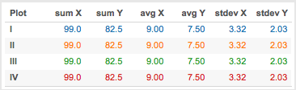
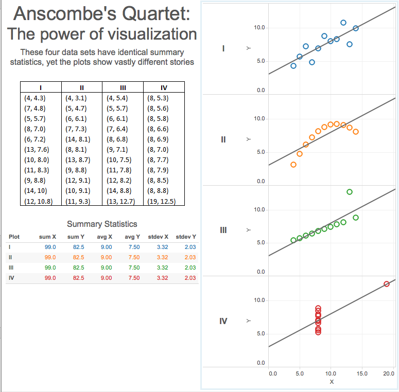
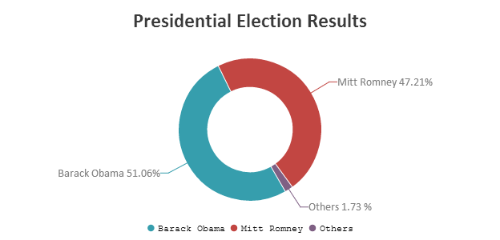

#  Data Viz Principles
Week 1 | Lesson 4.4

### LEARNING OBJECTIVES
*After this lesson, you will be able to:*
- Describe the characteristics of a great data visualization

### LESSON GUIDE
| TIMING  | TYPE  | TOPIC  |
|:-:|---|---|
| 5 min  | [Introduction](#introduction)   | Why use data visualizations?  |
| 10 min  | [Demo](#demo)  | Anscomb's Quartet  |
| 25 min  | [Demo](#demo)  | Visualization attributes   |
| 25 min  | [Demo](#demo)  | Choosing the right chart   |
| 5 min  | [Conclusion](#conclusion)  |   |

---

## Introduction: Why use data visualizations? (5 mins)

Because of the way the human brain processes information, using charts or graphs to
visualize large amounts of complex data is easier than poring over spreadsheets or
reports. Data visualization is a quick, easy way to convey concepts in a universal
manner – and you can experiment with different scenarios by making slight adjustments.

Here is some fun information about [data viz](http://www.sas.com/en_us/insights/big-data/data-visualization.html).

## Demo: Anscomb's Quartet (10 mins)

Here is the summary statistics for four plots. What do you think the visualization for
each of these plots would look like?

You can probably already guess that the answer is, although the four plots have the same summary statistics,
they actually are completely different and this can be seen when we visualize them together.

Anscomb's quartet reminds us not to rely completely on just the summary stats of our data. And that, especially during exploratory data analysis (EDA), which we will get to in Week 2, making some exploratory visual plots could keep us from making some incorrect assumptions about our data.

## Demo: Visualization attributes (25 mins)

What do you think might be important attributes that a data visualization should have?

## Edward Tufte

An influential figure in data visualisation is Edward Tufte, who has written several books on the topic and lectures on the topic at Yale University. I would encourage you to read a bit about his work and perhaps one of his books. The Visual Display of Quantitative Information is perhaps the most classic. He emphasises several principles, including honesty and clarity. He suggests we always consider what he terms data-ink ratio, but perhaps we might call data-pixels at this point (Tufte has been writing on this topic since the 1970s). Some good examples of visual honesty include the starting of axes at zero when appropriate, the sparing use of colour, and the consistency of sizings and axes. In general colour should be used to indicate a third dimension. We should not use colour to, for example, indicate separation between different points if we have already indicated this by some other measure such as shape.

Generally, in data visualizations, you’re going to use colour in one of three ways: sequential, diverging, or categorical.

Sequential colours are used to show values ordered from low to high. Divergent colours are used to show ordered values that have a critical midpoint, like an average or zero. Categorical colours are used to distinguish data that falls into distinct groups.

See images of each type externally and other discussion [here](http://mediashift.org/2016/02/checklist-does-your-data-visualization-say-what-you-think-it-says/)

## Classic charts

Something Tufte talks about in his books is really great charts to inspire. Charts that really get across a lot of data in an elegant
and well-thought-through way. I thought I'd show a few such charts. You may have seen a few as some are pretty well known. 

**John Snow and cholera**
One of the most classic is John Snow's investigation of a cholera outbreak which happened in Soho in 1854. Snow did thorough investigation
of the terrifying outbreak in which 500 people died in just ten days in an area of only a few streets. The general medical assumption
had been that disease was carried in the air by odours, but with this one image Snow was able to summarise all his findings and convince
at least some that it was in fact the water supply that was transmitting the disease (cholera is bacterial). The removal of the water pump's handle ended the epidemic, by forcing the residents to walk to a more distant well. It still took some time after this for the idea to be widely accepted and the image to be really appreciated (view the image externally [here](https://en.wikipedia.org/wiki/John_Snow#/media/File:Snow-cholera-map-1.jpg)).

**Florence Nightingale and the invention of nursing**
Florence Nightingale is pretty famous in the UK as the founder of professional nursing. In an important visualisation Nightingale made for presentation to the UK parliament on the Crimean War (1853-1856) she displayed the relative causes of death of soldiers from disease and from injury. Her work over many decades helped to lead to the reforms in sanitation within hospitals that we take for granted today (view the image externally [here](https://en.wikipedia.org/wiki/Florence_Nightingale#/media/File:Nightingale-mortality.jpg)).

**Others**
For some more modern examples I'd encourage you to check out Hans Rosling's TED talk on living standards [here](https://www.youtube.com/watch?v=hVimVzgtD6w) and the d3js library [here](https://github.com/d3/d3/wiki/Gallery). The originator
of d3js worked for some time at the New York Times, which has consequently had some pretty impressive visualisations. The Guardian newspaper has also been pretty strong on this.

A particularly nice d3 example is this NYT piece on the Facebook IPO [here](http://www.nytimes.com/interactive/2012/05/17/business/dealbook/how-the-facebook-offering-compares.html)

## Demo: Choosing the right chart  (25 mins)

In addition to taking visualization attributes into consideration, you should also
consider carefully, which kind of chart or graph to use. Let's look at a few commonly
used charts and graphs.

**Bar chart**
Bar charts are one of the most common ways to visualize data. Why? Because it's easy
and straightforward for the eye to compare information. Bar charts are
most effective when you have numerical data that splits neatly into different
categories.

**Pie chart**
Pie charts are to be discouraged in general; the only time that pie charts should be used is to show relative proportions
or percentages of information. If you want to compare data, leave it to bars or stacked bars. If your viewer
has to work to translate pie wedges into relevant data or compare pie charts, key points
you might be trying to convey may be missed. This is because of the way the eye will 
improperly perceive the relative sizes of the wedges. An alternative is doughnut charts,
but these are still problematic.

Here is another fun example of [pie charts in action](http://www.tv.com/news/learning-about-the-2013-pilot-season-through-pie-charts-136243394841/).

**Scatter plot**
Scatter plots are a great way to give you a sense of trends, concentrations
and outliers. This will give you a good idea of where you may want to investigate
further.

Here is some more information on [scatter plot](https://en.wikibooks.org/wiki/Statistics/Displaying_Data/Scatter_Graphs)

**Line plot**
Fitting a line of best fit on top of a scatter plot, with various possible formats for smoothing noise in the data.

**Histogram chart**
Histograms are useful when you want to see how your data are distributed across groups. You can see, for example, the frequency
with which your data might be clustered at certain parts of a range that can give you insight into the summary statistics. The area of
the bars will be proportional to the frequency of cases in the bin. If the bins are of equal width, then the height is simply proportional to the frequency, but if bins are not equal width the vertical axis will represent the frequency density (i.e. number of cases per unit
of the variable on the horizontal axis). I mention this as it can cause some confusion if you thought you were plotting frequency
but it turned out to be frequency density so this is something to look out for and ensure you are clear on your particular case. Additionally it's quite common to normalise the vertical axis. Depending on the visualisation, this may plot such that the area of each
bar sums to 1 (this is the standard in matplotlib). For more straightforward interpretation, some may plot unit widths such that the height is then interpretable as the proportion in each bin.

Overall, the aim of the histogram is to represent a sample estimate of the probability density for one variable, i.e. the probability the variable will take on the value within the range of the particular bin. This is directly the case if you normalise as the total sums to 1.

**Further**
Take a look at the matplotlib documentation for some inspiration. Tableau also has good resources on its website.

Click here for more [charts and graphs](https://drive.google.com/file/d/0Bx2SHQGVqWasT1l4NWtLclJJcWM/view).

## Conclusion (5 mins)
- Why is visualization so important?
- What are some things to keep in mind when creating a visualization?
- Describe when you would use particular types of charts or graphs.
    - bar chart?
    - pie chart?
    - scatter plot?
    - histogram chart?
