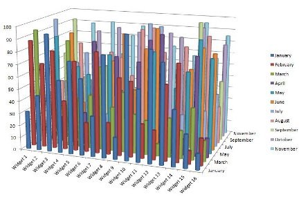
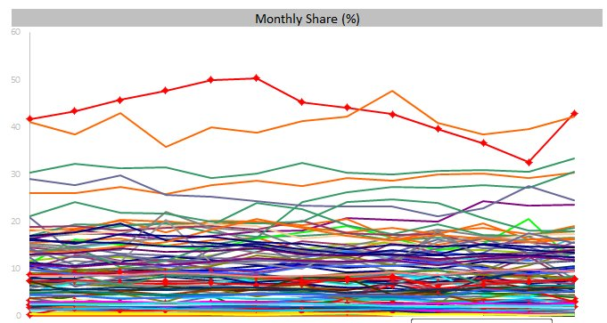
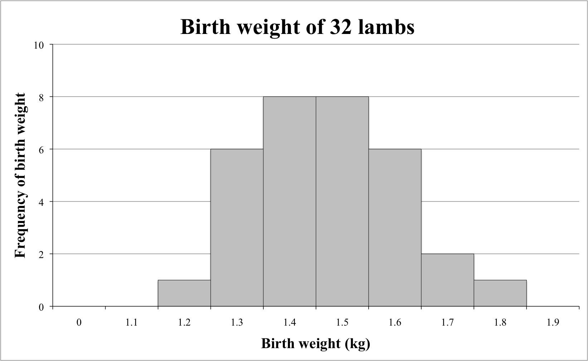
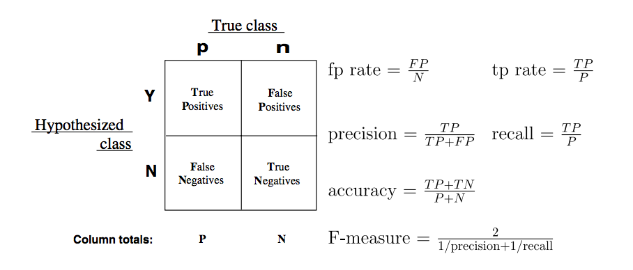
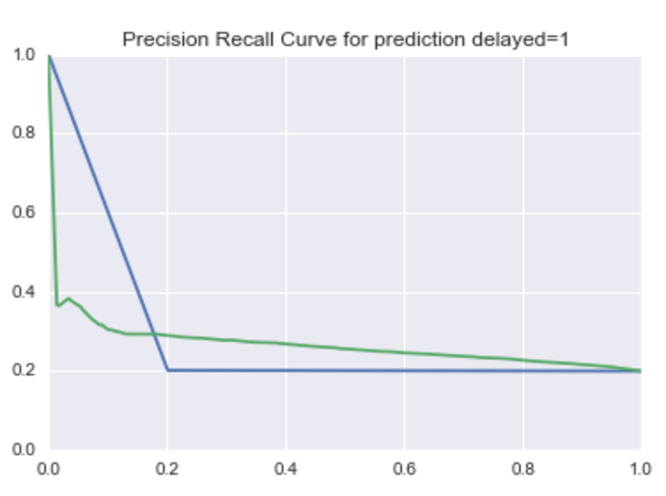
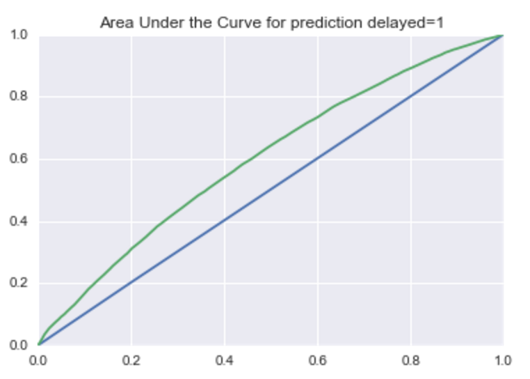

#  Communicating Results
Week 4 | Lesson 5.1

### LEARNING OBJECTIVES
*After this lesson, you will be able to:*

- Describe the difference between exploratory data analysis and visualization for sales/presentations
- Identify the components of a concise, convincing report and how they relate to specific audiences/stakeholders
- Explain accuracy, precision, recall, and type errors of a model
- Articulate the cost of false positives vs. false negatives.
- Explain a confusion matrix

### STUDENT PRE-WORK
*Before this lesson, you should already be able to:*

- Build linear and logit models
- Use cross-validation and regularization to improve performance
- Explain model coefficients and key metrics

### LESSON GUIDE
| TIMING  | TYPE  | TOPIC  |
|:-:|---|---|
| 5 min  | [Opening](#opening)  | We Built A Model  |
| 10 min  | [Introduction](#introduction)   | Good Visualization Practices and the Confusion Matrix  |
| 15 min  | [Demo](#demo)  | Precision Recall Trade-off  |
| 25 min  | [Guided Practice](#guided-practice<a name="opening"></a>)  | Visualizing Models Over Variables  |
| 25 min  | [Independent Practice](#ind-practice)  | Comparing Multiple Models  |
| 5 min  | [Conclusion](#conclusion)  | Communicating Results  |

---

<a name="opening"></a>
## We Built A Model (5 mins)

Congrats! You've been building models. However, there is a major step between your Jupyter notebooks, matplotlib figures, and the inevitable client/boss presentation.

Classes so far have heavily focused on two core concepts: developing consistent practice with pandas, matplotlib, and sklearn, and interpreting metrics that help evaluate the performance of models. But what does this really mean to the end user? Imagine user responses to some of the following statements:

1. The predictive model I built has an accuracy of 80%.
2. The logistic regression was optimized with L2 regularization, so you know it's good.
3. Gender was more important than age in the predictive model because it had a larger coefficient.
4. Here's the AUC chart that shows how well the model did.

How might your stakeholders respond? How would you respond back?

In a business setting, you are often the only person who can interpret what you've built. While some people may be familiar with basic data visualizations, by and large you will need to do a lot of "hand holding," especially if your team has never worked with data scientists before.

We'll focus this discussion around "simpler" problems (e.g. binary classification), but these tips apply to any type of model you might be working with.

First, let's review some of the knowledge we've developed about classification metrics, append some more, and then we'll talk about you can communicate your results.


<a name="introduction"></a>
## Introduction: Good Visualization Practices and the Confusion Matrix (10 mins)

We've spent time exploring  data and building models that performs well. However, our plots and visuals may be:

* **Statistically heavy**: Make sure your audience understands your plots, metrics, and jargon!
* **Overly complicated**: Pandas' `scatter_matrix()` is a useful function to quickly explore data, but it's just one example of the type of visuals that shouldn't be shown to a project stakeholder because it's just too much to understand at a glance.
* **Poorly labeled**: During EDA, you may be quickly flowing through your figures without labeling, but it's essential to prep and label before sharing!

###Can you spot why the following plots are bad?




###Why is this a much better approach?



What questions should we ask when building visuals for external, non-technical audiences?
These are a great start:

* **Who**: Who is my target audience for this visual?
* **What**: What do they already know about this project? What do they need to know?
* **How**: How does my project affect this audience? How might they interpret (or misinterpret) the data?

Let's review the confusion matrix:



Confusion matrices, for a binary classification problem, allow for the interpretation of correct and incorrect predictions for _each class label_. Remember, the confusion matrix is the beginning step for the majority of classification metrics, and gives our predictions deeper meaning beyond an accuracy score.

**Recall:** How do we calculate the following metrics?

1. Accuracy
2. True Positive Rate
3. False Positive Rate

**Check**: What would the precision and recall be for the following confusion matrix (with "green" being "true")?

             | predicted_green | predicted_not_green
-------------|-----------------|--------------------
is_green     | 13              | 7
is_not_green | 8               | 12


<a name="demo"></a>
## Demo: Precision Recall Trade-off (15 mins)

Imagine we receive an airline flight dataset and we want to predict what causes delayed flights.

Optimizing our logit model (delayed = 1) toward precision, we could bias toward flights being on time, with only a few clear "problem" observations labeled as delayed. The trade-off is lower recall; this doesn't give us visibility into problem flight patterns and is a poor model.

Optimizing toward recall, we look to identify all delayed flights. The trade-off here would be lower precision; we might wrongly predict on-time flights as delayed, thus artificially lowering the predicted performance of our flight network.

Below is a sample plot that shows how precision and recall are related for a model used to predict late flights:



This plot is based on choosing decision line thresholds on the ROC curve. In terms of the model, this would be like moving the decision line for lateness from 0.01 up to 0.99, and then calculating precision and recall at each decision.

There are a few interesting takeaways compared to the AUC benchmark (blue):

1. At a lower recall (below .2), there is a noticeable lower precision in the model.
2. Beyond .2 recall, the model outperforms the benchmark.

Whether we're optimizing for recall or precision, this plot will help us decide based on the .2 threshold.


<a name="guided-practice"></a>
## Guided Practice: Visualizing Models Over Variables (25 mins)

One effective way to explain your model over particular variables is to plot the predicted variables against the most explanatory variables. For example, with logistic regression, plotting the probability of a class against a variable can help explain the range of effect on the model.

Code along in a new notebook as we build visualization for a flight delay model:

```python
# read in the file and generate a quick model (assume we've done the data exploration already)

import pandas as pd
import sklearn.linear_model as lm
import matplotlib.pyplot as plt

df = pd.read_csv('../../assets/dataset/flight_delays.csv')

df = df.join(pd.get_dummies(df['DAY_OF_WEEK'], prefix='dow'))
df = df[df.DEP_DEL15.notnull()].copy()

model = lm.LogisticRegression()
features = ['dow_1', 'dow_2', 'dow_3', 'dow_4', 'dow_5', 'dow_6']
model.fit(df[features + ['CRS_DEP_TIME']], df['DEP_DEL15'])

df['probability'] = model.predict_proba(df[features + ['CRS_DEP_TIME']]).T[1]

ax = plt.subplot(111)
colors = ['blue', 'green', 'red', 'purple', 'orange', 'brown']
for e, c in enumerate(colors):
    df[df[features[e]] == 1].plot(x='CRS_DEP_TIME', y='probability', kind='scatter', color = c, ax=ax)

ax.set(title='Probability of Delay\n Based on Day of Week and Time of Day')
```


A visual like this can help showcase the range of effect on delays from both the day of week and the time of day: given this model, some days are more likely to have delays than others, and the likelihood of a delay increases as the day goes on.

### Bonus

1. Adjust the model to make delay predictions using airlines instead of day of week, and time, then plot the effect on CRS_DEP_TIME=1.
2. Try plotting the inverse: pick either model and plot the effect on CRS_DEP_TIME=0.

#### Visualizing Performance Against Baseline

Another approach of visualization is the effect of your model against a baseline, or even better, against previous models. Plots like this will also be useful when talking to your peers - other data scientists or analysts who are familiar with your project and interested in the progress you've made.

For classification, we've practiced plotting AUC and precision-recall plots. Consider the premise of each:

* For AUC plots, you want to explain and represent "accuracy" as having the largest area under the curve. Good models will be high to the left.
* for precision-recall plots, it'll depend on the _cost_ requirements; either a model will have good recall at the cost of precision, or visa versa.


<a name="ind-practice"></a>
## Independent Practice: Comparing Multiple Models (25 minutes)

Next, let's compare multiple models:

* For AUC plots, you'll be interested in which model has the _largest_ area under the curve
* For precision-recall plots, based on the cost requirement, you are looking at which model has the best precision given the same recall, or the best recall given the same precision.

Follow in your notebooks as we plot several models for AUC: a dummy model and additional regression features.

```python
from sklearn import dummy, metrics

model0 = dummy.DummyClassifier()
model0.fit(df[features[1:-1]], df.DEP_DEL15)
df['probability_0'] = model0.predict_proba(df[features[1:-1]]).T[1]


model = lm.LogisticRegression()
model.fit(df[features[1:-1]], df.DEP_DEL15)
df['probability_1'] = model.predict_proba(df[features[1:-1]]).T[1]

ax = plt.subplot(111)
vals = metrics.roc_curve(df.DEP_DEL15, df.probability_0)
ax.plot(vals[0], vals[1])
vals = metrics.roc_curve(df.DEP_DEL15, df.probability_1)
ax.plot(vals[0], vals[1])

ax.set(title='Area Under the Curve for prediction delayed=1', ylabel='TRP', xlabel='FRP', xlim=(0, 1), ylim=(0, 1))
```



This plot showcases:

1. The model using data outperforms a baseline dummy model.
2. By adding other features, there's some give and take with probability as the model gets more complicated. Try adding additional features (such as time of day) and compare models.


### Bonus

1. In a similar approach, use the sklearn precision_recall_curve function to enable you to plot the precision-recall curve of the four models from above.
    * Keep in mind precision in the first array is returned from the function, but the plot shows it as the y-axis.
2. Explain what is occurring when the recall is below 0.2.
3. Based on this performance, is there a clear winner at different thresholds?

<a name="conclusion"></a>
## Conclusion (5 mins)
- Review independent practice deliverable
- Recap: What is a confusion matrix? How would you describe to a layperson the difference between precision and recall? Can you think of business cases where precision or recall should be prioritized? What is the process to compare and adjust model balance?

***

### ADDITIONAL RESOURCES
- [Guide for building key python visualizations, including maps](https://www.dataquest.io/blog/python-data-visualization-libraries/)
- [Beautiful graphs with matplotlib](http://www.randalolson.com/2014/06/28/how-to-make-beautiful-data-visualizations-in-python-with-matplotlib/)
