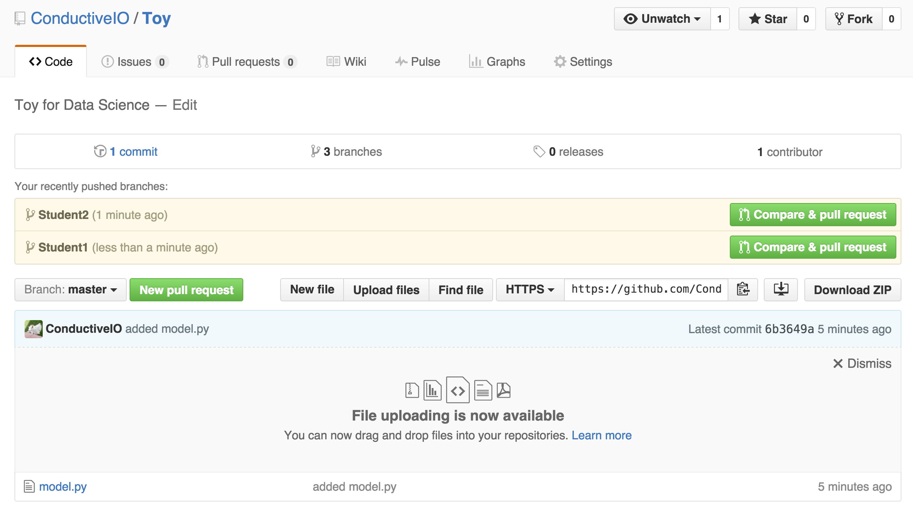
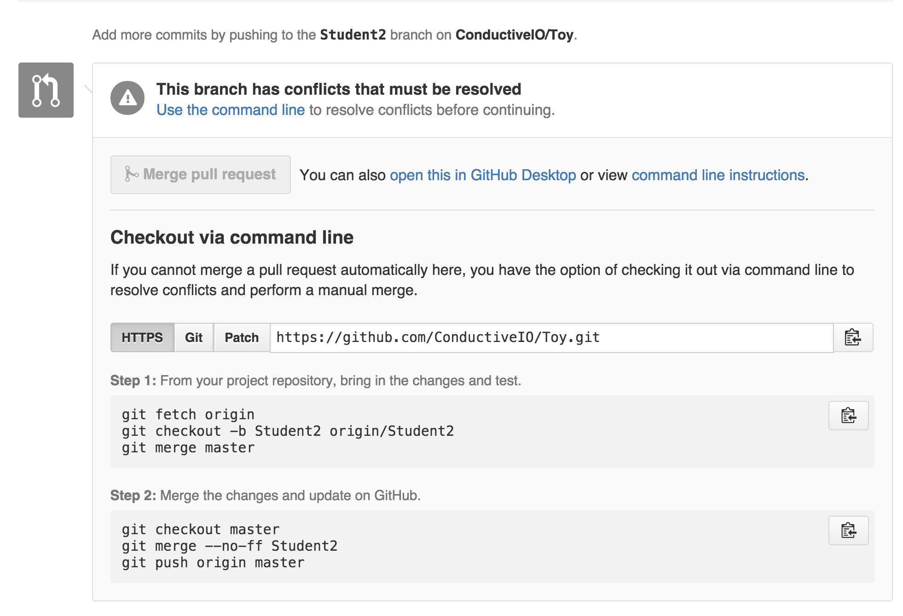
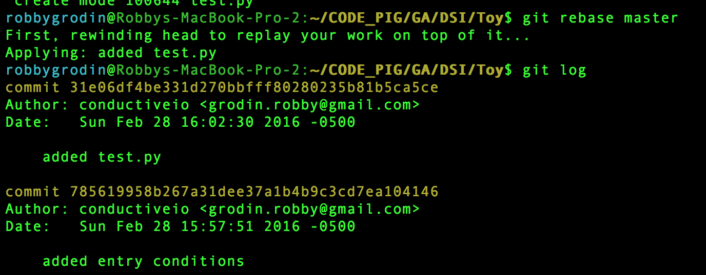

#  Github for Teams
Week 9 | Lesson 1.1

### LEARNING OBJECTIVES
*After this lesson, you will be able to:*
- Use branches to isolate changes tied to specific features
- Efficiently and correctly resolve merge conflicts
- Fetch changes from a remote without merging them into your own
- Explain how rebase combines two branches

### STUDENT PRE-WORK
*Before this lesson, you should already be able to:*
- Use Git/GitHub to fork, clone, push and pull
- Read through the following:
  1. https://www.atlassian.com/git/tutorials/using-branches
  2. https://www.atlassian.com/git/tutorials/comparing-workflows
  3. https://www.atlassian.com/git/tutorials/merging-vs-rebasing ('Conceptual Overview' section)
  4. http://nvie.com/posts/a-successful-git-branching-model/

> **Note:** This can be a pair programming activity or done independently.

### LESSON GUIDE
| TIMING  | TYPE  | TOPIC  |
|:-:|---|---|
| 5 min  | [Opening](#opening)  | Brief (re)introduction of Git & Github, leading into Branching  |
| 10 min  | [Introduction](#introduction)   | Merging |
| 15 min  | [Demo](#Demo)  | fetch, checkout, merge from the command line |
| 15 min  | [Independent Practice](#independent-practice)  | Resolve your Merge Conflict  |
| 10 min  | [Demo](#demo)  | How to use Rebasing  |
| 20 min  | [Discussion](#discussion)  | Team Workflows  |
| 5 min  | [Conclusion](#conclusion)  | Review, Recap  |

---

<a name="opening"></a>
## Opening (5 mins)
**Why are Git and Github Important?**
Git and Github are used to keep track of work contributions made by various team members on a centralized product. It allows collaborators to keep various versions of work-in-progress code separate from stable versions. At the core of this separation of concerns are the mechanisms called 'Forking' and 'Branching'.


<a name="introduction"></a>
## Introduction: Merging (10 mins)


**Branch**
- A feature branch is used to isolate features that are in progress
- Introduce the [git branch documentation](http://www.git-scm.com/docs/git-branch)
  * How to create and checkout a branch
  * How to list branches
  * How to remove a branch

**Code:** Create a branch for "Student A"

**Commits**
- Q: What is a commit?

> A: A "snapshot" of your code

**Code:** Create branches for Student 1 and Student 2, each having edited the same file. Explain that Student 1 and Student 2 are both working on the same feature, but on their own separate branches.



Now, open a pull request for Student 1 and show how to merge into Master. Success!

Next, do the same for Student 2.


UH OH! We can't merge this in because Student 1 and Student 2 worked on the same files and now we have different versions of the files we're trying to combine.  Let's create pull request anyway and sort this out.

<a name="Demo"></a>
## Demo: `fetch`, `checkout`, `merge` from the command line (15 mins)

Remember when we said GitHub is really helpful? Check it out:



Simply follow the directions to make this work!

```bash
git fetch origin
git checkout -b Student2 origin/Student2
git merge master
```

> Note: Make sure to explain **line by line** what this is doing.

In the simplest terms, `git pull` is just like running `git fetch` followed by `git merge`:

Quote:
_"When you fetch, Git gathers any commits from the target branch that do not exist in your current branch and stores them in your local repository. However, it does not merge them with your current branch. This is particularly useful if you need to keep your repository up to date, but are working on something that might break if you update your files. To integrate the commits into your master branch, you use merge."_
~ StackOverflow.com

```bash
Auto-merging model.py
CONFLICT (content): Merge conflict in model.py
Automatic merge failed; fix conflicts and then commit the result.
```

<a name="independent-practice"></a>
## Independent Practice: Resolve your Merge Conflict (15 mins)

Uh-oh! Looks like we hit a merge conflict. You'll need to work with your partner to resolve the conflicts. Git will mark the conflicts in the working tree for us - your terminal will list the problems.

Start by opening the problem files with your text editor, then edit the files by choosing which version you want to keep. Delete all the "extra stuff" git adds to show you the merge conflicts, including: `<<<<<<<`, `=======`, `HEAD`, `master`, etc.

Next:

```bash
git add .
git commit -m 'your message'
git checkout master
git merge --no-ff Student2
git push origin master
```

**Introduce:** The Nuclear Option
 - If you ever get completely screwed up, use 'git reset --hard HEAD'
   * **THIS WILL CAUSE YOU TO LOSE ANY CHANGES!!**
 - Or you can always remove and re-clone

<a name="demo"></a>
## Rebasing (10 mins)

While merging represents one possible path for combining different branches, there is another common path called `rebase`.

Rebasing works differently than merging. Rather than combining the finished data from two different branches via a single commit, it combines the two branches _themselves_, rearranging them and effectively re-writing history.

Here's what a rebase looks like. Suppose we have two branches, like this.


One day, someone makes a commit onto the `master` branch. We want to include those changes into our feature branch, so that our code doesn't conflict with theirs.


From our feature branch, if we run the command `git rebase master`, we can tell git to rewrite the history of our feature branch as if the new commit on `master` had __always been there__.



Rebase is extremely useful for cleaning up your commit history, but it also carries risk; when you rebase, you are *discarding* your old commits and replacing them with new (though admittedly, similar) commits.

This can seriously screw up a fellow collaborator if you're working in a shared repo. The golden rule for `git rebase` is "only rebase **before** sharing your code, **never** after."

**Check**: What is the golden rule for rebasing? Why is this important?

Like `git merge`, `git rebase` can sometimes run into merge conflicts that need to be resolved. The procedure for doing this is basically the same; once you fix the conflicts, run `git rebase --continue` to complete the rebase.


<a name="discussion"></a>
## Discussion: Team Workflows (20 mins)

So far, we've only talked about `rebase` in the context of working alone. Here are a few examples of actual, real-life git workflows - using both rebase and merge - that might get used in the field.

#### Single-Remote Workflows
One thing all of these approaches have in common is the necessity of staying on top of changes within a single shared repository.

This is usually accomplished by running `git fetch`, which pulls updates from origin, and merging those updates; alternatively, you could use `git pull` to do both at once.

#### Centralized Workflow
**How It Works**: The remote repo has one single branch on it, `master`. All collaborators have separate clones of this repo. They can each work independently on separate things. However, before they push, they need to run `git fetch`/`git pull` (with the `--rebase` flag) to make sure that their master branch isn't out of date.

> Note: Discuss the pros and cons of these approaches using the pointers below.

(+) Very simple

(-) Collaboration is kind of clunky.

#### Feature Branch Workflow

**How It Works**: This workflow is very similar to the 'Centralized' workflow. The biggest difference is that there are branches (which helps to keep feature-related commits isolated), and that instead of pushing changes up directly, collaborators:

(a) push up changes to a new remote branch rather than master, and
(b) submit a pull request to ask for them to be added to the remote repo's `master` branch.

> Note: Discuss the pros and cons of these approaches using the pointers below.

(+) Better isolation than Centralized model, but sharing is still easy. Very flexible.

(-) Sometimes it's *too* flexible - it doesn't meaningfully distinguish between different branches, and that lack of structure can cause problems on larger projects.


#### 'Gitflow' Workflow

**How It Works**: Similar to the Feature Branch workflows, but with more rigidly-defined branches. For example:

- Historical Branches : `master` stores official releases, while `develop` serves as a living 'integration branch' that ties together all the standalone features.
- Release Branches : 'release' branches might exist for any given release, to keep all of those materials together.
- Feature Branches : pretty much the same as in the prior model.
- Maintenance/'Hotfix' Branches : branches used to quickly patch issues with production code.

> Note: Discuss the pros and cons of these approaches using the pointers below.

(+) Highly structured - works well for large projects.

(-) Sometimes overkill for something small.


#### Distributed Workflows
These approaches all use multiple remote repos; typically, everyone has their own fork of the 'original' project (the version of the repo that's publicly visible and is managed by the project maintainer), and changes are submitted via pull request.

##### Integration Manager Workflow

**How It Works**: One collaborator plays the role of 'Integration Manager'. This means that they are responsible for managing the official repository and either accepting or rejecting pull requests as they come in.

> Note: Discuss the pros and cons of these approaches using the pointers below.

(+) One person integrates all changes, so there's consistency.

(-) Could get overwhelming for large projects.

##### Dictator/Lieutenants Workflow

**How It Works**: This workflow is very similar to the Integration Manager Workflow. The biggest difference is that rather than submitting all pull requests to a single integration manager, pull requests are funneled through 'Lieutenants', who all report to the 'Dictator'. Only the Dictator has write access to the official repo.

> Note: Discuss the pros and cons of these approaches using the pointers below.

(+) Could get overwhelming for large projects.

(-) Only one person has final write access, so there's consistency but also a single point of failure.

<a name="conclusion"></a>
## Conclusion (5 mins)
- Review the difference between `rebase` and `merge`
- Describe how pull requests work in the context of using Git/GitHub to collaborate

## Additional Resources

- [Atlassian - Git Workflow Diagrams](https://www.atlassian.com/git/tutorials/comparing-workflows/centralized-workflow)
- [Git Branching Workflow Discussion](https://git-scm.com/book/en/v2/Git-Branching-Branching-Workflows)
